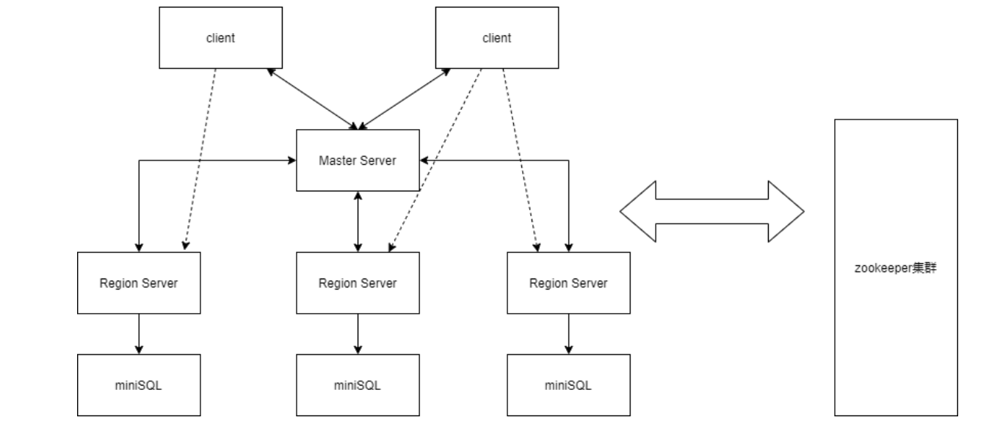
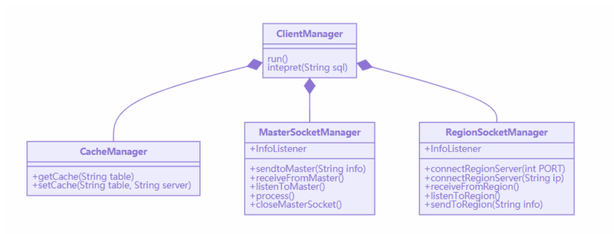
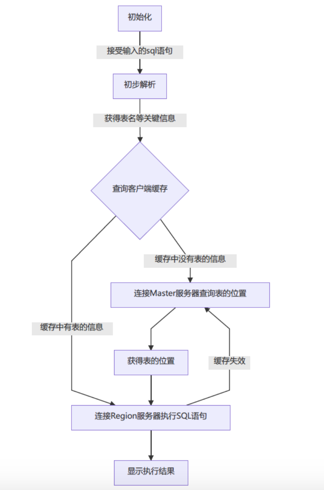
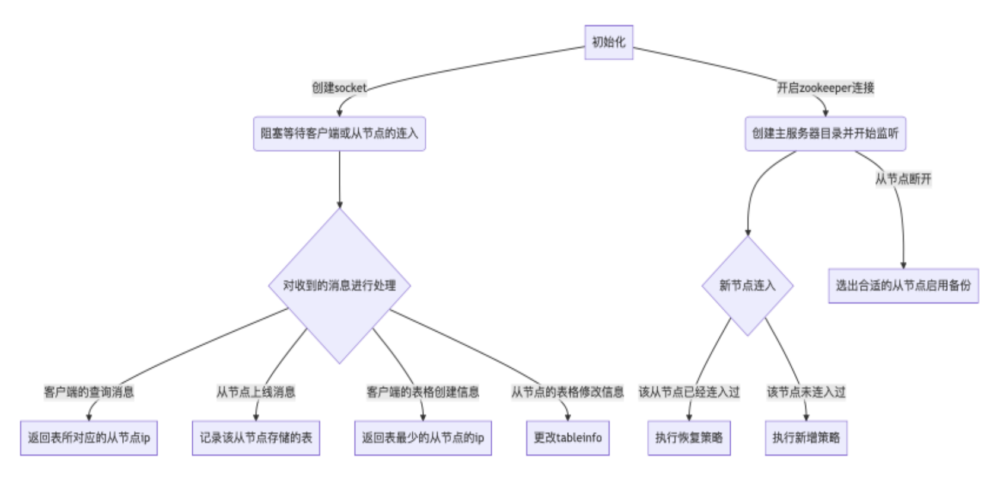
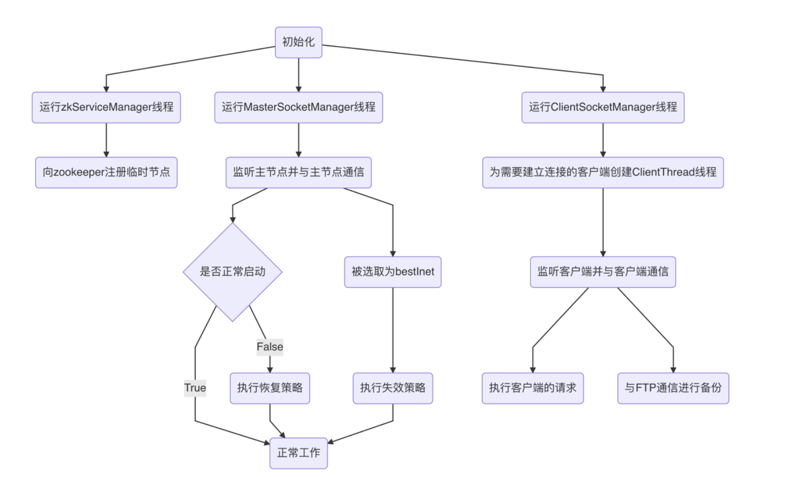
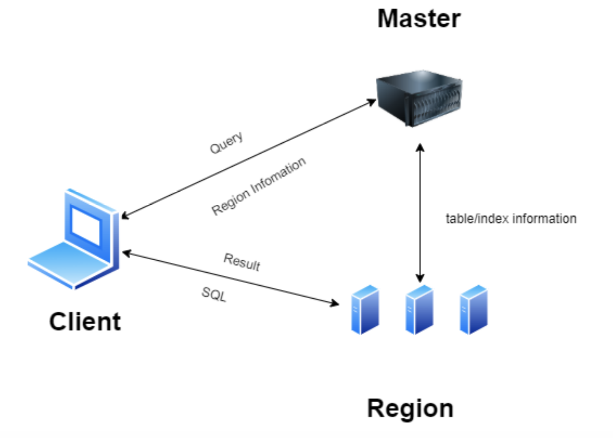

# 记一个Naive分布式数据库的实现

## 前言

上个学期上了一门必修课《大规模信息系统构建技术导论》，据说是用来对标MIT6.824而开设的一门分布式系统课程，然而上课内容一言难尽，感觉听的人也不是很多，唯一有价值的是这门课的project——实现一个分布式数据库引擎，但是对于具体怎么实现，这门课程也没有给出很多提示，唯一提供的资料就是几页写了作业要求的PPT

因此我们不得不从头开始闭门造车，虽然也看到过GitHub上很多开源的分布式数据库，但是这些项目规模过于庞大，完全不是一个课程project所能容纳的，并且老师说要在大二课程《数据库系统》的miniSQL上继承发展，做出一个分布式的miniSQL，因此很多开源的KV数据库的参考价值也就降低了(miniSQL是一个关系型数据库)

所以最终小组三个人缝出了一个四不像的**分布式关系型数据库引擎Distributed-miniSQL**，下面重点介绍一下整个项目实现的过程和细节。

## 技术选型

老师点名要用zookeeper进行集群管理，因此采用了Java来开发，同时使用Zookeeper作为集群管理，使用FTP服务器作为副本管理。

## 系统架构

### 总体架构

系统的源代码中将整个 maven 项目划分成三个模块，分别是 Client，Master Server 和 Region Server，分别对应分布式 MiniSQL 系统的客户端、主节点和从节点， 并且三者之间都可以在一定的通信框架下进行通信，同时主节点和从节点通过 Zookeeper 集群，对数据表的信息进行统一的管理。

### Client设计

Client 由一个 ClientManager 类负责管理，该类下面还有三个子功能的类，分别 是： 

-  CacheManager，负责客户端的缓存服务，使用一个 HashMap 来对缓存进行管 理，每次开启客户端就会创建而退出客户端就会清除，使用 key-value 的方 式存储了一些表名-从节点 IP 地址的对，并提供了增删查改的接口 
-  MasterSocketManager 负责和主服务器进行通信，通过建立 Socket 连接实现 异步的 IO 流，在一个单独的线程中运行，包括查询数据表所在的 Region 等功能
- RegionSocketManager 负责和 Region Server 进行通信，Client 在获得了某个 表对应的 Region 的 IP 地址之后会和这个 Region 建立 Socket 连接，并且监听端口位于一个单独的线程中，可以执行 SQL 语句的发送和接收 SQL 语句 执行结果等功能

整体工作流程可以用下图来表示：

### Master Server设计

MasterServer由一个MasterManager类负责管理，该类下面还有三个子功能的类， 分别是：

- TableManager，负责管理维护存储在主节点的各种重要信息。如 Map tableInfo 用于记录表与其所在从节点 ip 的对应关系；List serverList 用于记录所有连接过的从节点 ip，方便判断新连接的从节点是全 新的还是失效后恢复的；Map> aliveServer 用于记录当前 活跃的从节点 ip，以及每个从节点 ip 对应的所有表。依托于这些信息，我们 才可以实现容错容灾、副本管理等功能。 
- ZookeeperManager负责使用zookeeper进行集群管理。当每个从节点连入时， 首先需要在 zookeeper 的 db 目录下完成自己的注册，编号是 Region_0、 Region_1 等依次递增。通过 zookeeper 进行集群管理，我们可以确保当节点 有变化时，能够监听到，并做出相应的处理，如容错容灾服务等。 
- SocketManager 负责和 Client 以及 Region Server 进行通信。Client 在没有缓 存时，需要先访问主节点从而获得某个表对应的 Region 的 IP 地址，从而在 之后和这个 Region 建立 Socket 连接。Region Server 在增加删除表时，需要 通过 Socket 连接给 Master Server 发消息。同时，Master Server 在检测到有从 节点挂了之后，需要在负载均衡后选出合适的从节点，给从节点发消息以通 知它完成容错容灾。

整体的工作流程如下图所示：

### Region Server设计

从服务器由一个 RegionManager 负责管理，该类下包含四个子功能的类， 分别是： 

-  zkServiceManager 负责向 zookeeper 注册当前从节点的临时节点。
-  DataBaseManager 负责向主节点发送表的信息，并作为句柄被包含在 Master SocketManager 中。 
-  ClientSocketManager 负责为需要建立连接的客户端创建 ClientThread 线程， 并利用该线程，监听客户端并与客户端保持通信。一方面，从节点需要执 行客户端的数据库请求语句；另一方面，从节点需要在数据发生修改后， 把修改后的数据文件上传到 FTP 进行备份。这里需要使用到 FTPUtils 类， 该类中包含了一系列与 FTP 通信的函数，包括上传、下载以及删除等功 能。 
-  MasterSocketManager 负责监听主节点，并与主节点保持通信。主节点传给 从节点的信息主要有两类：以[3]开头的信息是主节点在其他从节 点宕机后，要求当前从节点获取该宕机从节点的备份，也就是执行失效策 略；以[4]开头的信息是主节点检测到宕机后的从节点重新上线 后，要求其执行恢复策略。

### miniSQL设计

miniSQL作为一个独立的模块运行在Region中，它采用了跟数据库系统课程中一样的架构设计：

## 技术细节

### Socket通信框架

本系统实现了 Client，Master 和 Region 之间的两两通信，通过 Socket 连接建 立稳定可靠的通信与异步的 IO 流，同时制定了一系列通信协议，用于确保通信 的可靠性和准确性，系统的总体通信架构如下图所示：

- 事实上也可以用RPC进行远程调用，但是这里我们实现了更底层的一套Socket通信框架，虽然比较简陋，但是至少能跑
- 这套Socket通信框架允许客户端跟多个Region相连，也允许Master跟多个Region相连

### 客户端缓存

中我们实现了客户端缓存，可以大大降低查询所需的时间，提高 IO 的 效率，缓存通过一个 HashMap 实现，并且会定期更新和清除缓存的内容，客户 端在向服务器发送 SQL 语句之前先对输入的 SQL 语句进行一个简单的解析，提 取出要处理的表名或者索引名，然后在缓存中先进行查询，如果查到了对应的 Region 地址就直接和 Region 进行连接，如果没有查到就和 Master 先连接并获取 Region 的地址之后再和 Region 连接。 

因此本系统实现了所谓的分布式查询，即客户端执行 SQL 语句时，并不是所 有时候都依赖 Master 提供的元信息，而是使用一套分布式的缓存功能（缓存分 布在各个客户端上），有的时候客户端可以直接实现和 Region 的连接以及通信， 并不完全依赖主服务器，因此也具有一定的容错容灾能力（当然主要的容错容灾 能力并不依赖于缓存）

### 集群管理

本系统作为一个分布式数据库，必须要对数据分布进行合理的设计。在本系 统中，为简化处理，一个表就是一个 Region。每个从节点管理着若干个 Region， 也就是管理着若干张表。主节点则记录了每个从节点和自己管理的表的对应关系。 当客户端需要对某张表进行操作时，则访问主节点获取表所对应的从节点并进行 访问；当有从节点挂掉，主节点执行容错容灾策略时，同时也要更新自己所存储 的表的对应关系。这部分具体的内容在容错容灾中详细阐明。 

集群管理，则利用 zookeeper 进行。当每个从节点连入时，首先需要在 zookeeper 的 db 目录下完成自己的注册，编号是 Region_0、Region_1 等依次递 增。通过 zookeeper 进行集群管理，我们可以确保当节点增加、失效、恢复时， 能够监听到，并做出相应的处理。

### 负载均衡

本系统中我们实现了负载均衡。当我们要新创建一张表时，主节点永远会选 择表最少的从节点进行创建。当我们要执行容错容灾时，永远是把挂掉从节点的 表的备份转移到表最少的从节点上。 

在进一步的设计中，我们还想解决热点问题。主节点每隔一段时间，都会给 自己管理的所有从节点发消息，让他们返回自己从收到消息到下一次收到消息的 这段时间内，所收到的访问次数以及每张表的访问次数。主节点收到从节点的所 有消息后，对消息进行处理，如有热点问题出现，即一个 RegionServer 中有两张 表都访问非常频繁时，把这张表删除，转移到另一个访问相对不频繁的从节点上。

### 副本管理和容错容灾

本系统通过 FTP 备份实现了副本管理功能，每当从节点检测到客户端发送 的命令对数据库的数据进行了修改，就把修改后的数据在 FTP 上进行更新。这 里还有一种策略，是另启一个线程，每过固定的一段时间就把从节点保存的数据 在 FTP 上进行更新。不过我们经过讨论，为了方便测试，还是使用了当前这种策略。 

容错容灾是在副本管理功能基础上完成的。一方面，主节点通过 zookeeper 监测到有从节点宕机，立刻从正常工作的从节点中选出最优的从节点，也就是存 放表数量最少的从节点，并向该最优从节点发送信息[3]ip#file，让该最 优从节点执行失效策略，也就是把信息中包含的表全部通过 FTP 下载到本地， 并将宕机从节点的 table_catalog 和 index_catalog 追加到本地的 table_catalog 和 index_catalog 之后。另一方面，当宕机的从节点重启后，主节点监测到该事件， 向其发送[4]recover，要求该从节点执行恢复策略，即把之前的表和索引 数据全部清空，完成之后向主节点发送[4]online，即完成容错容灾流程。

## 总结

虽然整体的设计和实现很简单，但是真的把这么一个分布式miniSQL写完之后感觉还是比较有成就感的，感觉里面用的都是一些分布式系统共通的设计原则，比如缓存，socket通信框架和通信协议以及主从管理的模式，算是本科期间做的比较用心的