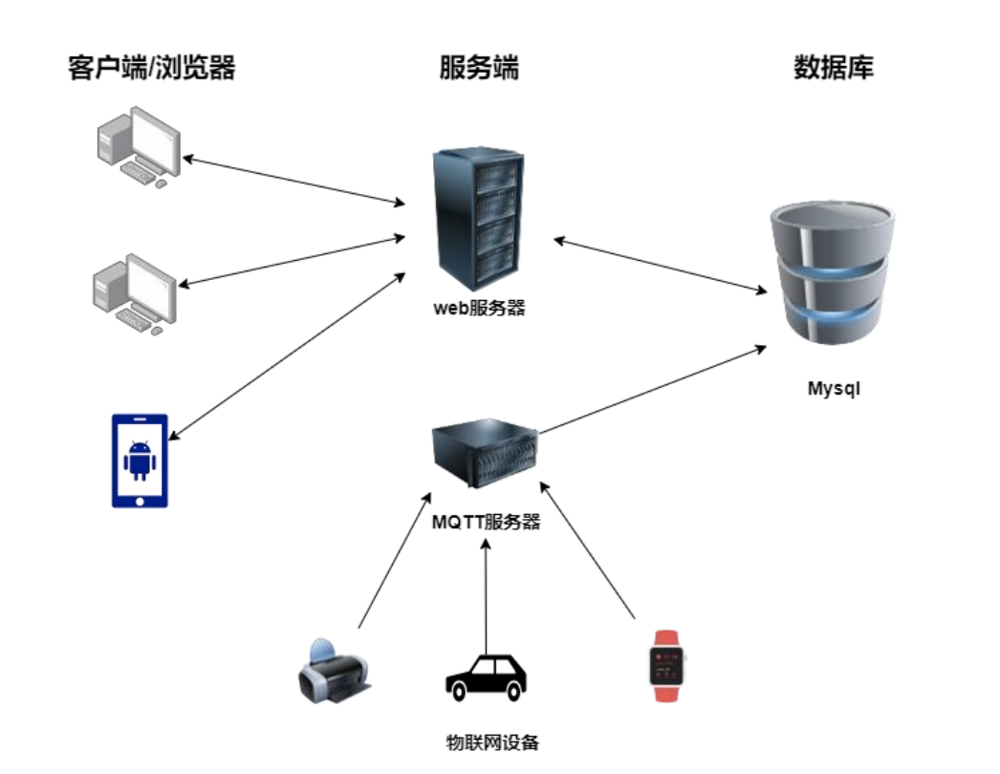
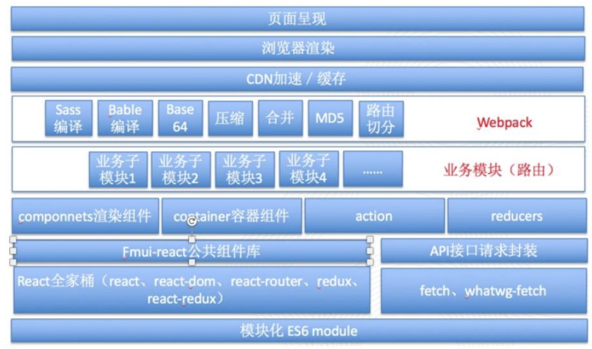
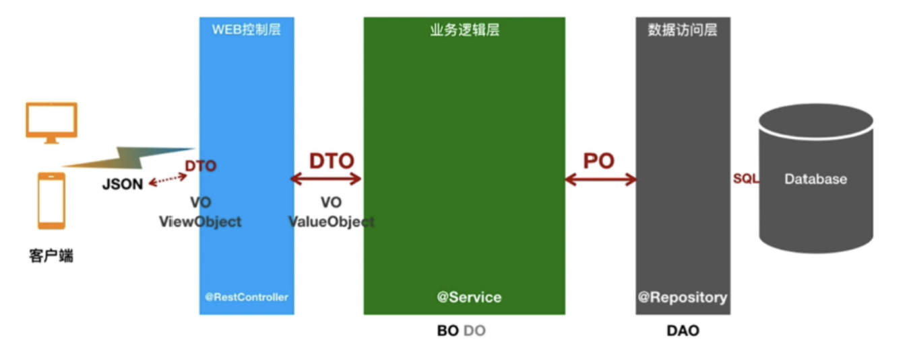
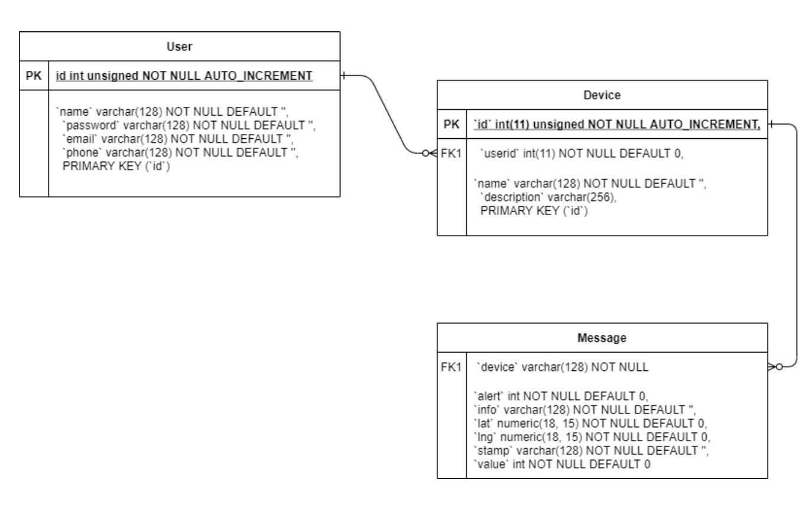
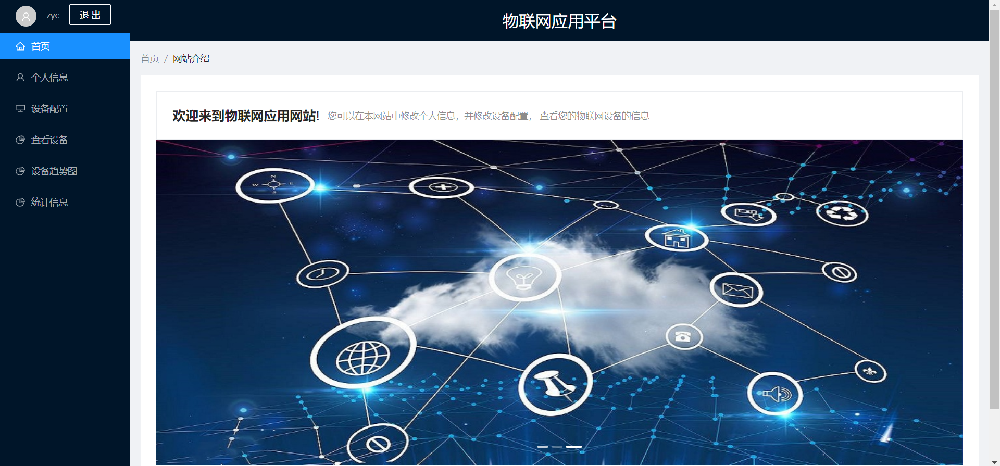
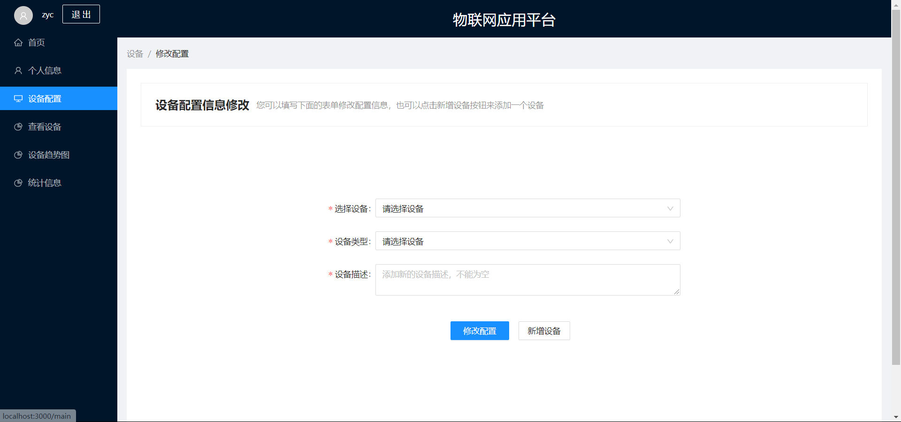
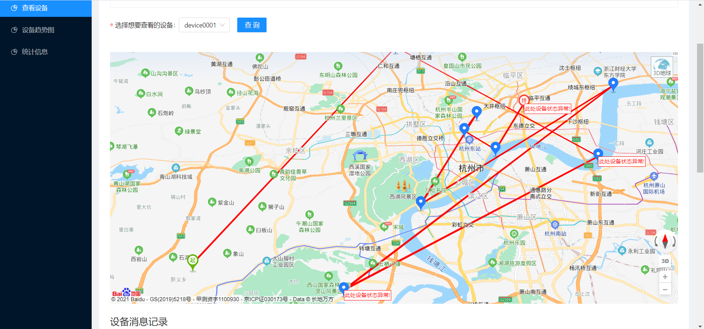
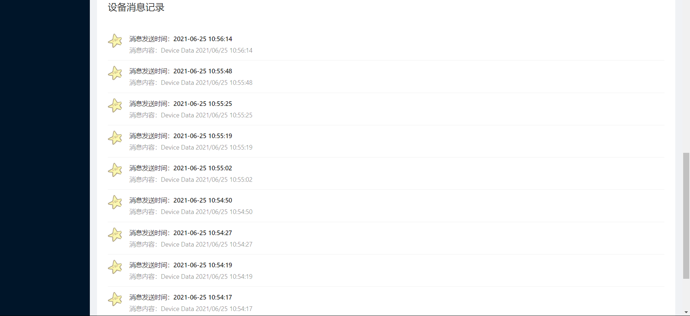
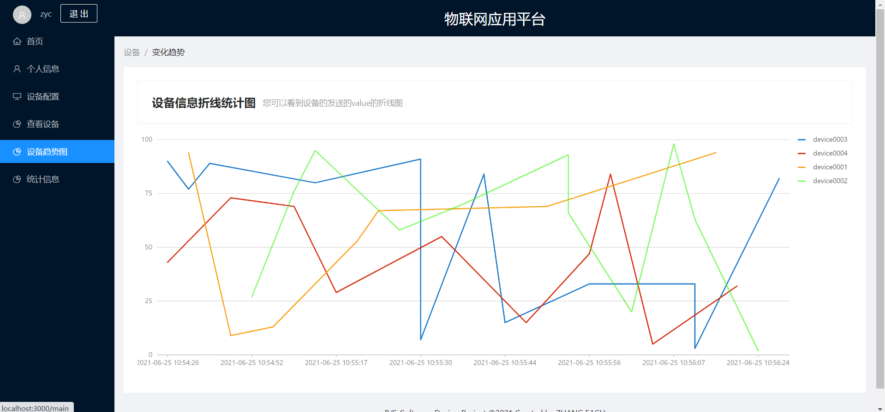
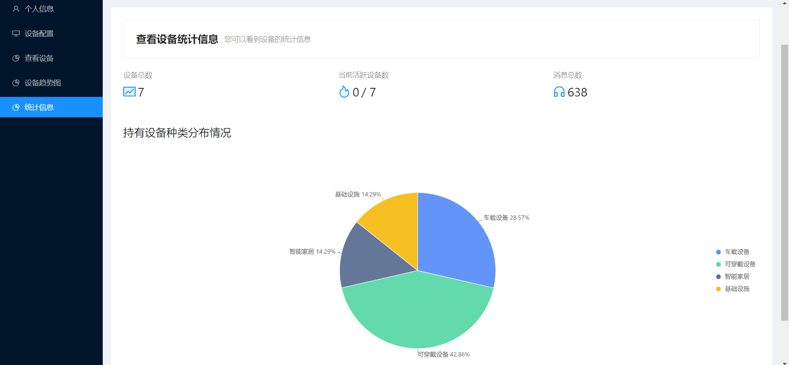

# 记一个物联网设备管理网站的设计和开发

> 这是上个学期一门专业选修课《B/S体系软件设计》的课程Project，目标是自选前后端技术，制作一个具有完整前后端的物联网设备管理网站。顺带一提这门课给分很好，而且整个课程就这么一个Project+几篇文档，相比于其他课非常省事，推荐去选。

最终做好的网站可以[点击链接](https://github.com/Zhang-Each/IoT-Device-Management-System)查看

## 网站需求

在《B/S体系软件设计》这门课上，我独立完成了一个物联网设备管理网站，基本实现了所有给定的需求，包括：

- 用户的注册和登录，注册和登录时的安全检查(比如密码复杂度，邮箱和手机号的格式规范)
- 用户个人信息的配置和修改
- 物联网设备的添加和信息修改
- 物联网设备的历史轨迹，消息记录查询
- 设备的统计数据可视化(设备数，种类等等)

值得注意的是这里所说的物联网设备实际上是老师编写的一个Java程序，不是真的有这些物联网设备，可以模拟出多个位于不同经纬度的物联网设备发送出定位和消息，并采用MQTT协议和服务器进行通信。

总的来说这些需求都是比较常见而且基本的，实现起来的难度不是很大。

## 技术选型

网站采用前后端分离的开发方式，同时还需要专门写一个接收MQTT的服务端并定时将收到的报文存储在数据库中，同时前端需要使用一些可视化的库来绘制设备轨迹地图和统计图表，最终我采用的技术栈包括：

- 前端：React + Ant Design 组件库+Ant Design Charts+百度地图 SDK+yarn 包管理 工具 

- 后端：Java Spring Boot 框架+Maven+MyBatis+Redis+Jackson 
- 数据库：MySQL 
- mqtt 服务器：Python3.8+mysql-connector+Paho(额外 python 库) 
- 测试工具：ApiPost 用于测试后端接口数据正确性

其中Ant Design Charts和百度地图 SDK分别用于绘制统计图表和物联网设备在真实地图上的行进轨迹。

## 系统设计

### 总体架构

系统总体的架构设计在**前后端分离**的基础上，增加一个MQTT服务器专门负责接收报文并和数据库进行交互，这样一来就使得Web后端和MQTT服务器解耦，更加容易开发了。

前端主要采用基于 Node.js 的 React 框架，并采用阿里主导的开源项目 Ant Design 作为 UI 组件框架，百度地图 SDK 作为设备的经纬度地理位置可视化工具，采用 React 全家桶开 发，前端总体架构可以用下面的图来表示：

后端主要使用 Spring Boot 框架编写而成，并集成一系列中间件，Jackson、MyBatis 和 Redis 等等来完善后端的功能，采用 json 格式进行数据的收发，其主要的架构可以用下图表示：

### 数据表设计

我设计了三个数据表，分别是User，Device和Message，分别用来存储用户，设备和MQTT报文中的消息，三个表的关系可以用下面的ER图来表示：

## 实现的效果

整个系统开发完成后的大致效果如下：

- 首页

- 设备配置界面，可以修改和添加新设备

- 设备地图运行轨迹可视化，设备的位置点都是按照经纬度在百度地图提供的地图上绘制的，其中起点和终点有专门的图标，监测到异常状态的点有异常提示，总体的轨迹使用折线绘制

- 设备的消息记录，按照时间顺序排序

- 设备发送过来的value(老师指定的一个关键统计数据)的变化趋势图，用折线统计图的方式绘制

- 用户的设备统计信息，包括了设备总数，活跃设备数(设定为一天内有登录记录的设备数量)以及消息总数，还有一个持有设备分布情况的扇形统计图

## 开发体会

这个网站的开发总体来说还是比较容易的，当然也可能是我做的比较水的原因。

前端的话我之前用过几次React所以就用React来写的，当然我对JavaScript和React框架本身的细节一无所知，所以基本上写前端也就停留在调用现有的组件和SDK上面，首先照着Ant-Design的模版先做了页面布局，画了个导航栏，然后在每个细分的页面添加一些表单和按钮之类的组件，然后引入百度地图SDK画地图还有Ant-Design-Charts绘制统计图表就做的七七八八了，大部分时候都是照着官方文档里的组件使用方式写，复制过来稍微改改细节就差不多了。

后端的MQTT服务器因为有Python现成的MQTT库因此比较简单，只用了一点点代码就做了个能跑的出来。而Spring Boot我一直都没有接触过，虽然学过Java但是学校里的Java并不涉及JavaEE的东西，因此也趁着这个机会稍微接触了一下，好在Spring Boot写起来确实很方便，IDEA提供了非常方便的Spring Boot项目启动配置方式，并且Maven中引入Jar包也比较方便。

具体的Web后端开发的话就是根据数据表实现一系列Entity，Mapper，Service和Request，由于数据表比较简单，因此也不存在什么难度，感觉Mybatis框架下写写CRUD还是非常方便的，~~我觉得反而前端要做的好看比较难，这种体量的网站后端怎么写都能跑得起来。~~ 

同时我也尝试了在后端加入**Redis和JWT的token认证**等功能，并做出了登录，Cookie保存，用户退出登录和网页重定向等功能，在具有一定安全性的前提下实现了简单的用户登录退出的认证，这里使用JWT产生token保存在客户端，并且在后端的Redis上进行token的存储用于身份认证，当然还是比较Naive的。

虽然在这门课之前我已经在好几门课(软工全家桶)上接触过了Web以及微信小程序的开发(当然都是自学，老师不会讲，甚至连懂都不太懂)，但是之前都是和人组队做网站，自己只负责很少的一部分，有的课甚至因为不需要做完整的网站只需要展示PPT而没有做完，这一次终于自己体验了一个简单的网站的完整的设计和开发，感觉做完之后还是比较有成就感的，虽然难度确实不算很大。

