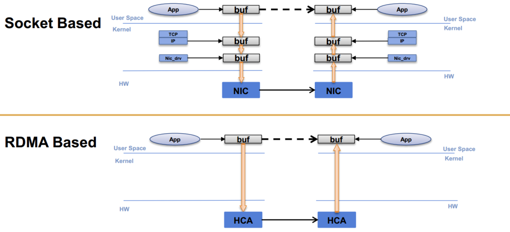

# 实习笔记04：RDMA通信协议

## 背景

​	  传统的TCP/IP技术在处理数据包的过程中需要经过操作系统和其他软件层，占用了大量的服务器资源和内存总线带宽，数据在系统内存，处理器缓存和网络控制器的缓存之间反复移动，给服务器的内存和CPU带来了大量的负担，加剧了网络的延迟效应。

​	  远程内存直接访问(RDMA)重点解决了这种网络带宽，处理器速度和内存带宽之间的mismatch问题，用于高性能计算集群的互联，这是一种新型的内存访问技术，可以让计算机直接存取和访问其他计算机的内容，并且不需要经过CPU的处理，可以直接将数据从一个系统快速移动到远程系统的存储器中而不对操作系统造成任何影响。

​	  Socket通信的数据需要经过Socket，TCP，IP，网络设备等多个层级之后才能到达设备驱动器中，而RDMA可以直接访问远端计算机的设备驱动器进行内存的读写。

## RDMA的传输方式分类

​	  RDMA的传输方式可以分成可信的和不可信的，其中可信的方式中NIC网卡使用确认的形式来保证消息的按顺序传递，而不可信的传输方式中不会进行确认。也可以分成有连接和无连接的两种，有连接的传输需要维护队列对的数据结构并进行一对一的通信，而无连接的通信方式可以进行一对多的通信。

​	  RDMA支持可信有连接，不可信有连接和不可信无连接三种大的通信方式，可以执行的操作包括收发，写和读等等，其中可信有连接的通信支持所有操作，而不可信连接不能进行读，不可信无连接只支持收发操作。

