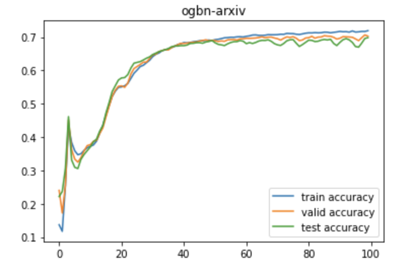

# PyTorch学习笔记02：Geometric库与GNN

> 之前学习Stanford的公开课CS224W的时候用到了torch_grometric, torch_scatter和torch_sparse等PyTorch扩展库来实现一些经典的图神经网络模型(当然还有networkx和deepsnap等辅助库，不过这些主要是用来保存图结构的，和PyTorch关系不大)，来记录一下学习这些库编写GNN的经验

## PyTorch_Geometric库

PyTorch_Geometric是一个开源的PyTorch扩展库，提供了一系列开箱即用的图神经网络结构，可以在使用PyTorch编写深度学习模型的基础上，非常方便地进行调用，而CS224W提供了一系列lab需要你实现GCN，GraphSAGE和GAT等多种图神经网络结构，并要求使用`PyTorch_Geometric(torch_geometric)`进行编写和实现，下面来总结一下coding过程中学到的一些东西。

同时`torch_geometric`和另外两个torch扩展库`torch_sparse`，`torch_scatter`，这两个库分别提供了优化后的稀疏矩阵操作和scatter操作，可以在GNN场景下优化模型的计算速度，一部分api也会在具体编写的时候用到。

## 直接调用GNN组件

PyTorch中提供了一些现成的组件可以直接调用并嵌入到模型中，比如图卷积网络中的图卷积层， `torch_geometric`提供了`GCNConv`可以直接进行调用，我们在编写模型的时候还是让整个模型继承`nn.Module`类并在init函数中定义若干卷积层，然后在forward函数中实现模型的前向传播即可。

值得注意的是这类组件可能需要额外的参数来进行前向传播，比如`GCNConv`在前向传播的过程中需要提供途中结点的特征和图的**邻接表**以便进行卷积操作。下面这段代码就是一个很简单的多层图卷积网络的具体实现：

```python
class GCN(nn.Module):
    """
    A graph convolution neural network with the architecture:
    x --> GCNconv --> BN --> ReLU --> Dropout --> x 
    …… x --> GCNconv --> log softmax --> out
    """
    def __init__(self,
                 input_dim,
                 hidden_dim,
                 output_dim,
                 num_layers,
                 dropout,
                 return_emdeds=False):
        super(GCN, self).__init__()
        # initialize the layers which have a repetitive unit 
        # "x --> GCNconv --> BN --> ReLU --> Dropout"
        self.num = num_layers
        # n graph-convolution layers & batch-norm layers
        self.convs = nn.ModuleList([
            GCNConv(in_channels=hidden_dim, out_channels=hidden_dim)
            for i in range(self.num - 2)
        ])
        self.convs.insert(0, GCNConv(in_channels=input_dim, out_channels=hidden_dim))
        self.convs.append(GCNConv(in_channels=hidden_dim, out_channels=output_dim))
        self.bns = nn.ModuleList(
            nn.BatchNorm1d(hidden_dim) for i in range(self.num - 1)
        )
        self.softmax = nn.LogSoftmax()
        self.dropout = dropout
        self.return_embeds = return_emdeds

    def forward(self, x, adj):
        for i in range(self.num - 1):
            x = self.convs[i](x, adj)
            x = self.bns[i](x)
            x = F.dropout(F.relu(x), self.dropout)
        x = self.convs[-1](x, adj)
        out = self.softmax(x)
        return out
```

在写好其他一大串训练测试的代码之后，我是用**Open-Graph-Benchmark**中的ogbn-arxiv数据集对模型进行了训练和测试，最终得到的准确率变化曲线如下图所示：

<center><center>

同时还有像`global_mean_pool`这样的图池化层可以实现不同类型的图池化操作。

## 自定义GNN层

除了直接调用现成的组件之外，`torch_geometric`还提供了编写自定义组件的方式来实现个性化的需求，比如实验中需要编写GraphSAGE和GAT两个模型的关键代码，这里就需要用自定义的GNN组件来实现两个模型。

> 事实上这些经典的GNN都是基于消息传递机制而设计的，整个GNN层可以分成message passing---aggregate两个主要过程，message passing是让每个节点向周边的领域扩散自己的特征，而aggregate则是每个节点接收到邻居结点传递过来的消息，并进行聚合处理更新自己的特征表示。关于GNN的通用架构和GraphSAGE/GAT的具体实现可以看我写的[另一篇博客](https://zhang-each.github.io/2021/07/13/gml5/)

而GraphSAGE和GAT实际上也是遵循了这种模式的，只不过它们在消息传递的过程中用的传播方式和聚合过程中的聚合函数不同。`torch_geometric`提供了自定义GNN层的方式，首先需要自己编写一个组件类来继承`torch_geometric.nn.conv`中的`MessagePassing`类，然后在此基础上实现`message`方法和`aggregate`方法以及所有的神经网络层都要实现的`init`和`forward`方法，就可以自己定义需要的图卷积组件。`message`方法主要实现图卷积中的消息传递操作，而`aggregate`主要实现聚合操作，同时在forward的函数中用`propagate`函数来调用模块的图卷积操作即可，`propagate`函数不需要自己给出实现。下面的代码给出了一个简单的GraphSAGE层的实现方式：

```python
class GraphSAGE(MessagePassing):
    def __init__(self,
                 in_channel,
                 out_channel,
                 normalize=True,
                 bias=False,
                 **kwargs):
        super(GraphSAGE, self).__init__(**kwargs)
        self.in_channel = in_channel
        self.out_channel = out_channel
        self.normalize = normalize
        self.linear_l = nn.Linear(self.in_channel, self.out_channel)
        self.linear_r = nn.Linear(self.in_channel, self.out_channel)
        self.reset_parameters()

    def forward(self, x, edge_index, size=None):
        # the propagate method will call the message passing procedure
        x_agg = self.propagate(edge_index, x=(x, x), size=size)
        result = self.linear_l(x) + x_agg
        if self.normalize:
            result = F.normalize(result)
        return result

    def message(self, x_j: Tensor) -> Tensor:
        result = self.linear_r(x_j)
        return result

    # aggregate the neighbor information
    def aggregate(self,
                  inputs: Tensor,
                  index: Tensor,
                  dim_size: Optional[int] = None,
                  ptr: Optional[Tensor] = None
                  ) -> Tensor:
        node_dim = self.node_dim
        result = torch_scatter.scatter(inputs, index, dim=node_dim, reduce="mean")
        return result
```

- 聚合函数可以使用`torch_scatter.scatter`中提供的优化后的内置函数来提高效率，不需要自己实现