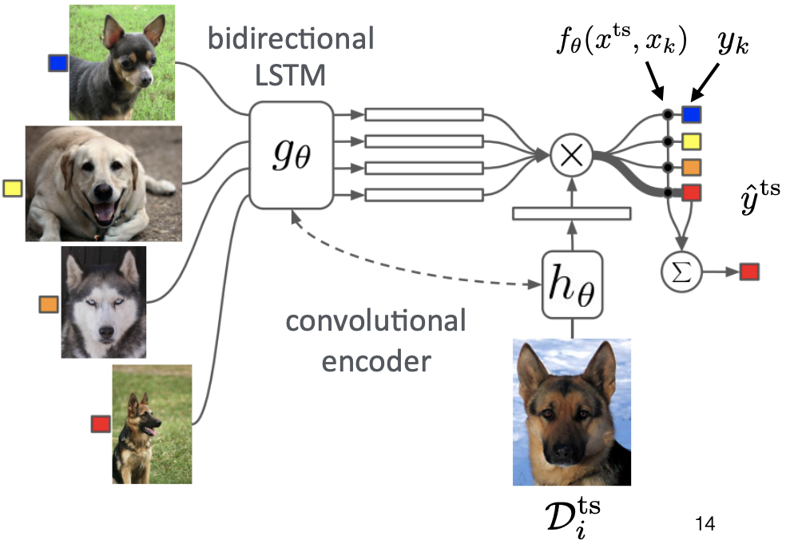
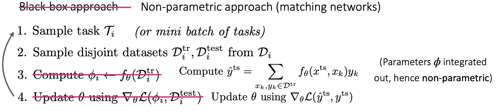
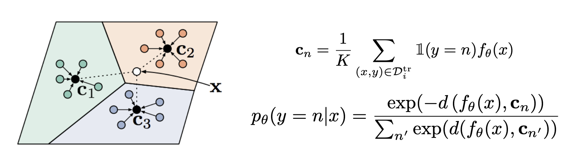

# CS330：Multi-task Learning&Meta Learning3

> Stanford CS330课程的Lecture6学习笔记，主要讲了少样本学习和度量学习的基本概念。

## 非参数化的少样本学习

​	  黑盒元学习方法本质上是将学习器用一个神经网络来进行参数化的表示，虽然笔记expressive但是会优化起来比较困难。基于优化的元学习方法本质上是对内部学习过程进行优化，将优化的结构嵌入到元学习器中，但是需要计算二阶梯度。这两种方法都是参数化的方法，即模型用一系列参数进行表示。本节课主要介绍的内容是少数据的(Low Data Regimes)的非参数化方法。

​	  非参数化的方法的核心思想是使用非参数化的学习器，比如图像分类问题可以使用将测试集和训练集图片进行比较的方法来完成图片的分类，而怎么确定比较的度量方式(metric)就成了关键的问题，我们常用的距离度量有L2距离，而元学习的方法可以让模型学习到如何比较不同图片之间的distance

### Siamese网络

一种Siamese网络的架构如下：

- 训练的时候是一个二分类问题，而测试的时候是一个N分类问题，测试的时候就是将测试集的图片和训练集中的所有图片进行比较。

### 匹配网络

​	  另一种度量学习的思路是将元训练和测试的过程融合到一起，用学习嵌入表示+K近邻的方式来进行图片的分类，模型的架构如下图所示：

该模型可以表示成：
$$
\bar y^{ts}=\sum_{x_k,y_k\in D^{tr}}f_{\theta}(x^{ts},x_k)y_k
$$
该模型的训练过程如下图所示：

但是这个模型依然需要测试集中的图片和每一个训练集中的图片向比较，我们是否可以给每个类用一个嵌入表示，然后在测试阶段只把测试数据和每个类的嵌入表示进行对比，就可以达到分类的目的

### Prototypical网络

- 将每个类都用一个Prototypical embedding表示，然后用softmax函数来计算测试数据属于每个类别的概率

## 元学习方法的比较

​	  元学习的三种方法， 黑盒学习，优化学习和非参数学习各有长短，我们可以通过表示能力，一致性(学到的元知识的有效性，即在测试数据集上的泛化能力)和对不确定性的感知能力等方面来评价方法的好坏。具体的对比如下：

| 方法               | 优点                                                         | 缺点                                            |
| ------------------ | ------------------------------------------------------------ | ----------------------------------------------- |
| Black-box          | 表示能力很强；容易将多种不同的学习问题相结合                 | 一致性比较差，优化比较困难，并且对数据效率低下  |
| Optimization-based | 一致性比较好，可以归结为梯度下降问题，在模型深度足够的时候表示能力很强，对大规模数据表示比较好，模型不可知 | 需要二阶优化，并且对计算和内存比较敏感          |
| Non-parametric     | 大部分架构的表示能力比较好，完全是前向传播的，不需要进行梯度优化，**训练比较快**，在特定场景下一致性比较好 | 对于比较大的K难以scalable，并且只能处理分类问题 |

## 常见的应用

- 使用少样本学习进行皮肤病诊断(因为皮肤病的数据量比较小，并且是长尾的)
- 使用少量样本进行模仿学习，用人类的视频作为训练集，让机器人学习一些基本动作，并且用teleoperated demonstration进行测试
- 低资源的分子性质预测

