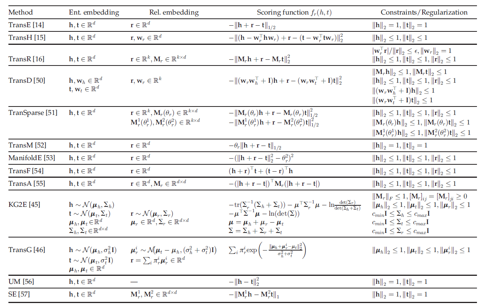
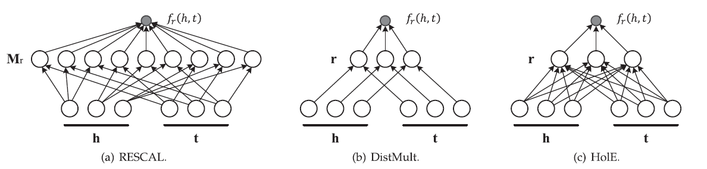
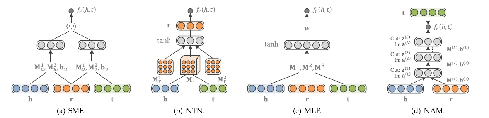

# 知识图谱1：知识图谱嵌入综述

> 知识图谱嵌入方向的文献综述《Knowledge Graph Embedding：A Survey of Approaches and Applications》的阅读笔记，包含对论文中关键表述的翻译和自己产生的一些体会。

## Introduction

​		知识图谱是一种包含了实体(Entity)和关系(Relation)的三元组，在语义解析、命名实体消解，信息抽取和自动问答中有广泛的应用。

​		知识图谱嵌入知识图谱研究的子方向，其目标是将知识图谱中的实体和关系嵌入到一个连续的向量空间中，而得到的这些嵌入向量可以被用在很多知识图谱的子任务中，比如知识图谱补全。

​		现有的很多嵌入技术都是基于观测到的事实(即**实体-关系-实体**这样一个三元组)进行的，对于一个给定的KG，会首先将实体和关系都表示在一个连续的向量空间中，然后定义一个**打分函数**来衡量每一个事实的合理性(Plausibility)，然后通过使得合理性最大化来学习到实体和关系的嵌入表示。

## 基于事实的知识图谱嵌入

​		当我们给定一个包含n个实体和m个关系的KG时，所有的事实facts可以用一个集合$\mathbb{D}^+=\left\{(h,r,t)\right\}$来表示，这里的h表示head，t表示tail而r表示relation，知识图谱的嵌入往往都需要用这些事实来作为评估的标准。

​		第一部分中已经提到一个典型的KG嵌入方法包含了以下三个步骤：

- 表示关系和实体
- 用打分函数评估
- 学习实体和关系的表示

而在打分函数的评估环节中，我们需要定义一个打分函数$f_r(h,t)$，并且这个打分函数需要让已经被观测到的的事实(即存在的三元组)获得尽可能高的分数而使得没有观测到的获得低分。

​		而KG嵌入的方式根据打分函数的不同可以分成平移距离模型(Translation Distance Model)和语义匹配模型(Semantic Matching Model)两种形式，下面会具体介绍两种不同形式的打分函数对应的嵌入模型的特点和区别。

### 平移距离模型

​		平移距离模型使用基于距离的打分函数，这类模型往往将“关系”视为从head嵌入向量到tail嵌入向量的平移，即需要让$h+r\rightarrow t$，而通过欧氏距离可以评估二者的相近程度。

#### TransE家族

##### TransE

​		TransE是最早也是最著名的平移距离模型，它将实体和关系都用d维空间中的向量来表示，并且希望学习到的嵌入向量满足$h+r\rightarrow t$，而其打分函数可以表示为：
$$
f_r(h,t)=-||h+r-t||_p
$$

- 这里的p一般可以是1或者2，并且希望对于已经观测到的事实三元组$(h,r,t)$要让打分函数的值尽可能高
- TransE的缺点在于只适合处理一对一的关系，而当知识图谱中出现一对多，多对一，多对多的关系的时候，使用这种算法学习到的嵌入向量的表示能力并不好

> 这种缺陷也很好解释，因为TransE将关系r表示成head和tail两个向量之间的“转移”，也就是head加上向量r可以变成和tail类似甚至是一样的向量，在一对一的关系中这种idea是没有问题的，但是在多对一，一对多和多对多的情况下，两个向量之间可能不能通过简单的线性的迁移就可以转换，这种时候TransE的idea就失效了。

##### 解决思路1：投影到新空间

​		要解决TransE存在的这个问题，一种可行的办法是在实体参与到不同的关系中时，将其投影到新的的空间中，TransH在此基础上使用超平面对原本的嵌入向量$h$进行投影，然后再使用TransE同样的方法使用打分函数评估其合理性，即：
$$
h_{\perp}=h-w_r^Thw_r\quad t_{\perp}=t-w_r^Ttw_r
$$
我们的目标是$h_{\perp}+r\rightarrow t_{\perp}$ 

​		此外，TransR提出为**关系建立一个专门的投影空间**，这时候实体都表示为d维的向量而关系都表示为k维的向量，在计算打分函数的时候需要先将实体的嵌入向量投影到关系r的空间中，即：
$$
h_{\perp}=M_rh\quad t_{\perp}=M_rt
$$
这里的投影矩阵$M_r$的维数是$d\times k$，因此参数量比较大。

​		TransD模型对TransR提出了一定的简化，将投影矩阵简化成了两个向量的乘积，并且实体中的head和tail分别使用不同的投影矩阵，使用了三个映射向量$w_h,w_t,w_r$来生成两个投影矩阵：
$$
M_r^1=w_rw_h^T+I,\quad M_r^2=w_rw_t^T+I
$$
相比于TransR而言需要的参数量减少了。而TransSparse用另一种方法对TransR进行了简化即将投影矩阵进行了稀疏化。

##### 解决思路2：放宽scoring的要求

​		而另一种解决TransE存在的问题的办法是放宽对于$h+r\rightarrow t$的要求，比如TransM中为每个关系r确定一个权重$\theta_r$，将可以能回一对多，多对一或者多对多的关系的权重参数设置的小一些。而TransF也采用了类似的策略，它不再要求$h+r\rightarrow t$而是希望$h+r$可以和$t$处于同一个方向上，因此它提出了新的打分函数：
$$
f_r(h,t)=(h+r)^Tt+(t-r)^Th
$$
​		TransA也是用类似的手段，并且引入了一个非负的对称矩阵$M_r$参与到打分函数中：
$$
f_r(h,t)=-(|h+r-t|)^TM_r(|h+r-t|)
$$

#### 高斯嵌入

​		基于高斯分布的嵌入方式是将head，tail和relation都看成是随机变量，并且使用一个高斯分布函数来表示其不确定性，因此我们有：
$$
t-h=\mathcal N(\mu_t-\mu_h,\Sigma_t+\Sigma_h)
$$
高斯嵌入的打分函数往往就通过比较$r=\mathcal N(\mu_r,\Sigma_r)$和t-h的距离来评估嵌入表示的合理性，比较著名的模型有KG2E

#### 总结

​		所有的基于平移距离的模型的信息(嵌入维数，打分函数和约束条件)可以用下面的表格来总结：

### 语义匹配度模型

​		语义匹配度模型通常使用基于相似度的打分函数，通过计算实体和关系在向量空间中的潜在语义匹配度来评估嵌入向量的plausibility

#### RESCAL系列模型

​		RESACAL系列模型是非常经典的语义匹配度模型，其中RESCAL模型使用一个参数矩阵M来计算语义匹配度，即：
$$
f_{r}(h, t)={h}^{\top} {M}_{r} {t}=\sum_{i=0}^{d-1} \sum_{j=0}^{d-1}\left[{M}_{r}\right]_{i j} \cdot[{h}]_{i} \cdot[{t}]_{j}
$$
而DistMult是对RESACAL的简化和改进，使用一个对角向量来计算打分函数，即：
$$
f_{r}(h, t)={h}^{\top} \operatorname{diag}({r}) {t}=\sum_{i=0}^{d-1}[{r}]_{i} \cdot[{h}]_{i} \cdot[{t}]_{i}
$$

而HolE即保留了RESACAL的表示能力，也和DistMult一样效率高而简单，它定义了一种循环式的计算方式：
$$
f_{r}(h, t)=\mathbf{r}^{\top}(\mathbf{h} \star \mathbf{t})=\sum_{i=0}^{d-1}[\mathbf{r}]_{i} \sum_{k=0}^{d-1}[\mathbf{h}]_{k} \cdot[\mathbf{t}]_{(k+i) \bmod d}
$$
另外还可以使用复数进行嵌入表示，即用复向量来表示实体和关系

#### 基于神经网络的模型

​		使用神经网络来评估语义匹配度也是一种非常常见的方法，语义匹配能量模型(SME)使用神经网络的架构，首先在输入层中将实体和关系映射到嵌入空间中，然后通过一系列神经网络层的线性变换之后计算其点积作为score，即：
$$
f_{r}(h, t)=g_{u}(\mathbf{h}, \mathbf{r})^{\top} g_{v}(\mathbf{t}, \mathbf{r})
$$

​		神经张量模型(NTN)是另一种神经网络架构，每一个关系r都有一个对应的张量$M_r$将输入的head和tail投影到隐层中，其打分函数比较复杂：
$$
f_{r}(h, t)=\mathbf{r}^{\top} \tanh \left(\mathbf{h}^{\top} \underline{\mathbf{M}}_{r} \mathbf{t}+\mathbf{M}_{r}^{1} \mathbf{h}+\mathbf{M}_{r}^{2} \mathbf{t}+\mathbf{b}_{r}\right)
$$
​		多层感知机(MLP)也是一种非常常见的神经网络架构，并且在将每个关系对应一个张量简化成了每个关系对应一个向量，减少了参数量：
$$
f_{r}(h, t)=\mathbf{w}^{\top} \tanh \left(\mathbf{M}^{1} \mathbf{h}+\mathbf{M}^{2} \mathbf{r}+\mathbf{M}^{3} \mathbf{t}\right)
$$
​		神经联合模型(NAM)使用**深度**神经网络进行语义匹配度的计算，即使用了很多隐层，每一层都使用ReLU作为激活函数。上面提到的这几种神经网络模型可以用下面的图来总结：

### 模型的训练

### 模型的比较

### 其他的嵌入方法

## 基于额外信息的嵌入