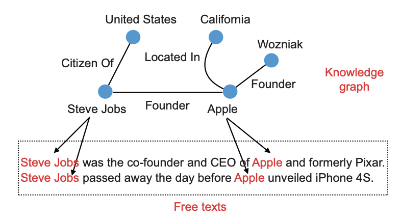

# 论文阅读笔记2：关系抽取文献综述

> 文献综述《A survey on neural relation extraction》的阅读笔记

## Introduction

​		关系抽取是知识图谱构建和自然语言处理中的一个关键任务，其目标是**从文本中抽取出实体之间的有意义的关系信息**。知识图谱是一种知识的表示形式，也叫做知识库(Knowledge Base)，可以提供结构化的寓意信息，又一系列的实体和对应的关系组成，而构建一个知识图谱往往有三种不同的方法，分别是：

- 专家提供注解，即依赖于专家系统
- 采用众包(Crowd-source)的方式构建知识图谱
- 从半结构化的数据中抽取出实体-关系-实体的三元组

​		因此关系抽取在知识图谱构建中有着非常重要的作用，而在抽取过程中，有几个必须经历的环节：实体识别、实体消歧(disambiguation)、关系抽取、事件抽取和事件预测，而这篇论文的主要内容就是在讨论关系抽取的研究进展。

​		传统的关系抽取方法往往着眼于特征工程，即手动构造各种各样的特征来完成信息抽取，这是一种符号化的表示，然而其最大的问题是语意间隙(semantic gaps，意思是存在一词多义，歧义的问题)的存在，一个单词往往有多种意思，而手动构造的特征中只能代表一个意思。而随着深度学习的发展，深度学习模型可以自动学习分布式的特征表示，有了分布式的特征表示，原本的符号匹配就变成了一些代表了分布式表示的向量的操作，这给关系抽取带来了新的进步。

> 这里的分布式表示的核心思想是：一个单词的意思是由其周围的单词决定的，因此同一个单词在文本的不同位置上所代表的意思可能不同，这也是深度学习模型和传统方法的重大区别。

## Preliminares

### 关系抽取的任务分类

​	关系抽取的主要任务是从文本中抽取实体之间的语义联系，而根据输入数据格式的不同，关系抽取又可以分为以下三个类别：

- 句子级别的关系抽取：目标是从一个句子中抽取出关系
- 文档级别的关系抽取：从一篇文档中(多个句子)抽取关系，这意味着一个关系的实体可能分布在不同的句子之间，但我们不知道目标位置是哪里
- 语料库级别的关系抽取：根据语料库中多篇文档给出的evidence，来推断实体之间的关系

​	另外根据需要抽取的关系类型，关系抽取又可以分为预定义的关系抽取和开放式的关系抽取，预定义的关系抽取只需要抽取预先定义的关系，而开放式的关系抽取需要从文本中自行寻找关系。

### 数据集和评价标准

​	关系抽取中常用的数据集有ACE数据集(文档级)，SemEval2010(句子级)，TACRED，CoNLL2004，NYT，GIDS，WebNLG，FewRel等等。

​	关系抽取任务的评价标准往往次啊用查准率，召回率和F1-score等，因为要直接衡量输出结果和真实数据的关系比较困难，因此往往采用比较topN的准确率来进评估关系抽取的结果。

## 关系抽取的挑战

​		这篇论文主要目标是介绍预先定义好的关系抽取任务，这类任务可以转化成一种分类任务，而其目前面临的主要挑战有：

- 如何从给定的文本中学习语义表示？早期的统计自然语言处理往往通过语义分析、语法分析和kernel-based method来建立语义的表示，而随着深度学习的发展，使用CNN，RNN，GNN等结构来学习语义表示也变得非常流行，同时也有了基于注意力机制的方法。
- 如何在标签不足的情况下训练模型？因为关系抽取的数据集往往是文本，而给文本进行标注是比较困难而昂贵的，这也决定了关系抽取模型的训练需要使用**弱监督**的方法，在弱监督关系抽取中，往往只提供一个很小的知识库，在此基础上，模型会结合一些启发式的规则自动地对文本中的实例进行重新标注，这种过程也叫做距离监督。同时当前也有一些研究使用一些额外的知识然后将关系抽取问题转化成一个少样本的学习问题。
- 如何抽取跨句子/文档的N元关系？当前的研究往往着眼于抽取单个句子中的关系，无论具体的任务是句子抽取还是文本抽取，这样的方法往往不能抽取出跨句子的N元关系，这类问题可以使用基于图的方法来解决。
- 如何同时抽取出关系和实体，关系抽取是知识抽取的一个子任务，往往需要先从给定的文本中抽取出实体，然后再根据实体抽取出对应的关系，但这样的pipeline往往会引发错误的累积导致抽取效果变差

## 用于关系抽取的神经网络模型

### CNN

​	  CNN结构用在关系抽取问题中时，首先需要**获取单词语义表示**，每个单词token都用一个稠密向量来表示，包括词嵌入和位置编码两个部分，词嵌入式单词token的低维表示，可以从大规模的文本中进行预训练得到，而位置编码是一个低维度的用来表示单词位置的向量，将二者进行拼接之后可以得到单词token的语义表示。

​	  第二步是进行卷积运算，需要定义卷积核和bias，然后将得到的结果进行池化操作，往往采用的是最大池化。而最后一步是分类和输出，通过一个softmax函数得到一个概率分布，并用预测最终的结果。

​      在池化的过程中直接使用最大池化可能会导致特征的丢失，因此可以采取分段池化的方式，同时CNN也可以使用注意力机制，注意力用来决定一个句子中的哪一部分是最值得关注的。

### RNN和LSTM

​	 LSTM被广泛用在关系抽取中，并且可以避免RNN存在的梯度消失和梯度爆炸的问题，LSTM是一种有门控单元的RNN，可以捕捉到长距离的依赖关系。双向LSTM(BLSTM)在此基础上可以从两个方向分别捕捉到句子中的依赖关系。

​	LSTM的使用方式多种多样，有在语法树上使用的，有上下文感知的LSTM也有嵌套LSTM等等。

### 基于注意力的算法

​	  注意力机制可以学习输入内容的重要性分布情况并且被证明有比较广泛的用途，比如机器翻译和自动问答，而在关系抽取中，很明显一个句子中的单词对于一个描述一个关系而言不是一样重要的，有的单词对于描述这个关系特别关键而有的单词就不那么关键，因此注意力机制可以在关系抽取问题中work，而Transformer因为其**自注意力机制**和衍生出的预训练模型BERT，也在关系抽取中得以应用。

### GNN

​	这部分不看了，写的没多大意思。

## 使用缺陷数据来进行关系抽取

​		前面已经提到在很多关系抽取的场景下，训练数据往往是有缺陷的(insufficient),其中存在的很多长尾关系难以被标注，并且各种各样的关系数量也十分庞大。解决这个问题主要有这样几种办法：

- 使用弱监督学习自动生成训练数据
- 使用额外的知识
- 探索出更有效的学习模型，比如少样本学习和对抗学习，需要在小数据集上可以取得比较好的效果

### 基于弱监督学习的方法

​	  弱监督学习的目标是从训练集中自动生成带标签的数据，大多数方法使用给定知识库中非常有限的三元组和一系列逻辑规则从文本中抽取信息，这个过程也叫做过程监督(Distant Supervision)，但是实际的样本中可能会有噪声，一个包含两个实体的句子中可能不包含其关系。

#### 生成训练数据

​	Mintz提出了一种自动化对齐知识库的范式，他们认为如果两个实体有对应的关系，那么所有包含这两个实体的句子都会表述这个关系，我们可以把所有包含了这个实体对的句子称为一个包(bag)，对于一个实体对，就要使用这个bag作为其训练数据。

#### 基于噪声数据训练

​	  当然很多时候得到的bag中可能有一些噪声样本，也就是包含了实体对而没有描述其关系的，这种样本被称为false positive样本，这些样本被视为是噪声，为了缓解这个问题，可以采取以下策略：

##### 多距离学习

​	  基于多距离学习的关系抽取有一个很重要的“至少一个”假设，这个假设认为bag中至少有一个表达了实体对之间关系的句子，在这种假设的基础上使用神经网络模型(比如PCNN)从bag中的各个句子中学习到句子的嵌入表示，然后从其中选择出最有可能表达了正确关系的一句作为样本，而剩下的句子就被忽略不作为真正的训练样本，可以表示为：
$$
j^{*}=\arg \max _{j} p\left(y_{i} \mid m_{i}^{j} ; \theta\right)
$$

##### 注意力方法

​	  多距离学习的方法会损失很多样本信息(因为有很多表示了正确关系的信息也在这个过程中被丢掉了)，而基于注意力机制的方法提供了一种对bag中的实例样本分配不同的权重的方法，并且让true positive的样本获得更高的权重，而噪声样本会得到更低的权重。

​	  这种注意力模型分为两个步骤，分别是句子编码器和注意力计算，句子编码器会使用神经网络模型先得到一个句子的分布式表示，并得到一个bag的若干句子的表示向量组成的集合$S=\left\{x_1,x_2,\dots,x_n\right\}$，而最终的整个bag的表示可以用一个加权和来表示：
$$
s=\sum_{i=1}^n\alpha_ix_i
$$
这里的$\alpha_i$就是注意力机制为每个句子生成的一个权重，其计算方式是：
$$
e_i=x_iAr，\quad \alpha_i=\mathrm {softmax}(e_i)
$$
这里的A是一个对角矩阵而r是一个和关系r有关的查询向量，之后可以将bag的嵌入表示s做线性变换并最终生成一系列条件概率来判断集合S中包含了关系r的概率，并进行关系抽取工作。

##### 强化学习

​	  这一部分不关注了，自己也没接触过强化学习，总之就是让使用强化学习让模型学会对噪声样本进行滤波。

##### 对抗学习

​	  基于对抗学习的方法首先使用一个句子级的true-positive样本生成器来生成一系列true-positive的样本，然后将它们作为负样本来训练一个判别器，当判别器的表现性能有显著下降的时候就对生成器进行优化，然后使用生成器来去除错误标注的数据。

##### 其他弱监督方法

​	  还有很对其他的弱监督方法，暂时不关注了。

### 使用额外知识

​	  使用额外的知识是处理缺少标注的数据的另一种方法，在额外知识的帮助下语义表示的学习可以更精确地学习到。一种方法是不使用关系标签，即label-free的距离监督方法，这种方法只使用一些KG中得到的先验知识来监督学习的过程，典型的代表是TransE模型，使用$t-h$作为监督信号来学习关系$r$，这类模型充分利用了KG中的实体类型的信息。

​	  长尾关系也是一种重要的额外知识，某篇论文中提出了一种利用head中数据丰富的类别来提升tail中的数据缺失的类别，他们首先通过GCN模型，使用标签中的隐式的关系知识来学习出显式的关系知识表示，然后将它们集成到一个关系抽取模型中，并使用coarse-to-fine注意力机制来完成关系抽取。

​	  为了学习已经存在的知识图谱中的信息，Han等人的论文中提出了一种同时表示知识和关系抽取的学习框架，将知识图谱和文本嵌入到了同一个语义空间中，并使用一种共同注意力机制。

### 少样本学习

​	  少样本学习是一种使用少量样本进行学习的任务，Han的论文中提出关系分类，特别是长尾关系的分类是一种少样本的学习任务，并且他们在论文中公布了一个FewRel数据集，这个数据集是众包完成的，包含70000条句子和100个关系，而少样本学习中还要处理噪声样本的问题，Gao等人提出了一种基于注意力的混合原型网络(hybrid prototypical networks)，这个模型将所有的实例嵌入到一个支持集中并且对每个关系都计算出一个特征向量，并且采用了实例级别和特征级别的混合注意力机制来选择包含了更多有价值信息的实例和特征维度。

