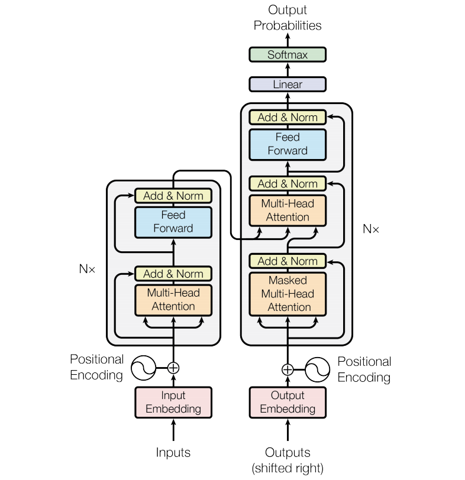
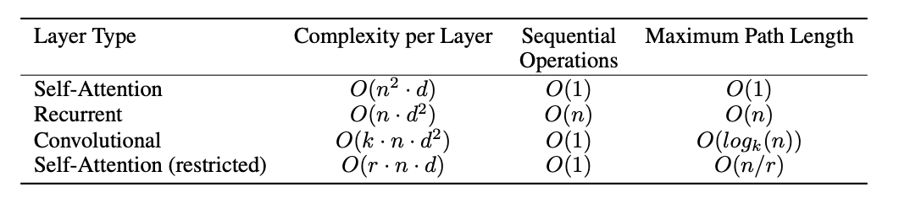

# 论文阅读笔记3：Transformer

> 经典论文《Attention Is All You Need》阅读笔记，该论文中提出了自注意力机制和Transformer模型

## Introduce

​	  主流的序列转换模型往往使用复杂的循环的卷积网络，并且是**编码器-解码器**的架构，而表现性能好的模型往往还使用注意力机制，这片论文中提供了一个简单的网络架构，被称为Transformer，这种网络架构只使用了注意力机制而放弃使用循环单元和卷积单元，通过注意力机制达到了对**序列中的全局依赖的刻画**。

## 背景

​	  减少序列计算量和加速计算是序列处理模型中非常基本的想法，像ByteNet和ConvS2S就是使用卷积神经网络作为单元进行并行计算的，这些模型中，计算量和序列中位置的距离有很大的关系，对于ConvS2S中是线性的而在ByteNet是对数级别的，这使得长距离的关系学习变得尤为困难，而在Transformer中这个过程被减少到了一个常数的规模，尽管这降低了有效分分辨率，这得益于Transformer中提出的多头注意力机制。

​	  自注意力机制是一种对一个序列的**不同位置分配不同的权重**，并学习到一个表示向量的方式，自注意力机制已经被用到了很多任务中，比如阅读理解，文本摘要等等，并且取得了很好的效果。端到端的记忆力网络往往都基于循环注意力机制并且已经在简单语言翻译等任务中得到了使用。

​	  而Transformer模型中首次实现了仅依赖于注意力机制的网络架构而不是使用卷积单元和循环单元，这一部分的工作将在后面重点介绍。

> 其实背景中扯了一大堆主要就是说Transformer的突破性在何处，没有什么别的阅读价值，反正我也没怎么看懂有些内容在说什么。

## 模型架构

​	  Transformer中沿用了非常经典的编码器和解码器架构，解码器将输入的序列转化成一个表示向量，而编码器将向量转化成对应的输出结果，并且在每个步骤中模型都是自回归的，也就是使用前面生成的符号作为输入来生成后面的内容(这和序列的特性也有关系，序列后面的内容往往和序列前面的有一定的联系)，同时Transformer模型使用了层级化的自注意力机制和point-wise的全连接层，其大致的架构如下图所示：

### 编码器和解码器

#### 编码器

​	  Transformer模型中的编码器采取了层级化架构，一共使用了N=6个编码器，每个编码器包含两个子层，分别是多头注意力层和一个全连接层的前馈网络，同时每一个编码器的每一个子层中使用了**残差连接和标准化**，也就是说假设每一层的输入是x，那么每一层的输出结果可以表示为：
$$
\mathrm{LayerNorm}(x+\mathrm{SubLayer}(x))
$$

- SubLayer是当前子层的运算函数，比如注意力运算和全连接运算
- 残差连接和标准化都是为了**防止模型过拟合**，提高模型的泛化性能
- Transformer模型中所有的向量的维数都是512

#### 解码器

​	  Transformer中的解码器也采用了层级化的架构，一共使用了N=6个解码器，并且每个解码器包含三个子层，其中的**新增的多头注意力层**会对**编码器层输入解码器的表示向量**进行注意力的计算，而原本的多头注意力层需要加上mask，因为在预测生成结果的过程中，不能让前面的东西感知到后面(还没生成)的东西的存在，这就是mask的作用，这样一来解码器层的注意力只能集中在已知的内容中。

### 注意力机制

​	  注意力机制总结下来就是对一系列的query和一系列的key-value对，我们需要确定对于每个query而言不同value的重要程度，而这个权重是根据query和key的相关度计算得到的。

#### 按比例的点积注意力机制Scaled Dot-product Attention

​	  Transformer模型中使用的是按比例缩小的点积注意力机制，注意力计算需要维度$d_k$的query和key以及维度$d_v$的value，然后在传统的注意力机制运算方式基础上加上一个**规模参数**$\sqrt {d_k}$ ，我们用向量化的方式可以将这种注意力机制的计算过程表示成：
$$
\operatorname{Attention}(Q, K, V)=\operatorname{softmax}\left(\frac{Q K^{T}}{\sqrt{d_{k}}}\right) V
$$
点击运算的方式相比其他方法而言运算速度要快很多，而规模参数是为了控制注意力计算的值的规模，防止器过大，对于比较小的$d_k$而言注意力计算结果不是很大，而对于比较大的$d_k$可以有效控制softmax函数的运算结果在一个合理的范围内(因为softmax函数中的指数运算增长速度非常快，如果不控制容易出现计算得到的权重一个特别大，而其他的接近0这样的情况)

#### 多头注意力机制Multi-head Attention

​	  Transformer采用了多头注意力机制，这种机制将query，key和value都进行h次投影，然后对h个投影进行并行的注意力计算，最后将h个投影组合之后进行线性投影生成最后的多头注意力机制。多头注意力机制允许Transformer在不同的表示空间中得到不同的注意力学习到不同的信息。多头注意力机制最终的结果可表示成：
$$
\operatorname{MultiHead}(Q, K, V)=\text {Concat}\left(\text { head }_{1}, \ldots, \text { head }_{\mathrm{h}}\right) W^{O}
$$
而每一个head中的注意力的计算方式可以表示成：
$$
\text { head }_{\mathrm{i}}=\operatorname{Attention}\left(Q W_{i}^{Q}, K W_{i}^{K}, V W_{i}^{V}\right)
$$
在多头注意力的计算过程中每个参数的规模如下：$W_{i}^{Q} \in \mathbb{R}^{d_{\text {model }} \times d_{k}}, W_{i}^{K} \in \mathbb{R}^{d_{\text {model }} \times d_{k}}, W_{i}^{V} \in \mathbb{R}^{d_{\text {model }} \times d_{v}}$而最终输出的结果$W^{O} \in \mathbb{R}^{h d_{v} \times d_{\text {model }}}$，而Transformer中一般有h=8个不同的“头”，这样一来每个头的query，key和value的的维度都是64(因为输入的嵌入向量是512维度，要拆成8个头)

#### Transformer中注意力的应用

- 在解码器的“编码器-解码器注意力层”中，query是来自上一个解码器层的，而key和value是来自于编码器的输出，这使得解码器中的每一个位置可以可以参与到输入序列所有位置的注意力计算上面。
- 在编码器中包含了自注意力层，这时候的key，value和query都是同源的
- 解码器中的自注意力层的key，value和query也是同源的，但是需要**加上一个mask**防止序列前面的内容被后面的内容所影响

### Position-wise前馈神经网络

​	  Transformer中的Position-wise全连接层包含**两个线性变换层**，并使用ReLU函数作为激活函数，其运算过程可以表示为：
$$
FFN(x)=\max (0, xW_1+b_1)W_2+b_2
$$
每个层之间的参数是单独的，也可以看成是一种kernel size为1的卷积，输入的x维度是512而内层的维度是2048

### 嵌入和softmax

​	  和其他的序列转换模型一样，Transformer也对输入的token进行嵌入，并用$d_{model}$嵌入向量，同时也会使用学习到的参数对解码器中的输出进行线性变换，并通过softmax函数生成一个概率分布，以此来预测下一个token的概率，在Transformer模型中**两个嵌入层和softmax层之前的的线性变换层的参数是共享的**，同时在嵌入层这些权重还要除以一个规模参数

### 位置编码

​	  尽管Transformer模型中没有循环和卷积单元，为了充分利用序列的信息，我们必须在嵌入向量中注入一些和位置有关的信息，因此本论文提出了一种位置编码的idea，通过在嵌入向量中加入位置编码的方式来保留一些位置特征，在Transformer中的位置编码使用了sin函数和cos函数，即：
$$
P E_{(p o s, 2 i)} =\sin \left(p o s / 10000^{2 i / d_{\text {model }}}\right) \\
$$

$$
P E_{(p o s, 2 i+1)} =\cos \left(p o s / 10000^{2 i / d_{\text {model }}}\right)
$$

这里的pos表示位置而i表示维度，也就是对于位于pos位置的token的嵌入向量第i维加上这样一个值。

## 为什么使用self-attention

​	  论文中比较了使用自注意力，循环单元和卷积单元等多种不同方式下的计算量，时间复杂度和最大依赖路径长度，结果如下：

​	  可以说学习长距离的依赖关系是很多序列问题中的关键挑战，而影响长距离依赖的一个关键因素就是模型中单元的**信号能够在模型中传播的步长**(比如RNN中的隐层会在整个后面的序列中都进行传递)，而这个路径越短则学习到长距离依赖的能力越强，因此论文中也对任意两个输入输出位置中的最大路径长度进行了对比。

- 我觉得这里的path可以理解为，为了捕获长距离的依赖而需要进行一个信息传递的过程，而两个位置之间的信息传递越直接(即消息传递的path越短)，能够捕捉到的长距离依赖就越多。
- 而在RNN中，因为隐层之间的信息是逐渐向下传递的，所以从全局来看，两个位置之间的最长消息传递path的长度是n级别的，而Transformer中因为自注意力机制直接将每个位置和所有的位置进行了注意力的计算，这就省略了RNN中一步步向下传递的过程，因此可以捕捉到非常多的长距离依赖信息
- 这样一来Transformer凭借其独特的注意力机制从传统模型中脱颖而出，实现了论文的标题：Attention is all you need

## 训练

​	  论文中训练模型有几个值得注意的点，一个是优化器，另一个是正则化的一些操作

### 优化器

​	  模型的训练使用了Adam优化器，并且设置了$\beta_1=0.9,\beta_2=0.98,\epsilon=10^{-9}$并且使用了一种自适应的学习率，其计算方式为：
$$
lr=d_{model}^{-0.5}\times \min(step^{-0.5},step*warm\_up\_steps^{-1.5})
$$
这样的自适应学习率可以使得训练初期的学习率线性提升，而训练后期的学习率逐渐下降

### 正则化

​	  Transformer中用到的正则化主要是使用了三种方式，分别是残差连接，dropout和标签平滑处理，残差连接前面已经提到过了，而dropout则是在嵌入向量和位置编码相加的那一层进行，这里选择的dropout概率是0.1

​	  而标签平滑处理可以让BLUE评价分数变高。

