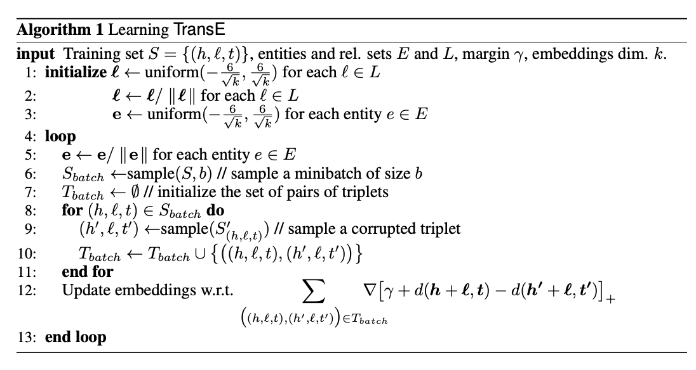
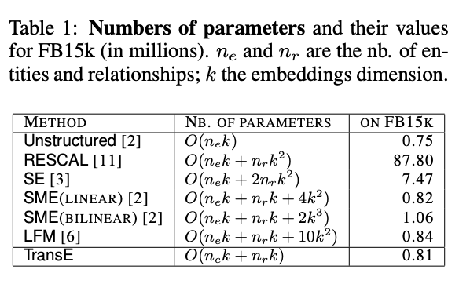

# 论文阅读笔记5：TransE

> 论文《Translating Embeddings for Modeling Multi-Realtional Data》阅读笔记

## 老生常谈的Introduction

​		将关系和实体用低维向量进行表示是一个很常见的问题(这个时候知识图谱的概念还没有提出)，而关系和实体可以使用一个三元组`(head, realtion, tail)`来表示，而在多关系的数据中，关系可能有很多个并且是异构的，这个时候传统的方法就不太好用了。

​		这篇论文中提出了一种基于Translation(转化)的思想，首先将一系列实体表示成向量空间中的一系列向量，然后将**relation看成是从head到tail的一种translation**，这样的方法可以大幅度减少参数的规模，并在处理一对一的关系中取得了非常好的表现，但是在处理一对多，多对一和多对多的关系中表现并不好，因为TransE模型中只把关系和实体都表示成一个向量，所以不好表示含多个实体的关系。

## Trans模型的具体描述

### 基本的定义

​		假设训练集S包含一系列三元组$(h,l,t)$，所有的实体组成集合E而所有的关系组成集合L，模型的目标就是去学习到一系列实体和关系的嵌入表示，并且要使得$h+l\approx t$，并且在基于能量的框架下，能量可以使用一个有关三元组的函数$d(h+l, t)$，而能量函数d一般是在d维度空间中衡量向量的不相似度的函数，往往采用L1或者L2范数。

### 学习的目标

​		为了学习到满足$h+l\approx t$的嵌入表示，TransE提出的目标函数采用了如下这种基于margin的形式：
$$
\mathcal{L}=\sum_{(h, \ell, t) \in S} \sum_{\left(h^{\prime}, \ell, t^{\prime}\right) \in S_{(h, \ell, t)}^{\prime}}\left[\gamma+d(\boldsymbol{h}+\boldsymbol{\ell}, \boldsymbol{t})-d\left(\boldsymbol{h}^{\prime}+\boldsymbol{\ell}, \boldsymbol{t}^{\prime}\right)\right]_{+}
$$
其中$[x]_+$表示向量x中的正数部分，并且$\gamma>0$是一个margin超参数，并且：
$$
S_{(h, \ell, t)}^{\prime}=\left\{\left(h^{\prime}, \ell, t\right) \mid h^{\prime} \in E\right\} \cup\left\{\left(h, \ell, t^{\prime}\right) \mid t^{\prime} \in E\right\}
$$
是一个**负采样集合**，是将训练集中的三元组改变其head或者tail生成一个坏样本产生的，并且损失函数希望正常样本的能量要比坏样本的能量要低，因此负采样起到了这样一种监督作用，同时学习过程中的优化采用SGD完成。

### 具体算法

​		TransE模型的具体算法如下：

- 首先按照一定的方式对参数进行初始化，然后开始不断的迭代优化过程
- 每一轮迭代过程中，首先要将实体的嵌入向量标准化，然后使用采样的一小批三元组进行训练，训练的过程中首先需要给每个三元组生成一个负样本，然后使用常数学习率更新参数

## 相关工作比较和metric选取

### 相关模型的比较

​		相比于其他已经存在的模型，TransE的参数亮可以说少的离谱，我们假设实体和关系都使用k维的向量来表示，则各个模型的参数量对比如下：

​		参数少使得TransE的训练变得简单，可以避免欠拟合的问题(即因为数据太少而不够学)，

### metric的选取

​		之前讲到$d(h+l,t)$可以选择L1范数或者L2范数，而这片paper中使用的就是L2范数，即：
$$
d(\boldsymbol{h}+\boldsymbol{\ell}, \boldsymbol{t})=\|\boldsymbol{h}\|_{2}^{2}+\|\boldsymbol{\ell}\|_{2}^{2}+\|\boldsymbol{t}\|_{2}^{2}-2\left(\boldsymbol{h}^{T} \boldsymbol{t}+\boldsymbol{\ell}^{T}(\boldsymbol{t}-\boldsymbol{h})\right)
$$
注意到算法中我们将向量都进行了标准化，因此h和t的L2范数都是1，而l在一对正负样本的比较之间不起任何作用，因此只需要考虑$\boldsymbol{h}^{T} \boldsymbol{t}+\boldsymbol{\ell}^{T}(\boldsymbol{t}-\boldsymbol{h})$就可以

### 缺点与不足

​		TransE模型的实体和关系都只用了一个向量进行表示，而这样的表示方式在涉及到一对多，多对一，多对多的场景下学习的效果就不太好

## 实验

​	   TransE论文中对wordnet和Freebase等数据集上进行了一系列实验，并在链接预测等任务中和一系列baseline进行了比较。具体的就不关注了，反正就是TransE很强(2013年限定)

