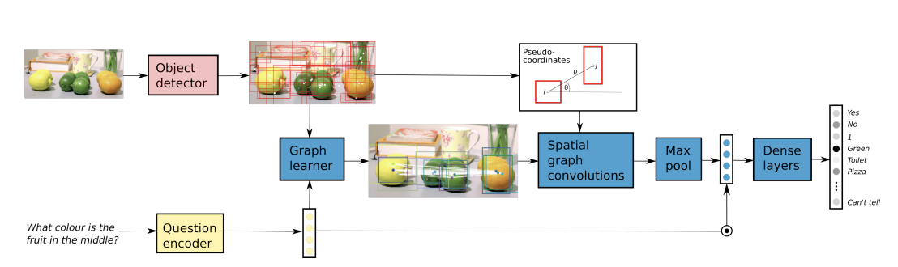

# 论文阅读笔记7：GraphVQA

## Introduction

​	  可视问答(VQA)是一个人工智能领域很热门的topic，需要对于一张给定的图片和问题生成对应的回答，而这个问题的难点在于它是一个结合了计算机视觉和自然语言处理的交叉任务，需要同时处理图像和文本数据。而这个问题**本质上是一个分类问题**，我们要做的就是在一个有限的答案集合中寻找到合适的答案。

​	  大多数现有的VQA都是使用一种“二流混合”策略，也就是独立地学习出图像和问题的嵌入表示(分别利用CNN和词嵌入想逛的模型)，然后将它们混合得到一个嵌入表示，使用这个嵌入表示来预测最终的答案，混合的方法往往是采用求点积和双向池化等，也有将注意力机制引入其中的模型。

​	  而随着深度学习的发展，计算机视觉领域的工作希望能够学习到更高级别的图片表示方法，一种基于目标检测的方法就被提出了，首先使用目标检测模型检测出图像中的所有目标，然后针对这些目标来生成图像的特征表示，而不是使用一个作用于全图的卷积层。本论文中就将这种方法应用到了VQA任务中。

## 本文的contribution

​	  一个很直观的想法是，VQA任务中，图中的各个物体以及其空间位置关系对问题的答案往往有很大的影响，而这些对象之间的关系可以用图结构来描述，因此本论文中提出中了一种可解释性好并且使用了图结构和图神经网络的VQA模型，解决了传统的VQA方法将图片和文本割裂，没有做对象和场景之间的好语义匹配等问题。

​	  在本文提出的模型中，首先对输入的图像进行了对象检测，将检测结果用框标注，然后将一个框中的对象作为一个图的节点，根据词嵌入表示和图节点的对应关系生成一张图的邻接矩阵，并据此使用图神经网络来得到图像的嵌入表示，最后再和问题中学到的问题嵌入向量混合，预测最终的结果，具体的模型可以用下图来表示：

## 模型的细节

### 输入数据的处理

​	  本模型中输入数据的处理采用和很多经典VQA方法相似的手段，使用预训练好的词向量来表示输入的问题中的每一个词语，并使用门控循环单元(GRU)来学习出**整个输入问题的嵌入向量**$q$，而对于图片则使用一个对象检测器来检测出图中的对象，用框对其进行标注，然后使用图学习器来学习出每个框中对象的嵌入表示，最后将其聚合成一个总的图像嵌入。

### 图学习器

​	  图学习器的设计是本论文中最重要的一个contribution，这个图学习器可以将图像中检测出的一系列目标表示成一个图，并计算其邻接矩阵。我们的目标就是根据**输入问题中包含的条件与对象特征的相似度**来学习出对象之间的关系并用图中的边来表示，最终得到一个无向的图结构，我们可以首先将问题的嵌入表示$q$和对象的特征$v_m$进行组合并得到一个联合嵌入，即：
$$
e_n=F([w_n||q])
$$
这里的函数F是一个非线性的函数，然后我们可以用$A=EE^T$的方式来得到一个邻接矩阵。这种方法可能导致生成的邻接矩阵过密，而VQA往往只需要少量关系就可以解决，因此可以对矩阵A的每一行取top-m，只保留权重最大的m条边，这样就可以得到一个相对而言比较稀疏的邻接矩阵。

### 空间图卷积

​	  论文中提出了使用空间图卷积的方式来学习出给定图的特征表示，这是因为VQA问题中的答案往往跟图像中各个对象的空间结构有一定的关系，因此使用基于空间结构的图卷积网络效果较好。在本文使用的空间图卷积中网络中使用了一种伪坐标函数$u(i,j)$表示以i为中心时候j的坐标，并且采用了极坐标的形式来表示，然后将坐标输入到高斯核中，并且定义了一种patch算子，计算方式如下：
$$
\mathbf{f}_{k}(i)=\sum_{j \in \mathcal{N}(i)} w_{k}(\mathbf{u}(i, j)) \mathbf{v}_{j}, \quad k=1,2, \ldots, K
$$
这实际上是对邻居节点特征的一种加权和，同时论文中对这个特征学习方式进行了以进一步的调整，给它加上了依据边的特性产生的权重$\alpha_{ij}$，即：
$$
\mathbf{f}_{k}(i)=\sum_{j \in \mathcal{N}(i)} w_{k}(\mathbf{u}(i, j)) \mathbf{v}_{j}\alpha_{ij}
$$
这里的权重是根据邻接矩阵A计算得到的，而对K个不同的kernel计算得到的结果进行合并就可以得到最终的图像的嵌入表示。
$$
\mathbf{h}_{i}=\prod_{k=1}^{K} \mathbf{G}_{k} \mathbf{f}_{k}(i)
$$
这里的$h_i$表示第i个节点的嵌入表示，将所有节点的嵌入表示组合成矩阵就是整张图像的嵌入表示H

### 预测层

​	  在通过L个时空图卷积层提取出了图片的图表示特征H之后，模型对矩阵H进行了最大池化输入并和问题的嵌入q进行一定的组合(论文中使用的是逐点相乘的点积)，之后通过一个使用ReLU函数作为激活层的全连接神经网络来完成最终结果的预测(相当于完成了一个分类任务)

### 损失函数和输出结果

​	  因为VQA的本质是一个多分类问题，因此最后一层使用了softmax函数对预测结果进行了归一化，并和选择其中概率最大的答案作为输出结果，而和其他的多分类问题类似，本模型中也选用了交叉熵作为损失函数，其具体的形式为：
$$
L(t,y)=\sum_{t_i\in t}t_i\log(\frac{1}{1+\exp(-y_i)})+(1-t_i)\log(\frac{\exp(-y_i)}{1+-\exp(-y_i)})
$$
这里的$t_i$表示每个答案对应的权重，而y是模型的输出结果。

