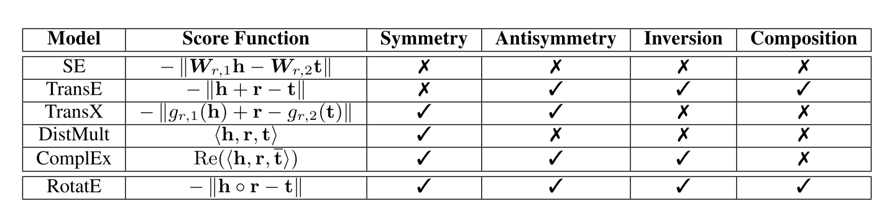

# 论文阅读笔记8：RotatE

> 知识图谱嵌入相关的论文RotateE的阅读笔记，这次的阅读笔记尝试按照和论文叙述方式不同的逻辑顺序进行记录。

## 本文的Contribution

​	  该论文是发表在2019年的ICLR上的一篇论文，提出了在复数空间中表示知识图谱中的实体和关系的方法，并且解决了已有的知识图谱嵌入算法不能完全表示对成/反对称/可逆/组合等关系模式的问题。

## RotatE的提出

### 知识图谱的关系模式

​	  知识图谱三元组中存在一些**比较特殊的关系模式**，包括对称/反对称/可逆和组合等等，用形式化的方法表示如下：

- 对称性：$r(x,y)\rightarrow r(y,x)$
- 反对称性：$r(x,y)\rightarrow \neg r(y,x)$
- 可逆性：$r_2(x,y)\rightarrow r_1(y,x)$
- 组合性：$r_2(x,y)\wedge r_3(y,x)\rightarrow r_1(x,z)$

### 不同KGE算法的比较

​	  而已有的基于Translation的方法可能对于上述一些情况的处理能力比较好，而在一些情况中有所欠缺，而RotatE采用复数嵌入表示，对于对称性/反对称性/可逆性/组合性的关系等各种情况，不同算法的对于各种关系模式的处理能力总结如下：

​	  我们发现TransE可以处理对称关系以外的所有关系，这是因为根据TransE的打分函数，具有对称关系的三元组最后计算得到的结果一定是r=0并且h=t，这样一来就会使得具有对称性的实体的嵌入表示非常接近

### RotatE的基本想法

​	  基于Translation的知识图谱嵌入方法把关系看成是向量空间中的迁移操作，而RotatE采用复数向量空间来表示知识图谱中的实体，并且将关系看成是复数空间中的实体的旋转，比如对于一个三元组$(h,r,t)$，我们定义将头实体h和关系r进行逐点的相乘之后得到一个新的复空间向量并将其和尾实体t进行比较。我们可以将h和t表示成k维的复数向量，并且让关系r的模长为1，且$r=(r_1,r_2,\dots, r_k), r_i=e^{i\theta_{r,i}}$，而RotatE模型的距离函数(实际上也就是打分函数)可以表示成：
$$
d_r(h,t)=||h\circ r-t||
$$

## RotatE算法框架