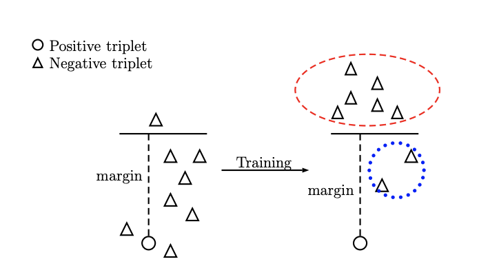
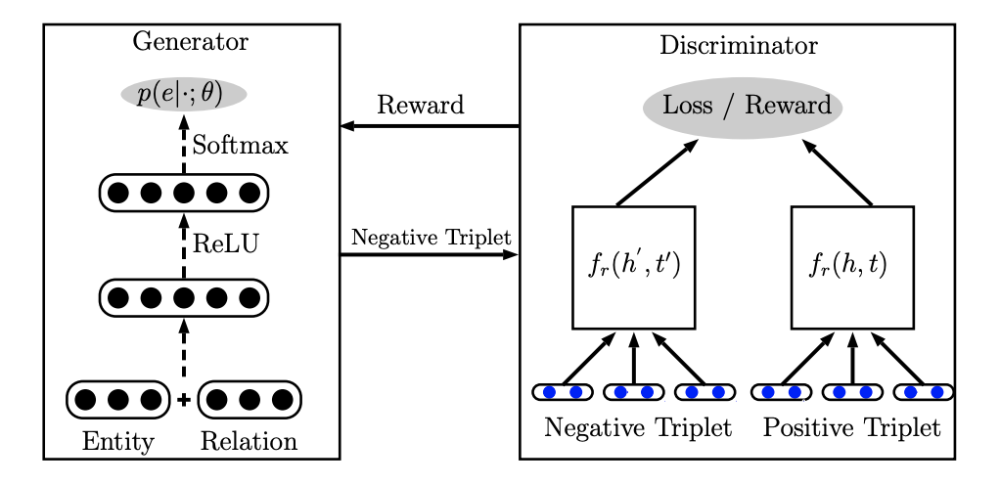
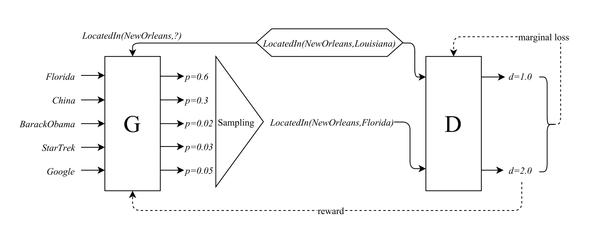
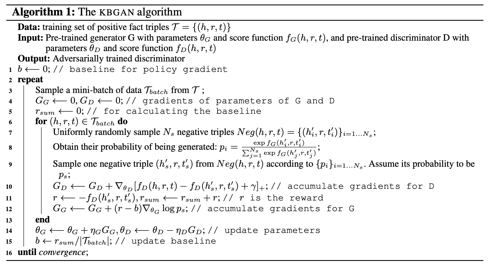

# 论文阅读笔记9：GAN4KGE&KBGAN

> 论文《Incorporating GAN for Negative Sampling in Knowledge Representation Learning》和《KBGAN》的阅读笔记，第一篇论文提出了将GAN引入到知识图谱嵌入学习的负采样中，而第二篇论文也独立地提出了这种使用对抗学习的方法来进行负采样的方式，并采用基于对数概率的KGE模型进行负采样来训练基于Margin的知识图谱嵌入模型的算法框架，因为两篇论文的方法比较相近因此放在一起看。

## Introduction

​	  这次将两篇主题相关的论文结合起来一起读，第一篇是《[Incorporating GAN for Negative Sampling in Knowledge Representation Learning](http://shuangyin.li/publications/KBGAN.pdf)》第二篇是《[KBGAN: Adversarial Learning for Knowledge Graph Embeddings](https://arxiv.org/pdf/1711.04071.pdf)》，这两篇论文都在提出一些训练GAN模型进行知识图谱负采样的想法和工作，因此放在一起写一些论文的阅读笔记，也方便将两篇论文形成对比。

​	  知识图谱嵌入的学习过程经常伴随着负采样，而传统的负采样方法都是随机对三元组中的head或者tail进行替换来得到一个负样本，但这种方法存在一个很严重问题，那就是找到的负样本可能太平凡了，我们训练知识图谱嵌入模型的一个很重要的point就是让模型**学会如何辨别一个三元组是不是合理的**，而如果三元组太容易被辨别出来，训练就没有效果了。

> 关于这一点，实际上论文KBGAN中提出了一个观点就是知识图谱中**只包含已经观测到的正确信息**，而不包含未知的正确信息，以及所有的错误信息(比如A和B**没有某关系**C)，而知识图谱嵌入模型要学会如何辨别正确的和错误的信息，就只能通过负采样的方式来生成。

​	  而使用随机替换的负采样策略的话，在训练的一开始还是比较有效的，因为这个时候嵌入向量还没有完全成型，无法正确表示三元组的关系，这个时候这些naive的负样本对于模型而言还是有学习价值的，而随着epoch的增加，模型逐渐学到了比较合适的知识图谱嵌入，这个时候再用简单的负样本来训练模型的判断能力就没有效果了，因为这些随机替换产生的负样本很容易就会被模型分别出来(表现在公式中就是负样本的打分函数超过了margin，导致这一部分不会产生loss，即loss为0，参数也就不会更新，没有起到训练的效果)，这个变化过程可以用下面的图来表示：

​	  而高质量的负采样样本可以进一步提高知识图谱的性能，因此怎么样在训练的过程中持续产生高质量的负样本就变成了难题，这两篇论文都将目光投向了对抗生成网络GAN，分别训练一个生成器来生成负样本，并训练一个判别器用作真正的知识图谱嵌入模型

## 论文的贡献

​	  两篇论文都提出了使用对抗学习的方法构建负样本并用于知识图谱嵌入的训练中，都采用了训练生成器和判别器的模型架构，生成器的作用是学习如何找到使判别器的loss非0的负样本，而判别器的作用是学习出知识图谱嵌入的模型，判别器实际上就是最重要学习的知识图谱嵌入模型，而生成器的选择有多种。两篇论文所做的工作的区别在于生成器的模型选择和具体的算法不同，下面会具体介绍。

## GAN的引入：基于神经网络的生成器

​	  在论文《Incorporating GAN for Negative Sampling in Knowledge Representation Learning》中，模型引入了GAN的一些机制，分为了生成器和判别器两个部分，其中判别器就是普通的基于margin的知识图谱嵌入模型，可以是TransE等等，而生成器是一个两层的神经网络，用于学习如何生成高质量的负样本。模型的大致结构如下图所示：

​	  生成器中实体和关系有另外的嵌入向量表示(和判别器中的不是同一套嵌入)，每个实体有一个对应的嵌入向量，而每个关系有两个对应的嵌入向量分别表示其本身$r$和逆关系$r^{-1}$，在生成器工作之前，我们需要先按照一定的规则选出需要替换的实体(head还是tail，可以用完全随机的选择，也可以用伯努利分布的概率采样)，然后根据换头还是换尾选择不同的输入，如果是替换头部就输入$(t,r)$，否则就输入$(h,r^{-1})$，将输入的两个向量合并之后放到一个两层的神经网络中进行运算。

​	  这个两层神经网络中包含了ReLU和Softmax等经典的神经网络组件，整个神经网络的运算目标是学习出针对输入情况的可选实体概率分布，即：
$$
p(e \mid(h, r, t), z ; \theta) =z \cdot p(e \mid t, r ; \theta) +(1-z) \cdot p\left(e \mid h, r^{-1} ; \theta\right)
$$
这里的z是0或者1，1表示换头，0表示换尾，实际上求出的就是要换的实体的概率分布，模型中取了概率最大的一个作为输出结果，同时因为输出的结果是一个索引，因此不能直接用基于梯度的方法来优化模型，论文中提出了一种使用强化学习的solution，定义判别器上的奖励函数为：
$$
R=\tanh \left(f_{r}(h, t)-f_{r}\left(h^{\prime}, t^{\prime}\right)+\gamma\right)
$$
而生成器的目标就是将奖励的期望最大化，即：
$$
J(\theta)=E_{e \sim p(e \mid \cdot ; \theta)}[R]
$$
这样就可以使用损失函数来优化参数了，具体的模型训练过程中使用了Adam优化器进行训练，并且

## KBGAN模型：基于知识图谱嵌入的生成器

​	  KBGAN这篇论文中也提出了使用对抗学习的方式来进行负采样，并且也采用了生成器-判别器的架构，但是和前面一篇论文的区别在于，它采用了两个知识图谱嵌入模型分别作为生成器和判别器，判别器依然用的是基于margin的知识图谱嵌入模型(如经典的TransE)，而生成器使用的是基于概率和对数损失的嵌入模型(如DisMult和RESCAL)，整体的架构如下图所示：

​	  这种基于对数损失的知识图谱嵌入模型**常见的形式是使用概率而不是距离来表示一个三元组的合理性**，即：
$$
p(h, r, t)=\frac{\exp f(h, r, t)}{\sum_{\left(h^{\prime}, r, t^{\prime}\right)} \exp f\left(h^{\prime}, r, t^{\prime}\right)}
$$
这里的f就是一个打分函数，在打分函数的基础上使用softmax函数生成概率分布可以选出**一系列三元组**中最合适的那一个，整个模型的损失函数可以定义成：
$$
L_{l}= \sum_{(h, r, t) \in \mathcal{T}}-\log \frac{\exp f(h, r, t)}{\sum \exp f\left(h^{\prime}, r, t^{\prime}\right)}, \quad \left(h^{\prime}, r, t^{\prime}\right) \in\{(h, r, t)\} \cup N e g(h, r, t)
$$
这样的知识图谱嵌入算法对负样本采样质量的要求更低，因为损失函数中每个三元组用了多个负样本去评估其合理性，而根据概率论，负样本选的多了之后总会出现几个特别有价值的负样本，因此模型整体的训练效果就上去了。

​	  也就是说**基于概率的嵌入模型对于负样本质量的要求更低**，同时基于概率的方法在负采样的时候也更具有优势(因为如何进行负采样有了概率作为显式的依据)，而**基于margin的方法在有高质量负样本的时候训练的效果更好**，因此本论文中用GAN对两个方法进行了结合，训练一个基于概率的模型用于生成负样本，然后用高质量的负样本来训练一个基于margin的模型，达到了优势互补的目的

​	  具体的训练就不多说了，因为生成器包含一个采样的过程，因此不能直接用梯度方法进行优化，论文中也采用了强化学习的方法进行了优化，因为对强化学习不太了解就不多讲了，最终学习出来的还是一个负样本的概率分布，整个模型的算法框架如下图所示：

