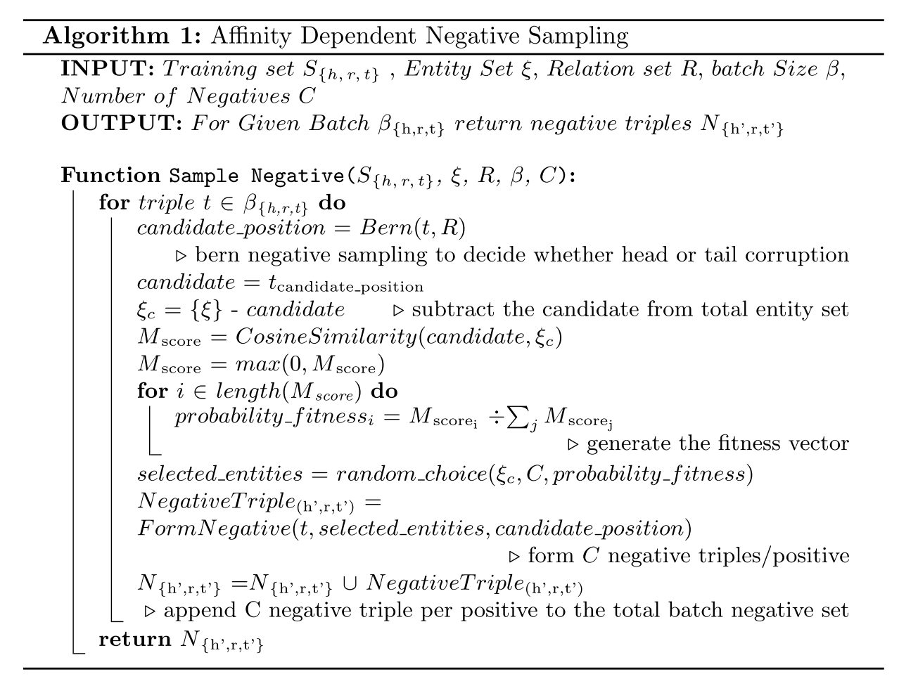

# 论文阅读笔记10：AffinityDependentNS

> 论文《Affinity Dependent Negative Sampling for KGE》的阅读笔记，论文中提出了一种亲和力机制进行负采样。

## Introduction

知识图谱由一系列主语-谓语-宾语(Subject-Predicate-Object)三元组组成的，这是和其他的文章中的提法稍微有些不同，以往的提法都是实体和关系，后面还是一律用实体和关系来代称。

这篇论文认为我们之所以需要负样本是为了在学习的过程中和正样本形成对比，让模型具有更强的辨别能力，它同样也提到了随机的负采样只在训练刚开始的时候效果比较好，并且应该根据**知识图谱中的实体之间存在的亲密度/吸引力 "Affinity"** 来进行合适的负采样。

## Contribution&Related Work

本文的主要贡献是提出了一种通过计算不同实体之间的affinity来进行负采样的策略，这种策略在每次负采样的时候需要根据已有的实体嵌入计算不同实体之间的affinity来确定最合适的负采样样本，但很明显这种方式的计算量非常大，效率非常低，因此本论文也在关注如何在进行有效负采样的同时提高训练的效率。

同时，本文的实验将各种各样的采样策略进行了对比，而选用的知识图谱嵌入模型有TransE和Distmult两个，分别是基于translation和基于语义相关性的代表算法。

## Algorithm

论文提出的Affinity Dependent负采样算法，对于KGE模型训练过程中的每一个正样本，都希望得到C个负样本，在训练阶段首先使用伯努利分布采样来决定对正样本的head还是tail进行替换，决定了之后选择出一系列可选择的替换目标(candidate)，并使用cosine metric来计算其和待替换的样本的相似度并存储在一个亲和力向量M中，然后使用这个，然后计算每个样本的适合程度：
$$
Fitness_i=\frac{M_i}{\sum M_j}
$$
然后选出C个负样本用于KGE模型的训练，整个算法流程可以用下面的伪代码表示：

- 读下来感觉整篇文章言之无物，主要就是讲了一个用cosine计算相似度然后进行负采样的故事