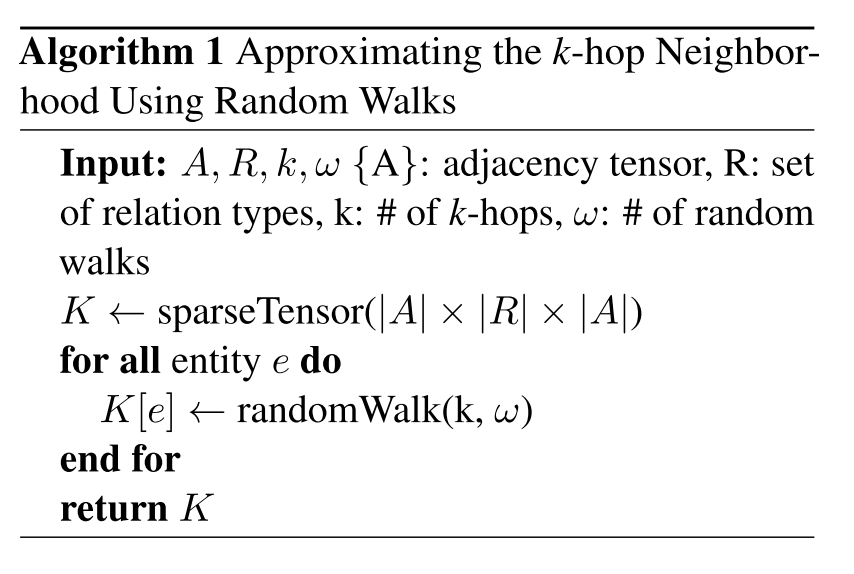

# 论文阅读笔记11：StructureAwareNS

> 论文《Structure Aware Negative Sampling in Knowledge graph》的阅读笔记，该论文提出了一种基于图结构的负采样方法

## Introduction&Contribution

论文开头还是介绍了一通知识图谱相关的东西，然后说到知识图谱是不完整的，其数据具有稀疏性和不完整性的特点，并且在训练的过程中需要用负样本进行对比，而传统的负采样方法获得的样本太“naive”了，对知识图谱嵌入模型带来的性能提升不够显著，基于对抗学习生成负样本计算代价又太高

因此本论文提出了一种**结构感知的负采样(Structure Aware Negative Sampling, SANS)**方法，利用知识图谱作为“图”的结构来找到合适的负样本。该算法会用一个三元组中的head或者tail的K跳以内的邻居来替换对应部分产生有效的负样本。作者假设和待替换的实体**相邻但是没有直接关系**的实体有更高的概率成为一个好的替换对象来产生负样本，并使用一系列实验进行了对比。

## SANS算法

对于一个给定的三元组$(h,r,t)$，负样本可以通过替换其head和tail中的一个来随机生成，同时在训练过程中SANS将损失函数定义为了：
$$
\mathcal L=-\log \sigma(\gamma-d_r(h,t))-\frac 1n\sum_{i=1}^n\log \sigma(d_r(h_i',t_i')-\gamma)
$$
也就是说我们需要给每个训练过程中用到的三元组都采样n个负样本。

本论文认为之前的知识图谱嵌入工作都缺少对知识图谱图结构信息的利用，因此提出了用知识图谱本身作为一个图结构时具有的信息来帮助完成负采样，为此我们需要先为每个节点构建它的K-hop邻居，我们用A来表示知识图谱的邻接矩阵，那么整张图的K-hop邻居可以表示为：
$$
\mathbb{K}=S^{+}\left(A^{k}+A^{k-1}\right)
$$
这里的S是一个逐点的函数，生成一个$n\times n$的矩阵用来表示任意两个点之间是否有相距K步以内的路径，用0或者1来表示，用这种方式可以得到每个节点所有K-hop邻居。

为了得到负样本，我们可以从$\mathbb{K}$中进行采样出非零的点作为负样本，而从直观上看，SANS利用了知识图谱的局部性，并认为没有直接关系但是在K-hop内可以获取的实体可以构造出比较难分辨的负样本。在计算$\mathbb{K}$的过程中很重要的一点就是因为知识图谱是一个异构图，存在多种关系，因此需要用一个额外的维度来表示不同的关系。

## SANS算法的变体

SANS在开始训练之前需要做找K-hop这一步工作，而这一步工作在数据集比较大的时候往往是比较耗时间的，因此论文还提供了一种近似计算的方法，使用$\omega$个步长为k的随机游走来近似估计$\mathbb{K}$，具体的算法如下：

