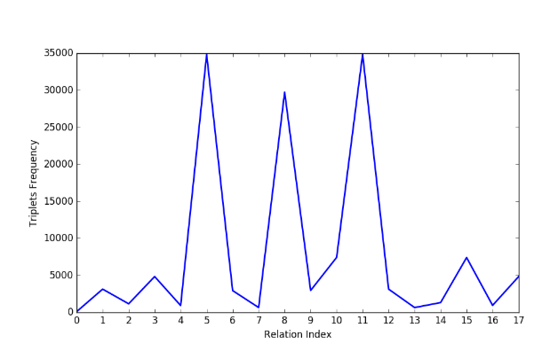
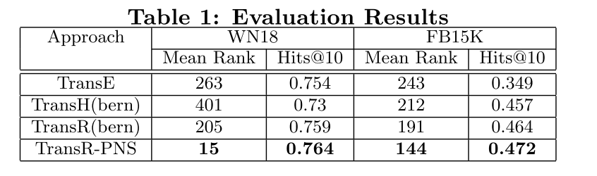
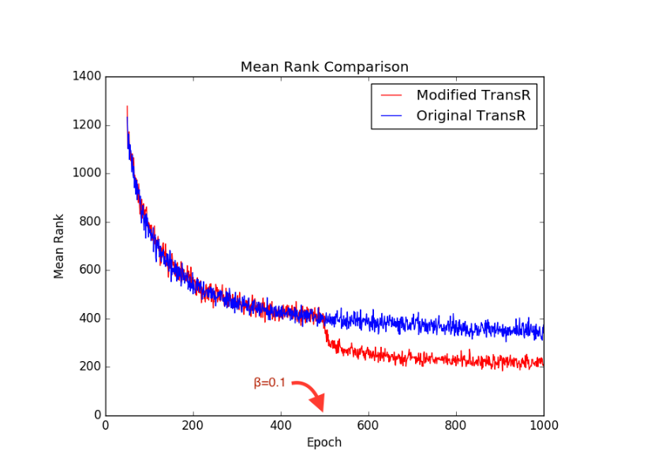

# 论文阅读笔记12：PNS

> 论文《Enhancing KGE with Probabilistic Negative Sampling》的阅读笔记

## 论文发现的问题

该论文研究了一些公开的知识图谱数据集，发现很多数据集中的三元组分布是非常不均匀的，比如WN18中有18个关系，但是每个关系对应的三元组的数量分布情况如下图所示：

可以看到不同的关系所对应的三元组数量差距悬殊，而知识图谱嵌入学习过程中进行负采样的时候往往是通过按概率替换head和tail的方式来进行的，没有考虑到数据的实际分布情况，这就会导致训练过程中采样出一些没什么用的负样本(太好分辨，即打分函数的值过大)，而不会对模型的训练提供任何帮助。

同时论文也发现，对于一些出现频率非常高的关系，模型在训练较少的epoch之后就可以达到很好的效果，而对于一些比较冷门的关系，需要更多的epoch来训练模型。

因此论文针对这些问题提出了对应的解决方案，使用基于概率的负采样。

## 论文提出的算法

- 论文提出首先对训练数据进行处理，用列表的形式来保存每个关系可能对应的head和tail
- 设定一个调整参数$\beta$(也叫做训练偏差)，这个参数在0-0.4的范围内逐渐增大，并且用来表示模型在负采样阶段对训练数据的bias，比如$\beta=0.2$就表示负采样阶段有20%的概率会去从预处理得到的关系-实体对应表中选择当前关系对应的实体并进行替换
- 这种方式保证了尽管有的关系只在少量样本中出现，但是我们依然可以在训练过程中筛选出合适的负样本进行学习

事实上我觉得这种方式比较简洁，而且训练效果貌似也比较好。

## 实验结果

- 采用WN18和FB15K作为数据集，并用MRR和Hit@10作为评价标准，并使用TransR算法作为嵌入模型，发现得到的效果如下：

- 发现论文提出的方法出奇地好，同时论文记录了训练过程中Mean Rank随epoch的变化情况，我们可以从下面的图中发现基于概率的采样方式对模型训练有比较大的帮助

