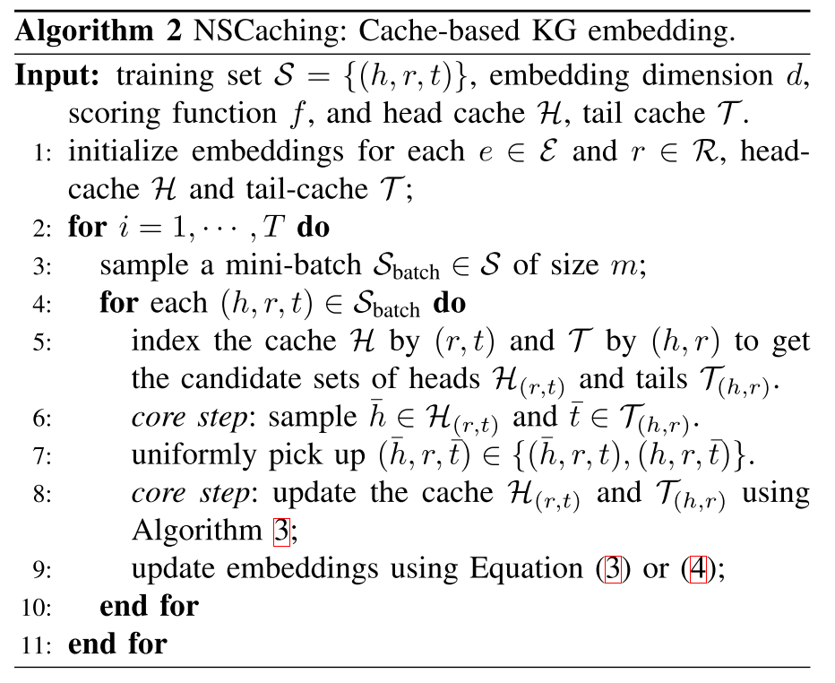
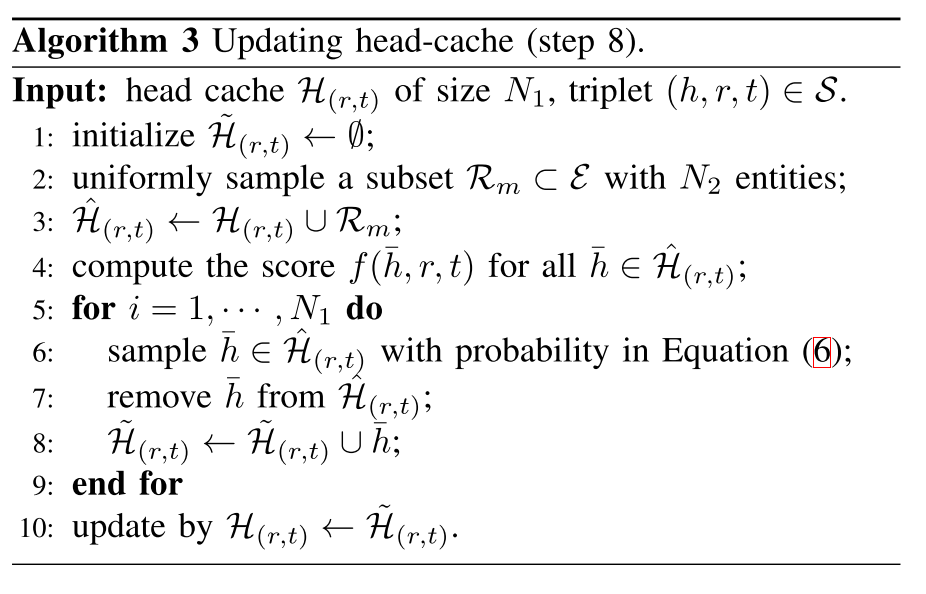

# 论文阅读笔记13：NSCaching

> 论文《NSCaching: Simple and Efficient Negative Sampling for Knowledge Graph Embedding》的阅读笔记

## Introduction

该篇论文的开头也是从知识图谱开始引入，讲到知识图谱嵌入，再讲到负采样，并提到了负采样的重要性和发展史，从最早的随机替换，到伯努利分布采样，再到GAN和强化学习的引入，知识图谱嵌入中的负采样方式效果逐渐变好，但是采样的计算量也在逐渐变大，当然，我也觉得基于GAN的负采样方式看上去很elegant，但是实际上华而不实，虽然看起来效果很好，但实际上计算量大的离谱并且需要预训练，我觉得属实没有必要。

而高质量的负样本又是知识图谱嵌入所必需的，因为基于负采样的方式本质上是简化版本的NCE(噪声对比学习)，而这种方式实际上就是要训练出一个具有判别正确样本和错误样本的能力的模型，换句话说，我们在训练知识图谱嵌入模型的过程中，要让模型逐渐学会如何用打分函数来区分出正确的三元组和错误的三元组

但同时，论文也关注到了不同负样本的打分函数值的分布情况，发现大部分负样本的打分函数是非常高的(即偏离事实，不真实)，只有少部分负样本的分数比较低并且是错误的(逻辑上正确的负样本被称为False Negative，这类样本又是需要避免的，我们**要找的是错，但是错的不太离谱的负样本**)

本论文从一个新的角度提出了负采样的方式，那就是直接使用内存中的数据结构来保存一些高质量的负样本(论文中称为Negative Sampling Caching)，主要的贡献包括：

- 提出了一种简单而有效的负采样方法NSCaching，这是一种通用的知识图谱嵌入采样机制
- 提出了合适的caching采样和更新策略，达到了exploration和exploitation的平衡
- 将NSCaching算法和自我学习进行了比较，发现了其内在的联系
- 在多个知识图谱数据集上进行了实验并验证了NSCaching的效果

## NSCaching算法

首先值得注意的是Caching的设计，论文中提出的方法是用$(h,r)$或者$(r,t)$作为索引来存储一个实体-关系对所对应的高质量负样本，然后对这个Caching进行定期的更新(实际实现的过程中应该就是一个map结构，并且用实体关系元组作为索引)，NSCaching的算法总体框架如下图所示：

很显然这个算法框架下的关键步骤就是如何从cache中进行采样并且对cache进行更新，论文对此作出的解释是：

- 从cache中按照概率分布进行采样，虽然说负样本的选择是打分函数值越低越好，但是我们不能保证这不是一个false negative的样本，因此如果每次都采样同一个(即分数最低那个)，逮着一只羊使劲薅也容易出问题，因此论文提出了基于概率分布从cache中进行采样，也就是更合适的样本被采样的概率更高，但是不那么合适的负样本也给予一定的机会采样
- cache的更新方式：训练刚开始的时候cache是空的，这个时候先随机找$N_1$个负样本作为初始，然后每次更新先生成$N_2$个新的负样本，并从新旧负样本中留下高质量的$N_1$个保存在caching中，具体的算法框架如下图所示：

- 这里的概率计算采用的是打分函数的softmax形式，当然**论文中的打分函数是越大越大，跟我上面认为的打分函数是互为相反数**的(事实上各种各样的论文对打分函数有没有负号这个问题一直没有明确统一的意见，我看到的有的论文是没有的，而有的论文有负号)，这一点要加以区别，但总体的思路没有变，这个概率计算具体的形式是：

$$
p(\bar{h} \mid(t, r))=\frac{\exp (f(\bar{h}, r, t))}{\sum_{h_{i} \in \hat{\mathcal{H}}_{(r, t)}} \exp \left(f\left(\bar{h}_{i}, r, t\right)\right)}
$$

## 和自我学习(Self-Pace Learning)的联系

自我学习的核心思路是一开始先学习简单的容易学的数据，然后再逐渐学习难学的数据，有一个循序渐进的学习过程，基于GAN的负采样方式很明显受到了这种学习方式的影响，而本论文提出的Caching机制也可以用自我学习来解释，一开始的模型判别能力很弱，因此负样本初始化的时候是随便选取的，这个时候的负样本可能很容易就会被分辨出来，而随着学习和训练的进行，模型的判别能力逐渐增强，cache中保存的样本也越来越难以分辨，一直学习下去就可以不断提高模型的分辨能力并毕竟模型的极限。