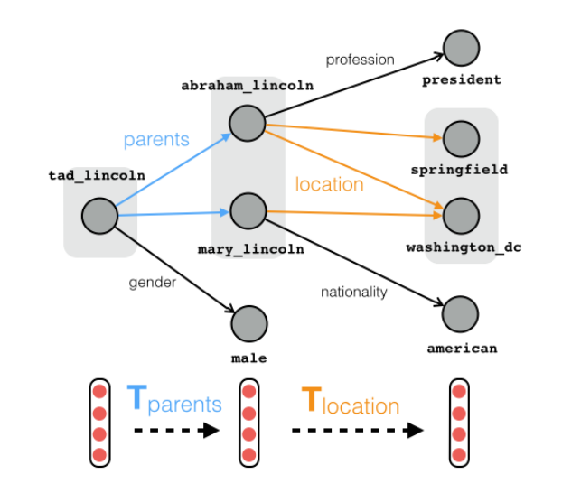
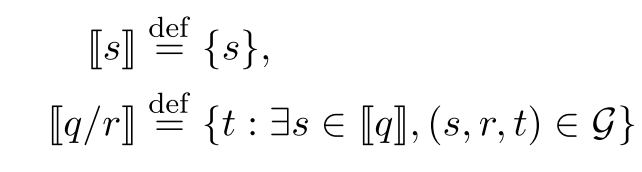

# 论文阅读笔记14：知识图谱路径推理

> 和知识图谱路径推理相关的两篇文章《Random walk inference and learning in a large scale knowledge base》，《Traversing knowledge graphs in vector space》和《Compositional Vector Space Model for KBC》的阅读记录，记录一些早期的知识图谱路径推理的研究。

## Introduction

第一篇论文[《Random walk inference and learning in a large scale knowledge base》](https://www.cs.cmu.edu/~tom/pubs/lao-emnlp11.pdf)发表在2011年的EMNLP上面，这篇文章提出了在大型的知识库中使用随机游走的方式进行采样和训练来构建知识推理模型，并将多条路径的信息进行聚合，再使用逻辑回归来预测结果，用的仍然是比较传统的方法。

而[《Traversing knowledge graphs in vector space》](https://arxiv.org/pdf/1506.01094.pdf)这篇论文则提出了一个基于向量空间的知识图谱推理框架，该论文认为传统的推理手段出现级联错误(Cascading Error, 即推理过程中出现的误差不断累积导致推理结果出现很大偏差的情况)的概率较高，并且往往是把知识图谱作为一个有向图来进行推理的，而近年来的知识图谱嵌入的发展提供了一种使用向量空间来表示知识并且将一系列实体和关系表示成具体的向量来完成各类下游任务的方式，这篇论文就是在向量空间中提出一个进行知识图谱推理的总体框架。

这篇论文的主要贡献有：

- 提出了一种在向量空间中进行知识图谱推理的框架，并且使用组合训练的方式使得模型可以进行较长路径的推理，减少了级联错误的发生。
- 将模型运用在了知识图谱补全任务中，取得了SOTA的效果

而另一篇论文[《Compositional Vector Space Models for Knowledge Base Completion》](https://arxiv.org/pdf/1504.06662.pdf)则没有采用知识图谱嵌入模型，而是使用随机游走的方式从数据集中采样得到一系列知识路径，然后使用这些序列来训练一个RNN结构的模型，并用这个模型对知识图谱中的路径进行一定推理和补全。

## 推理方法1：基于RNN

这是第三篇论文中提出的基于RNN+随机游走采样的推理方式，论文中提出的方法是，首先对于一个庞大的知识库采用Path Ranking算法进行随机游走，采样得到一系列路径，并以此来构建训练和测试数据集。

同时该模型主要进行的是关系的推理，对于每个实体和每条路径都用一个d维度的向量来表示，这种模型实际上就是将知识图谱中的路径看成是一系列关系的**序列化组合**，因此将一系列关系的向量表示输入RNN中可以得到一整条路径的表示向量，同时采用极大似然法来定义目标函数就可以训练出一个模型。

这个方法虽然经典但是感觉逐渐跟不上时代了，因此也就不细说。

## 推理方法2：使用嵌入表示

这是第二篇论文中提出的知识图谱补全和推理的总体框架。

### 任务的描述

知识图谱推理要处理的问题是在一个包含了一系列三元组 $(s,r,t)$ 知识图谱G进行路径查询q，而一个路径查询q往往包含了一系列的关系 $(r_1,r_2,\dots, r_k)$ 和一个起始锚点s，我们要找到从s出发经过q中的一系列关系最终可以到达的结果集合，记为$|[q]|$，同时需要定义：

我们可以将一个组合查询表示成：
$$
\mathcal C\left(s / r_{1} / \cdots / r_{k}\right) \stackrel{def}{=}\left\{t\mid\exists e\in\mathcal C(s / r_{1} / \cdots / r_{k-1}) ,\left(e, r_k, t\right) \in \mathcal{G}\right\}
$$
并定义错误的结果集合:
$$
\mathcal N(q)=\mathcal C(q)-|[q]|
$$
以上就是在知识图谱推理过程中要用到的一些符号，我们主要定义了组合查询，查询结果集合的形式。

### 总体框架

#### 向量空间模型

知识图谱领域的研究中出现过很多向量模型，用嵌入向量的形式来描述知识图谱中各个实体和关系的特征，常见的有双线性模型(Bilinear Model)和TransE等等，这类方法往往包含一个和向量空间表示形式相关的**打分函数来评价一个三元组在当前表示下的合理性**，比如双线性模型给每个关系r都定义了一个投影矩阵，其打分函数是：
$$
score(s/r,t)=x_s^TW_rx_t
$$
而TransE模型将关系r看成是向量空间中的translation(这一部分具体的可以去看[另一篇论文阅读笔记](https://zhang-each.github.io/2021/06/27/reading5/))，其打分函数是：
$$
score(s/r,t)=-||x_s+w_r-x_t||_2^2
$$
这些向量空间模型实际上都是将关系r表达成一种算子，将头实体(s)经过运算后的结果和尾实体(t)进行相似度比较来评价合理性，只不过双线性模型用的是矩阵乘法，而TransE用的是向量的加减，这两个模型共同特点在于，打分函数对于一个多个关系组合成的查询依然可以适用。

现在我们要处理一个查询路径 $q=(r_1,r_2,\dots, r_k)$ 对于双线性模型，我们可以推出：
$$
score(q, t)=x_s^TW_{r_1} W_{r_2}\dots W_{r_k}x_t
$$
对于TransE则有：
$$
score(q, t)=-||x_s+w_{r_1}+\dots+w_{r_{k}}-x_t||_2^2
$$

#### 总体框架

这篇论文提出的知识图谱路径推理模型就建立在上述向量空间模型的基础上，不同之处在于论文中提出了一种通用的推理框架，对于很多向量空间模型都可以适用。

我们首先假设一个向量空间模型的打分函数具有如下形式：
$$
score(s/r,t)=\mathbb M(\mathbb T_r(x_s),x_t)
$$
其中M是一个$R^d\times R^d\rightarrow R^d$ 的评价函数，而T是一个 $R^d\rightarrow R^d$ 的算子，同时我们定义：

这样一来打分函数就可以写成：
$$
score(q, t)=\mathbb M(|[q]|_V, |[t]|_V)
$$
实际上这就是整个模型的推理方式，我们从一个锚点出发，按照需要推理的路径不断找出符合的实体，最终用打分函数来评估查询的结果，选出合理的作为查询结果。

#### 组合训练

我们可以利用打分函数的评估效果来制定模型的训练目标，假设训练集中有N个不同的查询q和对应的结果t，我们可以定义如下目标函数：
$$
J(\Theta)=\sum_{i=1}^N \sum_{t^{\prime} \in \mathcal N\left(q_i\right)}\left[1-{margin}\left(q_i, t_i, t^{\prime}\right)\right]_+=\sum_{i=1}^N \sum_{t^{\prime} \in \mathcal N\left(q_i\right)}[1-score(q,t_i)+score(q,t_i')]_+
$$

- 这种训练方式依然继承了噪声对比学习的思路，采用负样本来提高模型学习的效果
- 训练集中有各种不同路径长度的查询，因此这个训练目标可以引导模型在不同长度的查询条件下预测正确的结果，同时关系算子也在训练的过程中可以尽量保留知识图谱内部的一些局部信息

#### 训练和评估中的细节

在实际的训练开始之前，我们可以从已有的知识图谱数据集中，**通过随机游走生成一系列长度各异的知识路径作为训练用的数据集**，事实上因为知识库比较大，这种构建数据集的方式可以构建出非常大的训练集。

在训练完成之后，可以用平均分位数来对模型的性能进行评估，即对于一个查询q，用模型得到其所有结果，然后计算其中比正确结果的分数低错误结果(即**模型认为错误结果更合理**)所占的比例，就是当前查询q的分位数，对所有的q的分位数求平均值就可以得到平均分位数，很显然这个指标需要越小越好。

