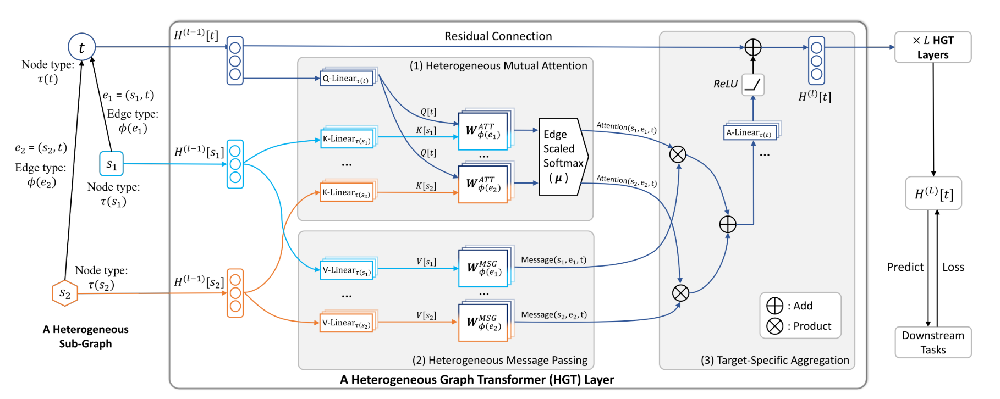
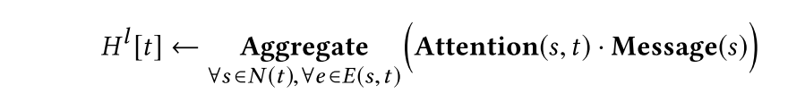
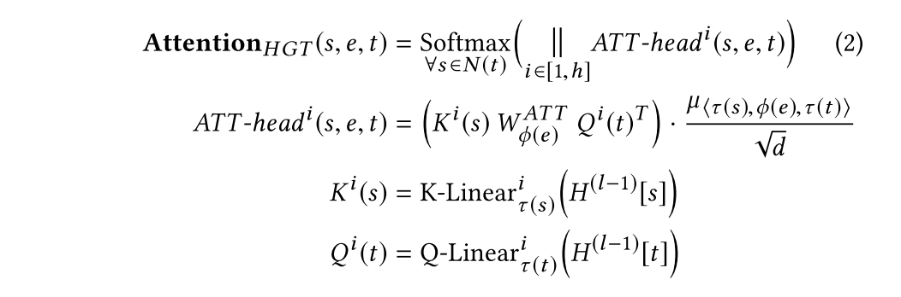
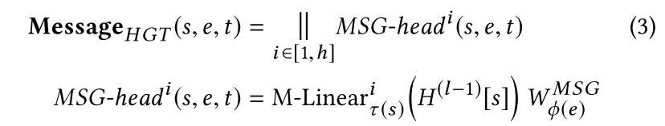
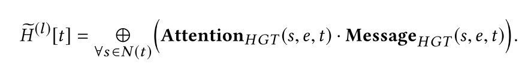
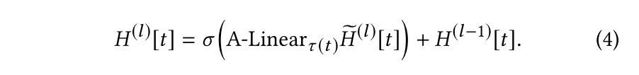
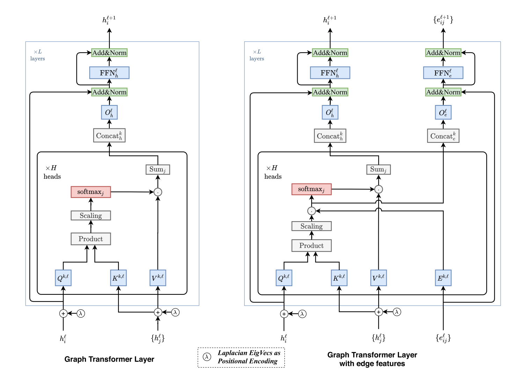
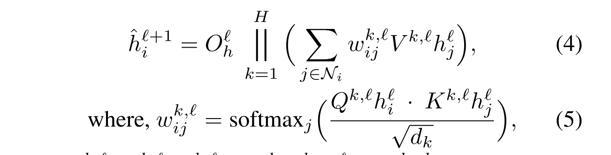
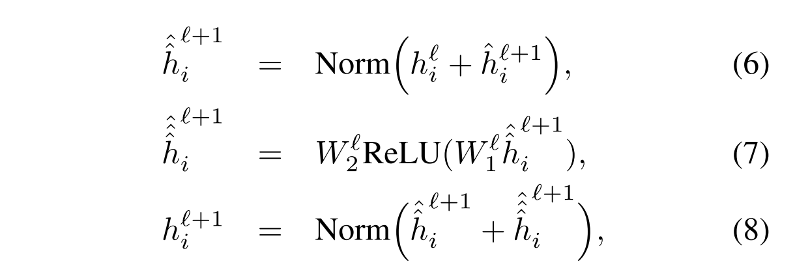
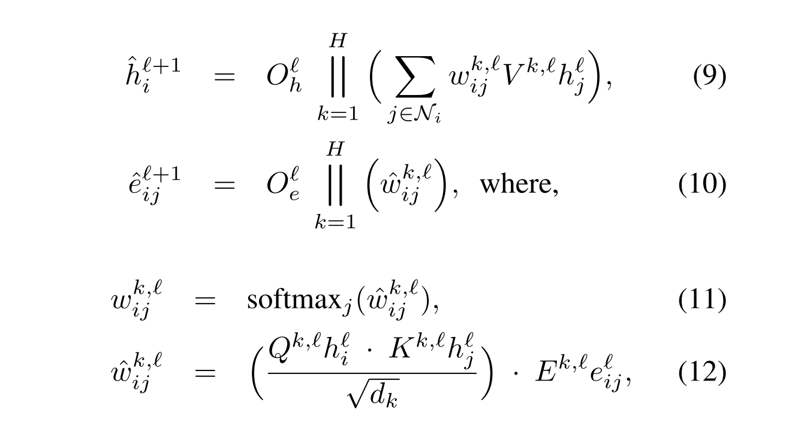

# 论文阅读笔记15：GraphTransformer

> 这次读了两篇论文都是讲Graph Transformer模型的设计的，分别是提出了异构图的Transformer模型的《Heterogeneous Graph Transformer》和总结了Graph Transformer架构设计原则的《A Generalization of Transformer Networks to Graphs》

## Introduction

Transformer模型于2017年一经提出就在深度学习领域掀起了热潮，各种各样的变体层出不穷，其核心的设计就是使用多头的自注意力机制和位置编码来代替CNN中的卷积池化层和RNN中的循环单元**来提取出更加全局的数据特征**，这项技术在CV，NLP，Speech等领域都取得了非常大的成功，关于Transformer的具体分析可以看我之前写的[另一篇论文阅读笔记](https://zhang-each.github.io/2021/06/06/reading3/)。

一种观点认为Transformer模型中的自注意力机制实际上就是在一个**全连接的图神经网络中进行消息传递**，因为原论文中的自注意力机制要计算输入序列中一个单词token和所有单词之间的注意力并将注意力作为特征计算过程中的权重，同时因为句子中的单词之间的依赖性是难以确定的，因此不妨直接假设所有单词之间都可能有某种联系，因此就**将序列转换成全连通图**来处理。

既然如此，Transformer结构也可以看成是一种特殊的图神经网络，自然也就可以在真的图结构使用，但是图数据和序列数据不同，图数据往往比较稀疏不可能做到全连通，因此需要在原有架构基础上进行修改，同构图的Transformer早已被人提出，而论文《Heterogeneous Graph Transformer》提出了在异构图上使用的Transformer架构，这种架构对于包括知识图谱在内的多种异构图数据结构都可以适用，并且取得了比较好的效果，可以在web-scale的大规模异构图中使用。

同时，另一篇论文《A Generalization of Transformer Networks to Graphs》在前面一系列研究的基础上提出了一种general的Graph Transformer框架，并研究了Graph Transformer中两个关键的组件的设计方式——图的稀疏性和位置编码。

## Heterogeneous Graph Transformer

### 异构图的定义

Heterogeneous Graph Transformer的研究对象是异构图，一个异构图可以表示成 $G=(V, E, A, R)$ 其中V表示节点集合，E表示边的集合，A表示节点的种类构成的集合，R表示边的种类构成的集合。可以用$\tau(v),\phi(e)$来表示一个结点/一条边所属的种类，

一条边e往往包含了起点和终点，可以表示成$e=(s,t)$，我们可以从中抽取出一个元关系 $<\tau(s),\phi(e),\tau(t)>$ 来描述某类结点和某类结点之间可能存在的某类关系，顺着这些元关系，我们可以找到一系列元路径(meta-path)，同时一类结点和一类结点之间可以有多种复杂的关系，这也是值得注意的。

### 总体设计框架

异构图Transformer(HGT)的设计和很多图神经网络一样，分成了Attention，Message Passing和Aggregation三个部分，其中Attention模块则使用了Transformer引以为傲的多头自注意力机制基础上改进的异构共注意力机制(**Heteroheneous Mutual Attention**)，整个模型的运作过程可以表示成：

### 模型的实现细节

HGT中根据的异构共注意力机制是根据元关系来确定的，对于输入的边 $e=(s,t)$ 模型需要计算终点t在边e上对于s的注意力，Graph Transformer将注意力分成了多个头分别计算，注意力然后再合并，对于先每一个头，将s和t分别投影到一个特定的线性空间中，然后使用Transformer的QKV模型计算自注意力，Graph Transformer中增加了一个edge-based矩阵和权重$\mu$ 来更好刻画图结构，值得注意的是投影的过程是**按照结点的种类进行投影的(即投影矩阵使用结点的种类进行索引)**，也就是说每种结点都有一个专属的投影空间，具体的计算过程如下：

然后再是进行消息传递和聚合：

同时，本论文提出了一种基于budget的采样机制，可以从大规模的异构图中采集到大致相同数量的各种类型和边并生成mini-batch进行训练，这一部分内容具体的就不关注了。

## General Graph Transformer Framework

### 全文的contribution

整篇文章总结了前面各种同构/异构图的Transformer架构，并作出了归纳，针对图的稀疏性和位置编码这两个图数据中的关键点进行了研究，并提出了融入边特征和不融入边特征的两种通用图Transformer架构。

### 对Transformer架构的总结

#### 图的稀疏性

前文也提到了，原生Transformer架构的自注意力机制是在全连通图上做的，因为不知道单词之间到底有何种关联，因此干脆就假设任何两个单词之间都有一定的联系，然后使用注意力机制来进行计算，而面对图数据的时候，我们不可能假设图的结点之间都互相连通。事实上大规模的图数据往往是非常稀疏的，因此模型中必须考虑到图的稀疏性。

#### 位置编码

原生的Transformer中对于输入的序列使用了位置编码，实际上就是一个sin和cos的周期函数，而图结构中因为结点不是有序的，这种位置编码就不再适用了。

论文中提出使用图的**拉普拉斯矩阵进行特征分解得到的特征向量进行位置编码**，具体的数学理论我看论文里也没提出，总之在训练开始之前需要为数据集中的每个图计算位置编码：
$$
\Delta=1-D^{-1/2}AD^{-1/2}=U^T\Lambda U
$$

#### 通用架构

论文中精美的插图已经很好地向我们展示了General Graph Transformer的架构，其中比较关键的是多头注意力层和残差链接层，多头注意力机制层需要分成多个头来计算注意力并进行合并。

而残差链接实际上就是$f(x)+x$的trick，同时要注意normalization

- 事实上这里只用到了Transformer中的Encoder，没有使用Decoder

#### 融入边特征的架构

同时，对于特定的下游任务，还可以将边的特征也融入到结点特征的计算中去，具体的做法是在计算注意力的时候增加一个边的权重矩阵E：

## 阅读感想与总结

花了一点时间草草浏览了这两篇论文，感觉第一篇HGT完全就是一个有自注意力机制的GNN，不知道为什么会被称为Graph Transformer，而第二篇论文加入了位置编码等关键元素之后更像是一个Transformer模型了，但事实上两个模型都只是在计算node embedding，如果需要做生成式任务还需要引入Decoder

个人认为这两篇文章除了用来看看精美的插图的公式以外没有特别大的价值。基本就是围绕一个Transformer和GNN两个主题一缝合来做的水文。