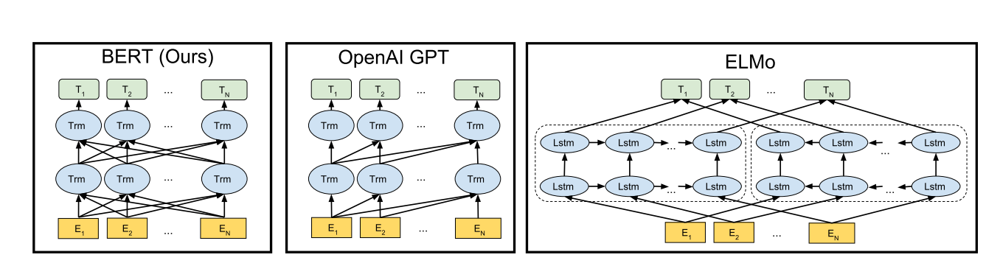
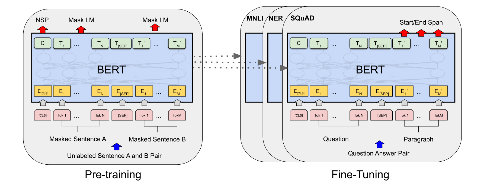
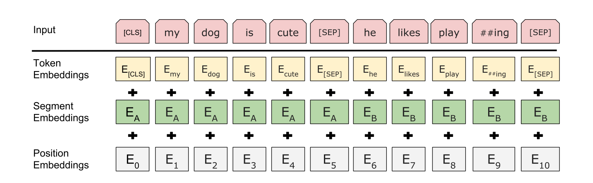
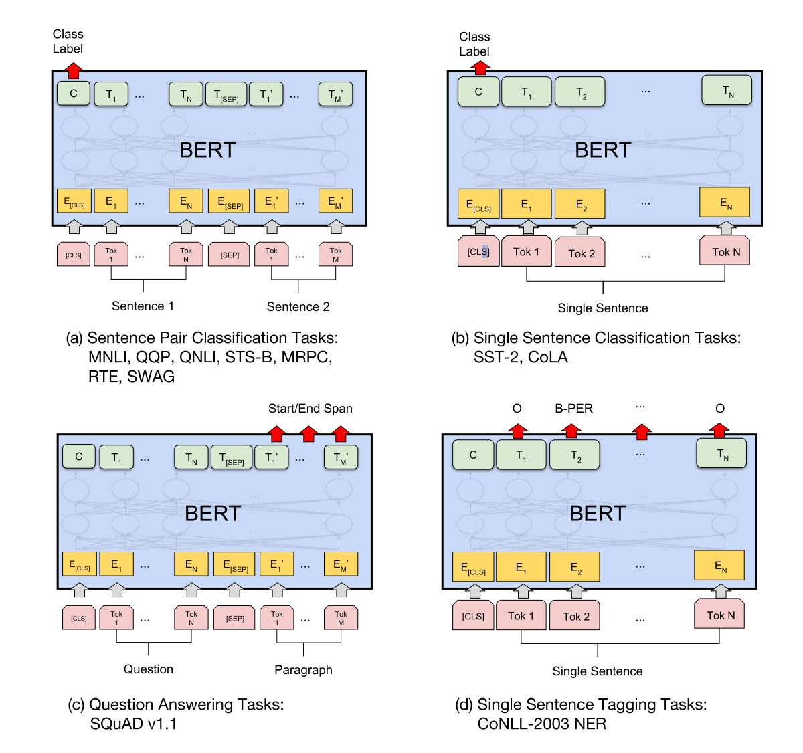

# 论文阅读笔记16：BERT

> BERT预训练模型原论文阅读笔记，了解一下BERT的基本架构和设计

## Introduction

BERT(**Bidirectional Encoder Representation from Transformer**，Transformer双向编码表示)是Google发布的一个预训练语言模型，可以从双向的上下文信息中获得双向的token编码表示，同时可以通过添加新层并进行微调训练之后在各种NLP任务上达到SOTA的效果。

BERT的结构很简单但是效果很强大(~~因为训练烧的钱也多~~)，并且在十一种NLP子任务中都取得了非常好的表现。

### 语言模型和预训练

语言模型的预训练已经被证明是非常有效的解决NLP任务的手段，预训练的语言模型在句子级的人物(自然语言推理，分段)和单词级的任务(命名实体识别，问答)中都表现的比较好。

预训练模型的使用方式一般有两种，一种是基于特征的方法(**feature-based**)，另一种是微调(**fine-tuning**)，基于特征的方法是**将从预训练好的模型中得到的特征**作为额外的特征输入，比如ELMo，而微调则是在训练好的模型基础上加上若干层和参数并再针对下游任务进行训练，两种方式在预训练的时候采用的是同样的目标函数，主要的区别在于如何解决下游问题。

作者认为现有的预训练方法对微调的限制过大，因为标准的语言模型都是单向的，这就限制了预训练的时候能够使用的网络架构，比如GPT模型在训练的时候使用的就是从左到右单方向的架构，并且每个token在计算注意力的时候只能和在它前面的token之间进行计算，这就给微调的方式带来了非常糟糕的影响，因为模型无法从两个方向来感知上下文了。而BERT解决了这个问题，提出了一种双向的预训练方式，使得模型更加适合通过微调的方式来解决下游任务。

### 本文的贡献

- 使用“Masked Language Model”训练方式进行预训练，使得模型可以学习到双向的上下文表示
- 用实验证明了预训练得到的表示不需要再放到复杂的模型架构中来处理下游任务，而是直接通过微调就可以得到非常好的效果，BERT是**第一个基于微调的，并且在句子级别和单词级别的任务上取得SOTA的预训练模型**
- BERT在十一项NLP子任务中取得了SOTA的效果

## 相关工作

NLP预训练的工作由来已久，最早的是词向量的预训练，出现了各种从不同角度出发提取特征的词向量训练方式，有的模型对单词进行从左到右的建模表示，而有的模型会训练单词来根据上下文判别单词的正确性从而得到合适的词向量，这些方法也被扩展到了提取句子会段落的嵌入向量上面。ELMo就是扩展了这种词向量的训练方式，训练出了一个对上下文敏感的语言模型。

词向量属于基于特征的预训练方式，训练完成之后的词向量会作为模型输入用在具体的下游任务中，而基于微调的预训练模型主要有GPT等，但是一般都使用从左到右的方式来训练出一系列自编码表示。

下图是BERT和其他一些预训练语言模型的架构区别：

## BERT模型

### 模型的基本架构

BERT模型的构建主要有预训练和微调两个步骤，预训练步骤中，BERT使用无标注的文本数据进行训练，而微调阶段的BERT模型首先要使用训练好的参数进行初始化，然后使用下游任务的有标注数据进行再训练，对参数进行一定的调整，每个不同的下游任务需要一个专门的微调模型，但是他们都是从BERT中统一初始化得到的。

BERT的优势在于**统一的模型架构**，微调只需要在原有模型上面加入少量层和参数就可以使用。

而BERT模型的基本架构实际上就是多层的双向Transformer编码器，也就是只使用了Transformer中的编码器部分构成深度网络，并且论文提供了两种预训练好的模型BERT-BASE和BERT-LARGE，BASE有12层总参数量在110M，而LARGE有24层总参数量在340M

### 预训练

#### 输入和输出的格式

为了让BERT更好地适应下游任务，BERT的输入格式可以是一个句子也可以是一对句子(比如问题和答案)，如果输入一对句子，也要讲句子放在一个token序列中，并且BERT模型中的句子不一定是语言学意义上的句子，可以是任何跨度的连续文本，同时BERT使用了预训练好的WordPiece词向量。每个输入序列的第一个token都是CLS标签，而输入两个句子的时候使用SEP标签进行分割，同时会有一个学习到的嵌入向量表示每个位置的token属于前一句还是后一句。

因此BERT的输入有三个部分组成，一个是单词token的嵌入，表示单词属于哪一句的分段嵌入(Segment Embedding)和位置编码嵌入，BERT的输入由这三个部分相加组成。

#### 预训练的任务

BERT的训练过程中使用了两种无监督任务，分别是Masked LM和Next Sentence Prediction(NSP)，

##### Masked LM

传统的条件语言模型一般都是从左到右或者从右到左进行训练的，但是这种方式并不能使得模型学习到双向的嵌入表示，双向语言模型一般会让模型不直接知道中心的单词，而是尝试去预测它。因此BERT使用了一种Masked的方法，随机将一定百分比的输入token加上mask然后再放到模型中进行训练，最后将预测结果放入一个softmax函数中生成对应的概率分布来预测中心单词的结果(事实上这种方式很常见)

而这种训练方式造成了预训练了微调的失配，被打上mask的token不会在微调中出现，因此BERT并不会直接用MASK标签来替换被masked的单词，而是采用一定的概率，对被选中的第i个token进行操作：

- 80%的概率用MASK标签来替代
- 10%的概率用一个随机的token来替代
- 10%不变保持原样

##### NSP

很多下游任务比如问答和推理都要理解句子之间的关系，因此BERT提出了使用预测下个句子的训练方式来预训练，我们需要从训练数据中选取上句A和下句B作为每一次的训练数据，在构造训练集的时候有50%的概率B是正确的句子(即A的下一句，用IsNext进行标注)，而另外50%的概率则B是一个随机选取的句子(用NotNext标注)，实验表明这样的训练方式对问答和推理任务大有裨益。

### 微调

BERT的微调只需要将BERT插入到下游任务指定的输入输出格式上就可以了，然后再使用下游任务对应的数据集进行训练，然后将BERT的输出结果导入到一些输出层中，相比于基于特征的方法，微调需要的计算更少，也更加廉价。

对于不同的任务选用不同的架构：

