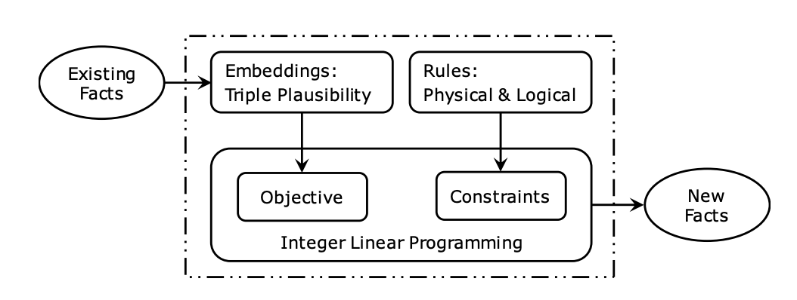
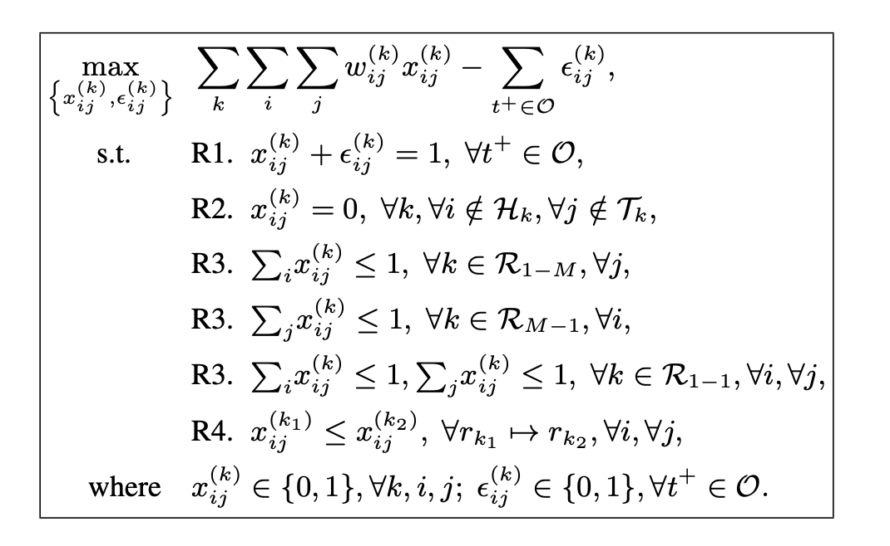

# 论文阅读笔记17：Rule-Based-KGE

> 这次读了两篇规则注入的知识图谱补全论文，分别是《Knowledge base completion using embeddings and rules》和《Injecting logical background knowledge into embeddings for relation extraction》来记录一下学习心得体会

## Introduction

规则注入的知识图谱嵌入和知识图谱补全是在知识图谱表示和推理的基础上加入逻辑规则和物理规则来提高知识图谱推理的精确度的一种手段，本次读了两篇早期的相关论文，分别是《[Knowledge base completion using embeddings and rules](https://www.ijcai.org/Proceedings/15/Papers/264.pdf)》和[《Injecting logical background knowledge into embeddings for relation extraction》](http://sameersingh.org/files/papers/logicmf-naacl15.pdf) 

两篇论文从不同的角度注入了逻辑规则进行知识图谱推理，第一篇文章使用的手段是在知识图谱嵌入模型的基础上，将逻辑规则作为约束条件，并将训练过程转化成一个整数线性规划(Integer Linear Programming)问题，而第二篇论文采用的是在矩阵分解的过程中加入逻辑规则得到知识表示进行推理的方法，两篇论文中提出的都是很经典的方法，下面具体来分析两种不同的方法的具体内容和表现效果。

## 规则注入方式1：将规则作为约束

### 知识图谱嵌入的局限性

虽然说知识图谱嵌入从提出以来取得了不错的效果，但是知识图谱嵌入存在的一个问题就是，它是**完全数据驱动的**，也就是说**模型学习到的知识完全取决于训练数据中有什么数据**，而对训练集中没有出现或者很少出现的数据，模型在推理时的表现会非常差。

### 论文提出的方法

论文提出了一种将知识图谱嵌入和逻辑规则结合的方法，也就是在知识图谱嵌入模型中引入规则约束，将其转化成一个整数线性规划的问题。

#### 知识图谱嵌入

知识图谱嵌入常用的经典模型有RESCAL和TransE等，它们分别属于基于语义匹配度和基于Translation这两大知识图谱嵌入的研究分支，并且都有一个打分函数来判断一个三元组的合理性，RESCAL的打分函数是：
$$
f(e_i,r_k,e_j)=e_i^TM_ke_j
$$
而其目标函数可以写成：
$$
\min \sum_k\sum_i\sum_j\left(y_{ij}^{(k)}- f(e_i,r_k,e_j)\right)^2+\lambda R
$$
其中$y_{ij}^{(k)}=1$表示这个三元组属于知识库，而R是模型所有的**参数的欧几里得范数之和**，这里用作正则项，很显然这个目标就是为了让打分函数做出尽可能符合真实情况(0或者1)的判断，而TransE的打分函数和目标函数分别是：
$$
f(e_i,r_k,e_j)=||e_i+r_k-e_j||_1
$$

$$
\min\sum_{t\in O}\sum_{t^-\in O^-}[\gamma-f(e_i,r_k,e_j)+f(e_i',r_k,e_j')]_+
$$

这是一种基于margin的方法，并且需要用到负样本。

知识图谱嵌入可以通过训练数据学习到知识的向量表示，但是这种方法学习到的表示完全依赖于数据分布，也就是“Data-Driven Method”

#### 规则的注入和表示方式

然后论文中提出了可以注入并增强约束的逻辑和物理规则：

- 噪音发现：已经存在的事实更容易被模型认为是对的，但是模型也需要辨认出其中的错误的事实
- 参数类型约束：一个关系对应的head和tail两个实体的参数应该是**具有确定的类型**的
- “最多一个”约束：对于一对多关系，那么给定一个tail，最多存在一个对应的head，而一对一，多对一等关系也遵循类似的约束
- 包含关系：也就是说一个三元组中的小关系可以被替换成更大的关系(比如HasWife是小关系，HasSpouse是大关系)

上述逻辑规则可以转化成如下约束条件：

这里的$$w_{ij}^{k}$$表示三元组的打分函数值，而$$x_{ij}^k$$是0或者1用来判断这个三元组是对还是错，是整数规划要学习的目标，而$$\epsilon_{ij}^{k}$$是一个松弛变量，如果是1表示这个三元组观察到的结果是错误的，同时我们希望观察到的结果尽可能都是对的，但这不是必要的。

这个整数线性规划的几个约束条件分别对应了一条逻辑规则：

- R1对应逻辑规则1，这个约束表明判断结果和观察结果应该是一致的
- R2代表了参数类型约束，即不满足参数类型约束的三元组应该认为是错的
- R3代表了各种不同关系的实体数量约束
- R4代表了细分的关系可以被更广泛的关系代替

这样一来我们在训练的过程中就把逻辑规则加了进去，可以学习到更好的嵌入表示并用于知识推理，同时模型也可以发现错误的事实，并且这是一个通用的框架，可以扩展到各种模型上。

具体训练的时候还需要计算每次求解之后的总loss，然后用梯度下降来更新各个参数的值。

## 规则注入方式2：基于矩阵分解

### 矩阵分解和知识图谱嵌入

这篇论文使用的知识图谱嵌入学习思路是很古老的矩阵分解方法，也就是说，如果一个知识库中有P个实体和R种关系，那么就构建一个$$P\times R$$的矩阵，每个实体对应一行，每个关系对应一列，然后用已知的三元组信息去填充矩阵，然后使用某种矩阵分解的方式得到实体和关系的嵌入表示，即将矩阵分解成$$P\times k, k\times R$$两个矩阵，对应的行和列就是实体/关系的嵌入表示。

同时，如果我们用$$v_{r_m}$$表示一个关系的嵌入，用$v_{(e_i,e_j)}$来表示实体对的一个嵌入表示，用V表示整个关系/实体的嵌入向量集合，并且定义实体对和关系的嵌入表示的相似度函数
$$
\pi_m^{(e_i,e_j)}=\sigma(v_{r_m}v_{(e_i,e_j)})
$$
那么我们的目标函数就可以写成：
$$
p(\mathbf{w} \mid \mathbf{V})=\prod_{r_{m}\left(e_{i}, e_{j}\right) \in w} \pi_{m}^{e_{i}, e_{j}} \prod_{r_{m}\left(e_{i}, e_{j}\right) \notin w}\left(1-\pi_{m}^{e_{i}, e_{j}}\right)
$$
这其实就是一个**极大似然估计**下的目标函数，我们可以用这样一个目标函数来评价学习到的嵌入向量的质量。

本论文就是在矩阵分解方法的基础之上，尝试加入逻辑规则在提升矩阵分解的效果。

### 规则的注入
