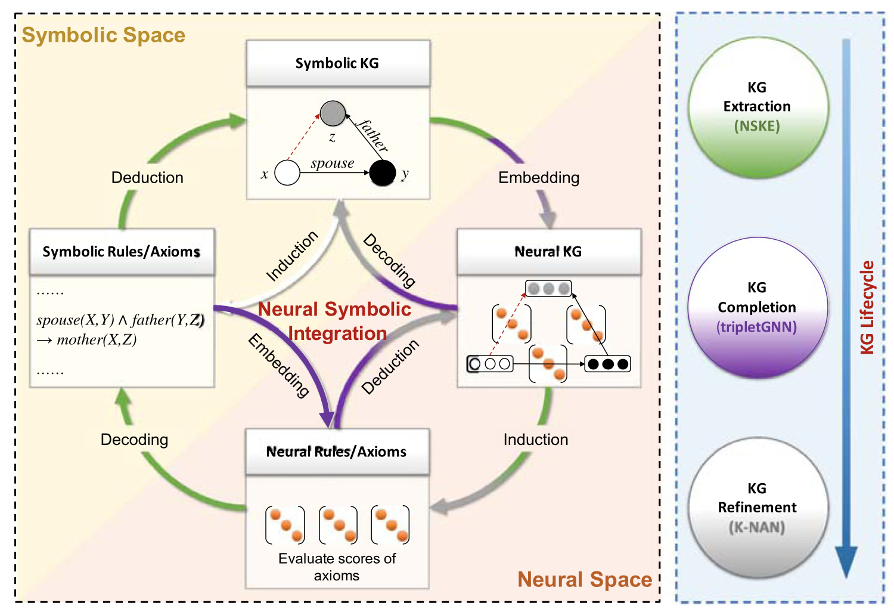
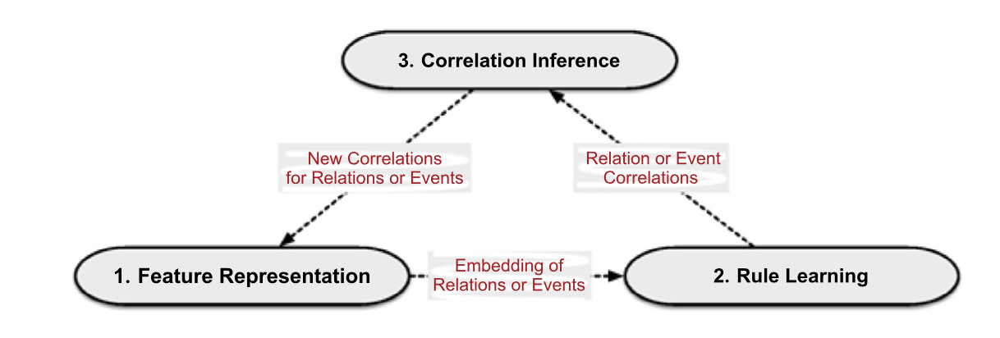

# 论文阅读笔记18：神经符号推理和知识图谱

> 论文《Neural symbolic reasoning with knowledge graphs: Knowledge extraction, relational reasoning, and inconsistency checking》的阅读笔记，提出了一种神经符号推理的总体框架

## Introduction

知识图谱是一种用三元组的形式来表示现实世界中的事实的数据形式，知识图谱推理(KGR)是知识图谱的重要应用方式，包括知识图谱抽取，知识图谱补全和改进等任务，这又被称为知识图谱推理的三个阶段，论文认为知识图谱的推理可以用下面这样一个总体的框架来描述：

即符号化的知识和规则可以被嵌入到神经空间中，而神经空间中的计算可以辅助进行知识图谱的推理，包括找到新的三元组和发现错误的三元组。

目前的知识图谱推理研究进展可以概括成两个大的方向，分别是基于符号化方法的逻辑推理和基于神经方法的向量空间表示，其区别可以用如下表格来表示：

| 方法     | 介绍                                         | 优点                         | 缺点                                                    |
| -------- | -------------------------------------------- | ---------------------------- | ------------------------------------------------------- |
| 符号方法 | 使用**逻辑规则**在知识图谱上进行推理         | 可解释性好，推理结果更加精确 | 需要良好定义的逻辑规则，无法大规模使用(缺少scalability) |
| 神经方法 | 用嵌入向量在隐空间表示实体和关系，并用于推理 | 可以规模化使用               | 缺少可解释性，模型的推理结果是不能被解释的              |

为了克服符号方法和神经方法存在的诸多缺陷，本论文提出了一种用于知识图谱推理的神经符号框架，集合了两种方法的优点，同时注重可解释性和规模化的使用，并且贯穿知识图谱的整个生命周期，可以用于完成三个子任务：用于知识抽取的神经符号推理，神经符号关系推理和神经符号异常检测(Inconsistency checking)

## 知识抽取

这一节主要讲的是论文提出的总体框架中知识抽取的部分，这个过程遵循这样的子结构：符号化的知识--生成神经向量表示--归纳出神经规则--解码成逻辑规则和公理(Axioms)--演绎出符号化的知识。

### 任务的形式

- 知识抽取的形式化定义：我们往往把知识抽取看成是关系抽取和事件抽取的结合，假设我们有一个关系集合R和事件集合E，以及含有M条语料的语料库T，并且T中的每一条语料实习都被表示成了长度不超过L的token序列，那么知识抽取的目标就是来预测每条语料中的关系和事件的标签
- 用于知识抽取的神经符号推理：神经符号推理可以充分利用已有的正确知识(基于关系集合R和事件集合E)，找到它们的潜在语义联系来辅助事件和关系的抽取，同时在事件抽取中还会用到多方面的事件相关性

### 使用的模型和方法

在提出的总体框架中，用于知识抽取的框架被称为NSKE，包括三个部分，分别是特征表示，规则学习和相关性推理：

- 特征表示是提取语义信息并将每个实例中的token在特征空间中进行编码
- 规则学习的目标是将类型集合R和E映射到语义空间中并找到潜在的相关性
- 相关性推理是为了在已有的关系相关性和实体相关性基础上体力出新的类型之间相关性

## 关系推理

用神经符号来解决关系推理实际上是一个由知识和规则嵌入构成的神经知识图谱解码成符号化知识图谱的过程。

### 问题的形式

- 关系推理：是知识图谱中最重要的任务之一，目标是发现实体或者丢失的实体中潜在的关系，比如知识图谱补全，基于符号逻辑的方式缺少泛化性和可扩展性，而有的研究将这个过程总结成了一个网络嵌入+链接预测的过程，尽管这些方法的可解释性比较差
- 神经符号关系推理的目标是将两种关系推理的方法想集合，我们将一个知识图谱表示成$$G=(E,P,F,A)$$，其中EPFA分别是实体，性质，事实和公理的集合，下面这张表展示了一些公理和其对应的语义场景。在本论文中作者希望在关系推理的过程中不仅需要从存在的事实中学习到嵌入表示，还要利用本体和公理

### 使用的模型和方法

神经公理推理中同时使用试试和公理有两个主要的挑战：

- 第一个挑战时公理的注入，因为事实和公理是两种不同的形式，我们需要将公理作为逻辑注入到基于事实的嵌入表示学习中
- 第二个挑战是模型的**不可知(agnosticism)**，因为公理的利用方式不同，我们需要设计很多不同的临时模型用于不同的公理

而在论文提出的框架中，用于完成关系推理的子结构被称为tripleGNN，首先定义一个三元组图，用无向无标签图的形式来表示知识图谱中的事实和公理，这和传统的方式相反。然后再用结点特征增强的图神经网络来学习嵌入表示并进行推理

## 异常检测

### 问题的形式

- 异常检测，也可以叫做不一致性检测的目标是发现知识图谱中存在的错误三元组，以往的方法往往基于统计方法或者逻辑方法
- 神经符号异常检测是用神经公理网络和知识图谱嵌入的方法来进行异常检测，论文中设计了一种可以同时利用三元组结构信息和公理信息的框架来处理这个问题，公理可以包含domain，range，disjoint，irreflexive和asymmetric等多种形式

### 使用的模型和方法

论文中提出的方法是K-NAN，将头尾实体的嵌入分成类型嵌入和语义嵌入两个部分，而将关系嵌入分成了语义嵌入，主语嵌入和谓语嵌入三个部分。

