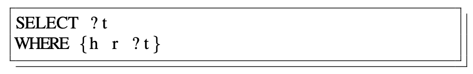
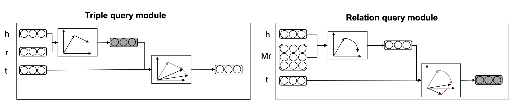
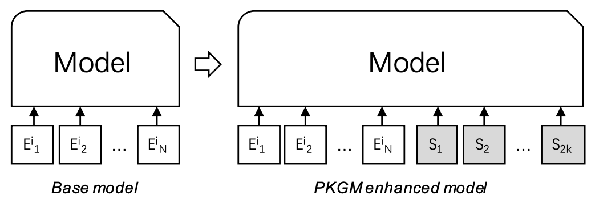
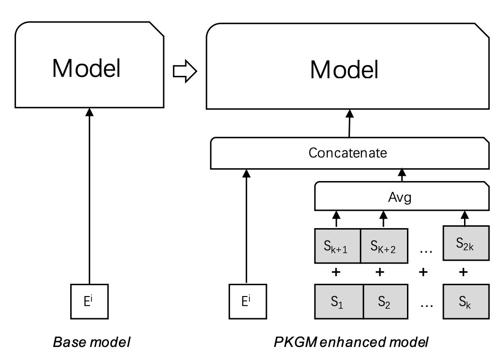
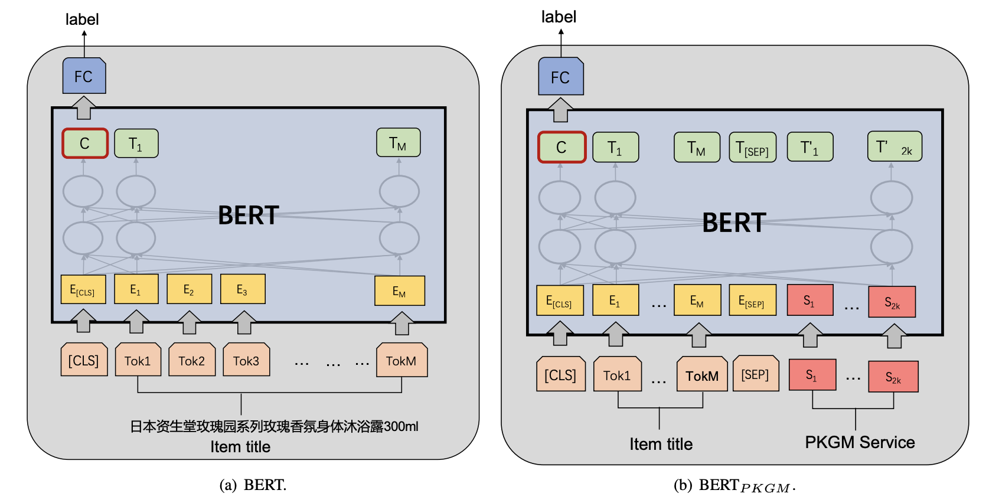
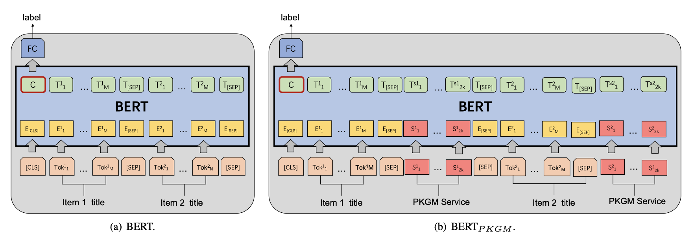

# 论文阅读笔记19：电商知识图谱预训练

> 论文[《Billion-scale Pre-trained E-commerce Product Knowledge Graph Model》](https://arxiv.org/pdf/2105.00388.pdf)的阅读笔记，主题是知识图谱的预训练和下游任务微调，是实验室里的一篇工作。

## Introduction

在介绍了一堆背景之后，这篇论文提出在电商领域的丰富数据构建商品知识图谱，并进行大规模的预训练得到一系列实体和关系的嵌入向量表示(后面也被称为服务向量)，并用在下游的电商任务(包括商品属性预测，同类商品检测，商品推荐等等)作为增强知识，同时这些预训练的知识图谱也可以用来进行知识图谱的补全。

知识图谱的嵌入表示的研究由来已久，并且有各种方法被提出，这些嵌入方法往往可以对实体和关系进行全局的编码，但是知识图谱中的三元组只是提供了一种或许能用得上的知识，而并不一定真的会在具体的任务中用到这些知识，这些需要知识的下游任务更需要一个表示向量作为知识增强而不是一堆三元组，因此本文的动机就是从商品知识图谱中提取出知识表示向量，并作为一个通用的知识提供者用于各种知识增强的任务中，这么做不仅可以避免繁琐的数据选择和模型设计，并且也克服了知识图谱的不完整性。

在NLP领域，BERT模型的提出让预训练和微调的概念被越炒越热，到处都在使用这种大规模预训练+下游任务微调的模式，因此论文想到能不能使用大量的三元组数据来对知识图谱进行预训练，并将得到的知识表示向量用于下游任务的知识增强(这样一来下游任务不需要直接接触三元组)。

论文中提出的预训练模型被命名为PKGM(Product Knowlegde Graph Model)，预训练模型中，下游任务关注的关键信息包括两个部分，分别是：

- 某个商品是否具有某个关系(某个属性)
- 给定某个商品(头部实体)和关系/属性，是否可以找到尾部实体(属性值)

> 这里的商品知识图谱实际上是将商品的名字，属性和属性值表示成了head，relation和tail的三元组

同时，**考虑到知识图谱的不完整性可能对下游任务造成影响(可能会因为知识图谱的不完整而导致引入bias)**，预训练模型应该拥有以下三种能力：

- 判断某个商品是否具有某种关系
- 基于给定的头部实体和关系，预测尾部实体
- 对于给定的头部实体和关系，补全尾部实体(如果这个尾部实体应该存在)

因此最终本论文提出的预训练知识图谱模型被分成了两个模块，分别是三元组查询模块和关系查询模块，两个模块的特点和区别可以用下面这张表来总结：

| 模块           | 使用的KGE模型 | 功能和特点                                                   |
| -------------- | ------------- | ------------------------------------------------------------ |
| 三元组查询模块 | TransE        | 对三元组进行编码，训练之后可以用于尾部实体的预测             |
| 关系查询模块   | 迁移矩阵Mr    | 对一个实体**是否应该具有某个关系这一判断进行编码**，训练之后可以用于关系的预测和查询 |

在完成预训练之后，这两个模块就可以提供知识服务向量，其中三元组查询模块**可以提供包含尾部实体的信息(尾部实体+关系)**，比如如果目标实体是一个智能手机，那么三元组查询模块进行提供基于目标关系的尾部实体查询功能，比如品牌，产地等等，无论这样的三元组是否在知识图谱中存在，因此三元组查询模块的优点是：

- 可以用向量计算而不是访问三元组数据的方式提供查询结果
- 可以进行尾部实体的补全

而关系查询模块可以根据指定的头尾实体来查询其可能的关系。

有了服务向量之后，我们就可以将这些服务向量添加到基于嵌入的下游任务中作为知识增强，同时我们可以根据需要输入的嵌入向量的个数，将下游任务中基于嵌入的方法分成两类，分别是：

- 单个嵌入的任务：采用将服务向量**合并成一个**并添加到原本输入后面的方式完成下游任务
- 嵌入序列的任务(a sequence of embedding)：采用在原本的输入序列后面添加服务向量进行扩展的方式完成下游任务

因此本文的贡献可以总结成如下几点：

- 提出了一个对知识图谱进行与训练的方式，并用服务向量向下游任务提供知识增强服务
- 提出的模型PKGM具有两个优点：具有补全能力和独立于三元组的数据
- 在三项下游任务中对PKGM进行了验证，证明知识增强的有效性

## PKGM的细节

PKGM的两个关键部分实际上可以概括为两种不同的查询：

即给定h和r查询是否有t，给定h判断是否存在一个r使得构成三元组t，而PKGM对两种模型分别采用了两种不同的方法来建模：

### 预训练时的建模

在预训练阶段，PKGM对两种问题分别进行了建模，对于三元组查询模块选用的是TransE模型，即：
$$
f_{triple}(h,r,t)=||h+r-t||
$$
而对于关系查询模块，选用的是一种新的不知道叫什么的模型，这种模型不涉及尾部实体t，而是只用h和r进行判断：
$$
f_{rel}(h,r)=||M_rh-r||
$$
每个关系用一个嵌入向量r和一个迁移矩阵进行描述，然后将二者相加作为每个三元组的打分函数：
$$
f(h,r,t)=f_{triple}(h,r,t)+f_{rel}(h,r)
$$
这里的嵌入向量h和r在两个模块各自的打分函数中是共用的，而整个学习过程的损失函数也和基于translation的方法一样是基于margin和负采样的，即：
$$
L=\sum_{(h,r,t)\in \mathcal K}[f(h,r,t)+\gamma-f(h',r',t')]_+
$$
这就是PKGM在预训练阶段的模型，按照这种方式完成模型的预训练之后，就可以对外提供知识服务了。

### 服务

完成预训练之后PKGM就可以根据功能模块提供对应的服务，对于三元组查询模块，模型提供的服务是：
$$
S_{triple}(h,r)=h+r
$$
意思是我们对于给定和h和r要查询t的时候，模型**不会再去搜索整个数据集寻找最合适的t**(以往一般是根据打分函数来寻找最合适的t，但是在当前问题场景下计算量过大了)，而是**直接使用预训练好的h和r来表示t**，根据我们的训练目标，这里的h+r应该是非常接近t的，因此模型选择直接将其拿来用避免过大的计算量。

- 这实际上可以看成是一种内在的，隐式的知识图谱补全，因为下游任务需要的只是一个知识向量

而在关系查询中，PKGM使用如下形式的服务函数对外提供关系查询服务：
$$
S_{rel}(h,r)=M_rh-r
$$
如果这个头部实体h存在关系r的话对外提供的服务向量应该是接近于0向量的，综上所示，PKGM在提供服务方面至少有这样几个优势：

- 用一种隐式的方式访问尾部实体，这就是的服务和三元组数据独立开来，并且保证了数据的隐私
- 对外服务用向量的形式来提供，并且提供两个向量，一个代表尾部实体另一个代表关系是否存在
- 可以补全出知识图谱中不存在的三元组

### 在下游任务中的使用

提供的知识向量在下游任务中的使用方式有两种，一种是输入一连串的embedding，另一种是输入单个embedding

在将一个商品作为目标实体的情况下，我们可以通过三元组查询得到k个服务向量(代表尾部实体)，记为$$[S_1,S_2,\dots, S_k]$$，以及关系查询得到的k个向量$$[S_{k+1},S_{k+2},\dots,S_{2k}]$$

我们可以用下面这种方式利用得到的知识向量：

这里的E是某个商品原本的N维嵌入向量，而S则是从PKGM中得到的包含知识的服务向量，我们将其输入下游的模型中进行微调就可以使用。

而如果需要输入单个embedding，论文采用的方式是将关系和尾部对应的进行合并，然后对k组向量求均值作为出入和原本的商品嵌入E进行合并，即：
$$
S_{j}'=[S_{j},S_{j+k}](j\in[1,k])
$$

$$
S=\frac 1k\sum_{j=1}^k S_j
$$

这个过程也可以用下面的图来表示：

## 实验和下游任务

### 预训练

预训练的时候采用了一个非常大的电商商品数据集(Billion-Scale)，并且数据集原本是淘宝商家填写好的结构化数据使用阿里的超算平台进行处理之后生成超大数量的三元组，并在大量的参数服务器和工作服务器上进行训练才得到预训练好的模型。

同时对于每个产品，会根据它本身的数据类型选择了10个最重要的relation并保留，然后将其他的属性舍弃不用。

模型使用Tensorflow搭建，优化器使用了Adam

### 商品分类

实际上商品分类是一个文本分类问题，通过商品的title对不同的商品进行有监督的分类，下游任务中使用BERT+预训练好的服务向量的形式来完成文本分类任务：

商品本身的embedding是使用BERT编码得到的商品title(若干个词组成的短句)，在作为baseline的BERT中，我们使用一个[CLS]标签和BERT编码后的文本作为输入C，并放到一个全连接层中得到预测结果p，即：
$$
p=\sigma(WC+b)
$$
然后使用交叉熵作为损失函数，就可以用这样简单的的方式构建一个商品分类器。

在使用了预训练模型提供的服务向量后的BERT模型中，我们用一个[CLS]标签开头，然后加上商品本身的embedding和2k维度的服务向量，中间用[sep]标签分割，作为模型的输入C，剩下的和baseline一样操作，这个模型是$$BERT_{PKGM-all}$$，然后论文还分别用三元组查询向量和关系查询向量得到的k维服务向量作为知识输入构建了另外两个模型$$BERT_{PKGM-T},BERT_{PKGM-R}$$ 

### 商品对齐

商品对齐任务的目标是发现表示同一个产品(product)的商品(item)，商品对齐任务可以归结为判断商品的title是不是表达了相同的意思，即NLP中华的paraphrase identification任务，论文中使用了下面的模型进行对比：

处理问题的时候依然使用BERT，并且将两个商品的embedding一起输入，再将得到的结果通过一个FC层进行二分类，使用了PKGM的模型会再多若干服务向量。

### 商品推荐

- 看到这里差不多了，商品推荐这一部分先不看了，因为对推荐系统本身了解的不多。