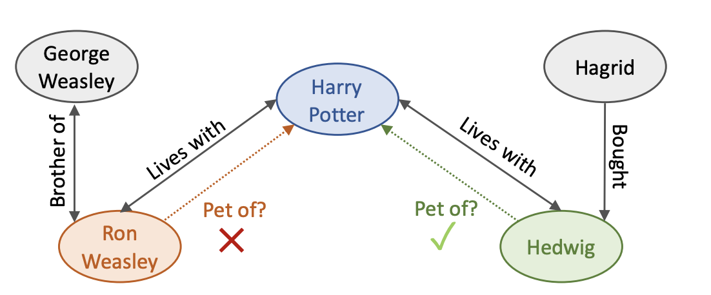
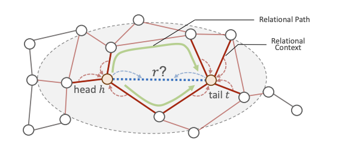

# 论文阅读笔记20：PathCon

> KDD2021论文[《Relational Message Passing for Knowledge Graph Completion》](https://cs.stanford.edu/people/jure/pubs/pathcon-kdd21.pdf) 的阅读笔记，提出了一种用关系消息传递进行的知识图谱补全方法。

## Introduction

论文首先还是说知识图谱很有用，然后提出知识图谱的不完整性以及存在错误样本的问题，因此知识图谱的补全就非常有必要。同时论文认为知识图谱中的关系并不是均匀分布的，而是和周围的关系相关，比如“毕业于”这个关系附近有比较大可能出现的关系是“出生于”或者“大学位于”，而不是“电影所使用的语言”之类的关系。因此研究给定实体对条件下，这些实体附近的关系分布对于知识图谱的补全很有意义，本文提出了一种**关系消息传递(Relational message passing)**的方式，通过只研究关系的分布特征而不是用结点的性质和特征来进行知识图谱的补全。

### 关系消息传递

在图神经网络中消息传递往往指的是结点之间的消息传递，即结点之间互相将自己的特征传递给邻近的结点，而关系消息传递至考虑边的特征并且在相邻的边(共享顶点的边)之间传递，因此，关系消息传递具有以下三个新的优势：

- 具有归纳能力(Inductive)，因为不涉及结点信息(包括结点的id)，因此可以处理训练集中没有出现过的结点
- 存储效率高，不需要计算实体的嵌入，而关系的数量一般远少于实体的数量
- 具有可解释性，预测的过程可以解释为对不同关系之间的相关强度(correlation strength)进行建模

但是这种方法的缺点在于计算代价太高，因此论文提出了交替关系消息传播的方法，在知识图谱中交替传递结点和边的消息，并且可以证明这种方法大大降低了计算复杂度，使得计算复杂度达到了和传统的结点消息传递一样的水平。

### 关系上下文和关系路径

在交替关系消息传递的框架下，论文主要研究了两种知识图谱中的局部子图拓扑结构，包括关系上下文和关系路径：

#### 关系上下文

关系上下文实际上指的是某个关系附近的邻域结构，因为一个实体周围的一些关系可以决定实体本身的性质，实际上是一种Breadth-First的局部特征，可以决定实体和关系自身的一些性质

#### 关系路径

关系路径值得就是知识图谱中一连串的关系构成的路径，可以确定一个实体对的相对位置关系，可以决定实体之间和关系之间的一些性质，其实就是Depth-First的局部特征。

### 全文的贡献

本文主要的贡献有：

- 提出了交替关系传播框架，并且相比现有的基于嵌入方法有诸多优点
- 在提出的框架下探索了两种子图拓扑结构——关系上下文和关系路径，并证明二者对于关系预测很重要
- 提出了一个新的知识库DDB14可以用于KG相关的研究

## 问题的定义和描述

对于给定的知识图谱$$G=(V,E)$$，进行关系预测实际上就是要考虑给定头尾实体的条件下$$p(r|h,t)$$的概率，而根据贝叶斯定理，我们知道：
$$
p(r|h,t)\sim p(h,t|r)p(r)
$$
进一步我们可以有：
$$
p(h, t \mid r)=\frac{1}{2}(p(h\mid r) p(t\mid h,r)+p(t\mid r)p(h\mid t, r))
$$
而$$p(r)$$对于给定的数据集是个定值，因此我们需要考虑的就只有$$p(h,t|r)$$ 

- $$p(h|r),p(t|r)$$ 指的是在给定关系r下某个实体出现的似然概率，这就涉及到知识图谱中实体的局部结构，论文认为可以使用局部的关系子图来代替实体本身，而这其实就是上面提出的**关系上下文**
- $$p(h|t,r),p(t|h,r)$$指的是在给定头(尾)实体和关系下预测尾(头)实体出现的可能性，这实际上和**关系路径**有关

因此论文接下来主要围绕提出的关系上下文和关系路径对问题进行建模。

## 论文提出的方法

传统的消息传递方法是在结点之间进行消息的传递，其过程可以概括为：
$$
\begin{aligned}
m_{v}^{i} &=A\left(\left\{s_{u}^{i}\right\}_{u \in \mathcal{N}(v)}\right) \\
s_{v}^{i+1} &=U\left(s_{v}^{i}, m_{v}^{i}\right)
\end{aligned}
$$
而边之间的消息传递其实就是将上面公式中的结点换成边就可以了，即：
$$
\begin{aligned}
m_{e}^{i} &=A\left(\left\{s_{e^{\prime}}^{i}\right\}_{e^{\prime} \in \mathcal{N}(e)}\right) \\
s_{e}^{i+1} &=U\left(s_{e}^{i}, m_{e}^{i}\right)
\end{aligned}
$$
但是这种方法的问题在于计算代价太高(因为边的邻近边定义太广泛，和结点的度数有一定联系)，因此论文提出了一种交替消息传递的方法，即将边的消息传递分成了两部分，首先由附近的边传递到顶点上，然后由边所在的**两个顶点传递给边**，这样可以减少很多计算量：
$$
\begin{aligned}
m_{v}^{i} &=A_{1}\left(\left\{s_{e}^{i}\right\}_{e \in \mathcal{N}(v)}\right) \\
m_{e}^{i} &=A_{2}\left(m_{v}^{i}, m_{u}^{i}\right), v, u \in \mathcal{N}(e) \\
s_{e}^{i+1} &=U\left(s_{e}^{i}, m_{e}^{i}\right)
\end{aligned}
$$

一种很intuitive的理解方式是结点在边的消息传递过程中起到了分布式中心的作用，从和其相邻的边中获得信息并暂时存储，然后在进行propagate，论文中将这种框架称为交替关系消息传递。

- 这种方式和信任传播机制比较类似，但是区别在于应用领域和对边-结点交替传递机制使用目的的不同，信任传播主要用力计算一个图模型中没有观测到的变量的边缘分布情况，而本论文提出的方法主要是为了在KG中预测边的类型，同时信任传播机制使用边-结点的交替传递主要是为了获取因子图的特殊结构，而本论文中主要是为了减小计算量
- 尽管论文中提出的框架只用了边的特征，但是这种方法很容易扩展并引入结点的特征

### 关系上下文

对于一个三元组$$(h,r,t)$$，h和t的关系上下文一般和关系r有比较高的相关性，因此关系上下文将会提供非常有价值的信息来表示一个关系所具有的特征，因此基于上下文的消息传播过程可以表示成：
$$
\begin{aligned}
m_{v}^{i} &=\sum_{e \in \mathcal{N}(v)} s_{e}^{i} \\
s_{e}^{i+1} &=\sigma\left(\left[m_{v}^{i}, m_{u}^{i}, s_{e}^{i}\right] \cdot W^{i}+b^{i}\right), v, u \in \mathcal{N}(e)
\end{aligned}
$$
这里的u和v是边e的两个顶点，这种消息传递的循环会进行K次

### 关系路径

而为了增强模型对于两个实体h和t的相对位置的推理能力，还需要在模型中输入关系路径进行学习，我们用$$\mathcal P_{h\rightarrow t}$$ 来表示两个实体h和t之间的所有关系路径，我们的下一步操作就是定义关系路径并将其用向量进行表示，而在论文提出的算法框架中，每条关系路径p用一个独立嵌入向量$$s_p$$进行表示

而另一个问题随之而来，这就是关系路径的数量可能会随着知识图谱的规模变大而出现指数级别的增长，但是大部分奇奇怪怪又臭又长的的关系路径在真实世界中并不会出现，因此我们可以控制路径的长度k，防止关系路径过多。

### 关系上下文和路径的组合

在关系上下文的消息传递阶段，我们假设K-1轮的迭代之后实体结点h和t收到的消息是$$m_h^{K-1},m_t^{K-1}$$ ，我们可以认为这个向量里包含了结点接收到的上下文消息，然后我们可以计算出关于实体对$$(h, t)$$的上下文信息：
$$
s_{(h, t)}=\sigma\left(\left[m_{h}^{K-1}, m_{t}^{K-1}\right] \cdot W^{K-1}+b^{K-1}\right)
$$
同时对于实体对$$(h, t)$$的关系路径集合，虽然里面可能包含了很多条路径，但是他们的**最终目的是等效的，那就是预测关系h和t之间的关系r**，因此我们可以用**注意力机制来计算每条路径的权重**，并得到h和t之间所有路径表示的一个加权和，即：
$$
\alpha_{P}=\frac{\exp \left(s_{P}^{T} s_{(h, t)}\right)}{\sum_{P \in \mathcal{P}_{(h, t)}}\exp \left(s_{P}^{T} s_{(h, t)}\right)}
$$

$$
s_{h \rightarrow t}=\sum_{P \in \mathcal{P}_{h \rightarrow t}} \alpha_{P} s_{P}
$$

然后论文采用的方式是将实体对$$(h,t)$$的关系上下文和关系路径进行相加并用softmax计算关系r的概率分布，同时使用交叉熵作为损失函数来进行模型的训练：
$$
p(r \mid h, t)=\operatorname{SoftMax}\left(s_{(h, t)}+s_{h \rightarrow t}\right)
$$

$$
\min \mathcal{L}=\sum_{(h, r, t) \in \mathcal{D}} J(p(r \mid h, t), r)
$$

- 这个模型被称为PathCon

### 可解释性

PathCon模型只学习关系的表示，因此可以得到不同关系类型之间的纯关系，该模型的可解释性可以分成两个部分。

- 一方面，对关系上下文进行建模可以捕捉到想要预测的关系和附近关系的相关性
- 另一方面，对关系路径进行建模可以捕捉到想要预测的关系和实体对之间存在的路径之间的关联，并且这和一阶的逻辑推理规则是一致的(事实上知识图谱中的路径推理大多都有这个特点)

### 一些关键的设计

到这里为止PathCon框架还缺一些关键组件的设计，比如在关系上下文学习阶段的aggregator和关系路径的学习方式，论文中提出的方式有：

- aggregator有均值聚合和跨上下文聚合(向量相乘)
- 关系路径的表示有使用均值和RNN两种方式(都是使用一堆关系得到一条路径的表示)

