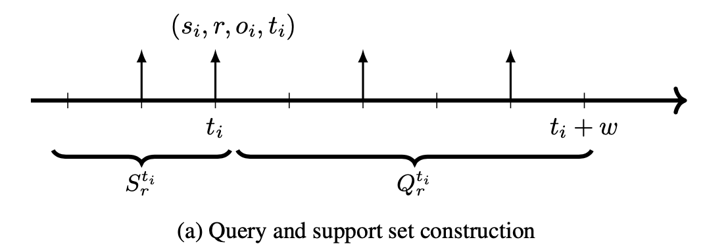
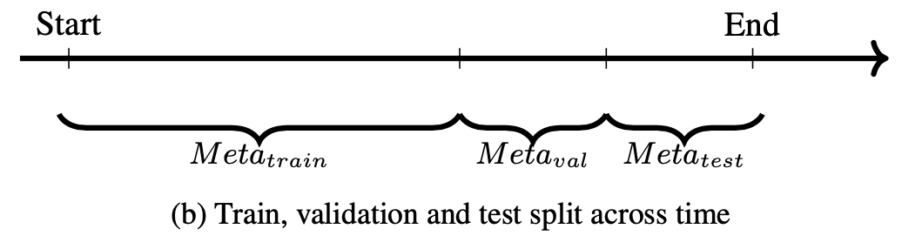
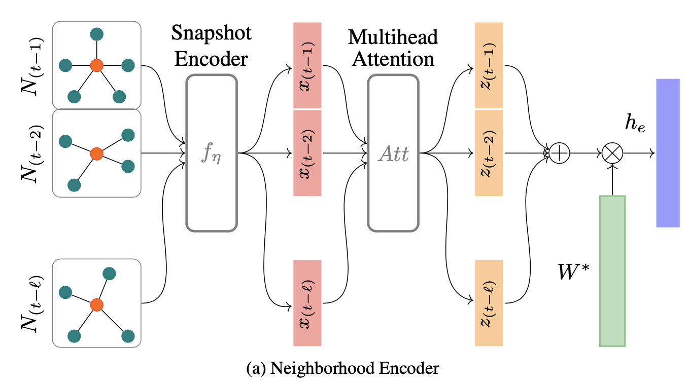
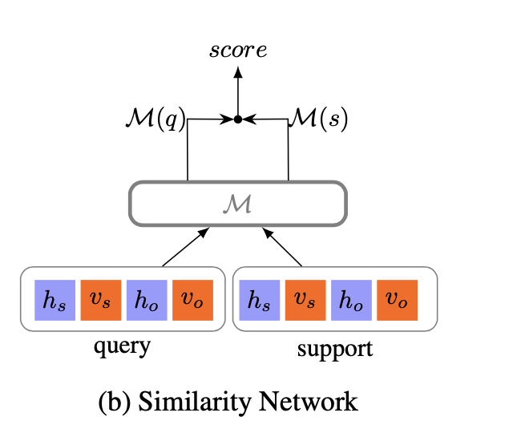
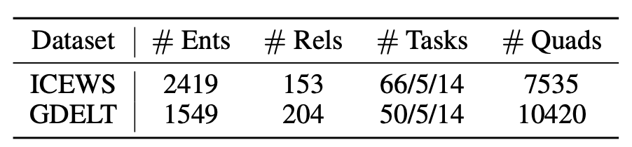
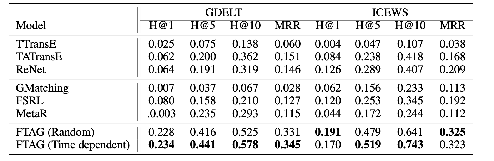

# 论文阅读笔记22：FSL4TKG

> 论文《One-shot Learning for Temporal Knowledge Graphs》的阅读笔记，这篇论文主要提出了一种时序知识图谱表示方法和进行单样本学习的框架

## Introduction

很多现实世界中实际的知识图谱会面临长尾分布的问题，也就是一些关系大量出现而一些关系出现的次数很少，即关系的分布非常不均匀，这种观察到的现象也推动了少样本学习的发展，顾名思义少样本学习就是从比较少的数据中学习并获得泛化的能力。

但是对于知识图谱来说，现有的大部分方法都是为静态知识图谱和某些场景量身定制的，不能应用在时序知识图谱的场景中，这是因为：

- 用于静态知识图谱的方法不能对实体在时序意义上的依赖进行建模
- 这些任务在少样本学习框架下的定义没有加入时间层面的约束

也有一些时序知识图谱的表示方法将目标着眼于预测某个时间点的链接预测，适用面比较窄。时序知识图谱面临着更严重的数据缺失问题，是高度不稳定的(non-stationary.)，因为之前没有观测到的新的关系可能会在时序知识图谱的某个时间点出现

本论文针对时序知识图谱的这些问题和短板，提出了一种**用于时序知识图谱的链接预测的单样本的学习框架**，这个框架使用了自注意力机制对时序数据进行有效编码，并用一个相似度网络来计算一个query和一个单样本数据实例的相似度。论文将这个模型命名为**Few- shot Temporal Attention Graph Learning (FTAG)**，因此本论文的贡献可以概括成以下几个方面：

- 提出一个用于时序知识图谱的少样本学习框架
- 提出了一个使用自注意力机制的时序邻近编码器，用于提取时间维度上的邻居信息
- 在两个热门的真实世界数据集上进行了实验并达到了SOTA，并构建了两个新的用于时序知识图谱少样本学习的开源benchmark

## 问题的形式化定义

### 时序知识图谱补全

知识图谱是由一系列三元组组成的，三元组的构成包括head，relation和tail(也可以叫做subject，relation和object)，而时序知识图谱在此基础上多了一个时间维度，变成了用一系列四元组来表示：
$$
G=\{(s, r, o, t) \mid s, o \in \mathcal{E}, r \in \mathcal{R}\}
$$
知识图谱中的预测和补全主要有尾实体预测和关系预测，即$$(s,r,?),(s, ?,o)$$ 而在时序场景下任务也变成了在特定时间节点t进行关系或者尾实体的预测，即$$(s,r,?,t)$$，同时我们在预测过程中使用打分函数对可能的结果进行评估，模型的学习目标就是让真实的结果获得更高的分数。

时序场景下对于问题的建模的关键是利用时间节点t之前的若干个时间节点的信息。

### 少样本学习和Episodic Training

少样本学习(FSL)的目标就是在每种类别只有少量标注样本的情况下训练处有效的模型，元学习是一种处理FSL问题的方法，元学习在已有的条件下，加入一个任务集合，并且**每个任务是一个N-way K-shot(即N分类，每个类别提供K个样本进行训练)的分类问题**。元学习的目标就是利用不同任务之间共享的信息来以弥补由于标记的数据点很少而导致的关于每个任务的信息匮乏。

而Episodic Training是一种元学习的具体实现方式，假设我们有一个庞大的任务集合T，那么每个Episodic就会包含一个T的任务子集L，以及从L中采样出的支持集合S和批次数据B，并且S和B都是有标注的数据，现在的训练目标就变成了训练处可以将S中的样本映射到一个分类器中，并且将目标函数定为：
$$
\theta=\underset{\theta}{\arg \max } E_{L \sim \mathcal{T}}\left[E_{S \sim L, B \sim L}\left[\sum_{(x, y) \in B} \log P_{\theta}(y \mid x, S)\right]\right]
$$

- 说了半天其实S和B分别就是套了个新皮的训练集

### 少样本时序知识图谱的学习框架

在时序知识图谱+少样本学习的场景里，关系集合R中的所有关系按照出现的频率被分成两个部分，分别是高频关系集合F和稀疏关系集合T，稀疏关系集合被用于构建任务集合并进行Episodic Training，每个任务都被定义成针对一个稀疏关系r的，并且有专门的训练集和测试集，分别写成：
$$
\begin{array}{l}
S_{r}=\left\{\left(s_{0}, r, o_{0}, t_{0}\right) \mid s_{0}, o_{0} \in \mathcal{E}\right\} \\
Q_{r}=\left\{\left(s_{q}, r, o_{q}, t_{q}\right) \mid s_{q}, o_{q} \in \mathcal{E}\right\}
\end{array}
$$
这里的支持集合$$S_r$$包含一个有标签的关系为r的四元组实例。

而对于查询集合$$Q_r$$在每个Episodic中会随机选择一个关系和一个四元组来构建一个支持集合$$S_r$$ ，四元组的选择方式有这样两种：

- 完全随机选择m个四元组
- 时间依赖的选择：选择的时候**受到时间距离上的约束**，**只能选择和支持集合所在的时间点之后并且距离不超过w的数据**：

$$
Q_{r}^{t}=\left\{\left(s_{q}, r, o_{q}, t_{q}\right) \mid s_{q}, o_{q} \in \mathcal{E}, t_{q} \in\left[t_{0}, t_{0}+w\right]\right\}
$$

每个任务的数据集划分过程可以用下面的这张图来表示：

而整个元学习的过程的划分(训练，评估，测试)也需要按照时序来划分，三个部分的数据互相独立不共享，其中位于时间序列的最前面的用于训练，中间的用于validation，而后面的用于test，整个过程可以用下面的图来表示：

在训练的过程中，每一个episode都有一个对应的的loss $$l_{\theta}$$ 它使用了一个打分函数对查询集合中的查询进行打分，并且要求正确的结果获得更高的分数。打分函数是一个在训练过程中学习到的度量空间(其实就是可以学习的神经网络参数)，并且用来表示一个测试查询和支持集合的相似度。

因此最终总体的损失函数可以表示为：
$$
\mathcal{L}=E_{r \sim \mathcal{T}}\left[E_{Q_{r}^{t} \sim G, S_{r}^{t} \sim G}\left[l_{\theta}\left(Q_{r}^{t} \mid S_{r}^{t}\right)\right]\right]
$$

## 模型的细节

FTAG模型主要分成邻居编码器和相似度网络两个部分，分别负责对邻居信息进行编码和用相似度网络计算查询和支持集的相似度。

### 编码器

FTAG模型的编码器的总体架构图如下所示：

我们用$$\mathcal{N}_{\tau}^{r}(e)$$来表示$$\tau$$时刻，实体e通过关系r相连的所有邻居的集合，并定义某个时间节点t上e的邻居集合为：
$$
N(e)=\bigcup_{r \in \mathcal{F}, \tau \in[t-\ell, t-1]} N_{\tau}^{r}(e)
$$
编码器的关键组成部分主要有这样几个

#### 快照聚合Snapshot Aggregation

快照聚合器(Snapshot Aggregator)$$f_n$$用于聚集某个时间点t的局部的邻居信息，并且将这个表示结果和实体e原本的表示向量进行组合，这个过程可以表示为：
$$
\begin{array}{l}
f_{\eta}\left(N_{\tau}(e)\right)= 
\sigma\left(\frac{1}{C_{e_{\tau}}} \sum_{r \in \mathcal{F}} \sum_{e_{j} \in N_{\tau}^{r}(e)}\left(W^{T}\left[v_{r}: v_{e_{j}}\right]+b\right)\right) \\

\end{array}
$$

$$
x_{\tau}^{e}=\left[f_{\eta}\left(N_{\tau}(e)\right): v_{e}\right]
$$

#### 序列聚合

序列聚合器g的作用是将时间序列上的若干个快照(区间$$[t-l.t-1]$$)进行聚合，这里使用的是Transformer中提出的多头自注意力机制，并且使用了Feed-Forward结构，位置编码和其他一些奇奇怪怪的东西，这一块在Transformer论文中都有就不细说了，有点浪费时间

### 相似度网络

有了邻居编码器之后，每一个subject和object对都可以表示成一个向量$$[h_s:v_s,h_o,v_o]$$，这里的h和v分别表示基于时间序列的表示向量和实体原本的表示向量，然后我们使用下面的网络结构，将查询集合中的输入$$(s,o)$$和支持集合中的训练数据$$(s_0,o_0)$$进行相似度的比较并得到打分函数：

$$
\begin{array}{l}
x^{(1)}=\sigma\left(W^{(1)} x+b^{(1)}\right) \\
x^{(2)}=W^{(2)} x^{(1)}+b^{(2)} \\
\mathcal{M}(x)=x^{(2)}+x
\end{array}
$$
最终的相似度计算用二者的打分函数的内积来表示：
$$
\mathrm{score}=\mathcal{M}(s)^T\mathcal{M}(q)
$$

### 模型训练

训练的过程中采用经典的负采样方法，构造包含负样本的查询集合$$Q_{r}^{t}=Q_{r}^{t^{-}} \cup Q_{r}^{t^{+}}$$ 并用定义margin的损失函数：
$$
\mathcal{L}=\max \left(\text { score }^{-}-\text {score }^{+}+\lambda, 0\right)
$$
因此整个算法的流程可以用下面的伪代码来表示：

## 实验

### 数据集

这篇论文中采用的数据集是ICEWS和GDELT，是两个之前从来没听说过的时序知识图谱用的数据集，这两个数据集的规模如下：

- 总的来看规模比较小，但是实体和关系数量相对比较多，应该属于是非常**稀疏的数据集**

### 实验结果

实验结果如下，metric依然是经典的Hit和MRR，论文表明除了它这种方法其他的方法都基本p用没有

