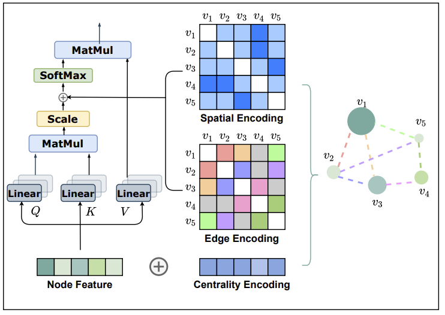

# 论文阅读笔记23：Graphformer

> 论文《[Do Transformers Really Perform Bad for Graph Representation?](https://arxiv.org/pdf/2106.05234.pdf)》的阅读笔记，该论文发表在NIPS2021上，提出了一种新的图Transformer架构，对原有的GNN和Graph-Transformer等架构进行了总结和改进。

## Introduction

Transformer是近几年来人工智能领域极度热门的一个模型，在自然语言处理和计算机视觉等领域取得了巨大的成功，但是它却在图结构的数据，尤其是图级别的预测任务(就是以图而非节点和边为单位进行性质的预测)上表现不好，之前论文阅读笔记系列中，我们也在《[论文阅读笔记15：Graph-Transformer](https://zhang-each.github.io/2021/09/09/reading15/)》中介绍了图Transformer的通用架构以及专门用于异构图的Transformer模型，但是这些模型都主要面向节点级别的任务，并且**基本就是在通用的GNN架构上换用了Transformer引以为傲的自注意力机制**，而对于图级别的预测任务表现不佳。

本论文提出的Graphformer就是针对图级别的任务提出的Tranformer架构。我们知道Transformer的强项在于对序列化的数据进行建模，而图作为一个非欧式数据结构是没有序列特征的，因此直接使用Transformer架构必然会带来各种问题，而作者认为解决问题的关键就在于将**图的结构信息引入模型**中，为此作者在论文中提出了下面三个重要的图结构编码方式：

| 编码方式                    | 作用                       | 补充说明                                                     |
| --------------------------- | -------------------------- | ------------------------------------------------------------ |
| 中心编码Centrality Encoding | 对图结点的重要性进行编码   | 作者认为大规模图结构中的结点重要性是不同的，比如社交网络中，网红比普通网名的重要程度高，并且在自注意力机制中并不能体现出结点的重要性特征 |
| 空间编码Spatial Encoding    | 对图结点的空间结构进行编码 | 自注意力机制是一种全局的注意力计算，这样一来会导致编码过程中丢失图结点的空间性质，因此需要使用额外的空间编码对图结点特征进行补充 |
| 边特征编码Edge Encoding     | 对边的特征进行编码         | 一些任务中还需要充分利用边的性质，因此要对边的特征进行编码   |

- 本模型是面向图级别的预测任务的，但是上面的几种编码依然是对结点和边进行编码，之后还需要通过**图池化**(Graph Pooling)等手段**得到整张图的特征**，这个后面会细嗦

论文对这几种编码方式的有效性进行了数学上的证明，并在数据集上进行了实验

## 相关工作

### 图神经网络GNN

图神经网络是用在图结构上的神经网络，具体的可以看我博客中的另一片图神经网络文献综述(其实就是一堆论文缝合的)，图神经网络对节点特征的提取可以分成两个阶段，分别是聚合Aggregate和组合Combine
$$
a_{i}^{(l)}=\text { AGGREGATE }^{(l)}\left(\left\{h_{j}^{(l-1)}: j \in \mathcal{N}\left(v_{i}\right)\right\}\right), \quad h_{i}^{(l)}=\text { COMBINE }^{(l)}\left(h_{i}^{(l-1)}, a_{i}^{(l)}\right)
$$
其实这个过程就是将邻居节点的信息收集起来然后进行组合，得到节点自己的特征。

如果要得到整个图的特征表示，那么我们还需有一个ReadOut的函数，一般就是一个图池化的过程：
$$
h_{G}=\operatorname{READOUT}\left(\left\{h_{i}^{(L)} \mid v_{i} \in G\right\}\right)
$$

- 我们可以发现图神经网络中，节点特征都**依赖于局部结构**——即节点邻居的信息，很难学到全局的特征表示，因此通用的GNN架构对于图级别的问题效果可能不好。

### Transformer架构

Transformer因为太热门我已经不想提了，之前的论文里也好几次提到过，这个模型引以为傲的东西就是它的多头自注意力机制和FFN，Position Encoding等一系列trick，其中自注意力机制可以表示为：
$$
\begin{array}{l}
Q=H W_{Q}, \quad K=H W_{K}, \quad V=H W_{V} \\
A=\frac{Q K^{\top}}{\sqrt{d_{K}}}, \quad \operatorname{Attn}(H)=\operatorname{softmax}(A) V
\end{array}
$$

- 其实就是QKV注意力机制的一种变体，区别在于使用了投影矩阵将QKV投影到了多个空间中，因此可以获得多个不同的注意力

## Graphformer的架构与细节

本文将提出的模型命名为Graphformer，其结构如下图所示：

可以看到整个模型就是在原本的Transformer模型上融入了三个新的编码特征，下面我们逐一介绍：

### 结构编码

#### 中心编码

中心编码使用**节点的度数作为节点重要性的衡量标准**，这其实也基于一个很直观的感受，那就是图中被更多节点连接的结点往往会更重要，比如社交网络中，网红总是被更多人点了关注，因此Graphformer构造了一批**和节点度数有关的向量**(每个度数都有一个向量表示，和具体是哪个节点无关，度数相同的结点的中心编码也相同)，并且将这个中心编码直接和节点特征相加作为输入：
$$
h_{i}^{(0)}=x_{i}+z_{\mathrm{deg}^{-}\left(v_{i}\right)}^{-}+z_{\mathrm{deg}^{+}\left(v_{i}\right)}^{+}
$$

#### 空间编码

Transformer中使用了位置编码对一个输入序列进行编码，防止自注意力导致的序列特征丢失，而图并不是序列，因此不能使用和原生Transformer一样的位置编码，论文提出的方法是用一个函数$$\phi(v_i, v_j)$$ 来表示两个结点之间的相对位置关系，而模型中选择了最短路径距离作为具体的函数实现(如果没有路径那就是-1)，这样一来一个路径长度就对应了一个空间结构向量，论文中的做法是直接把它加到注意力计算后的结果上：
$$
A_{i j}=\frac{\left(h_{i} W_{Q}\right)\left(h_{j} W_{K}\right)^{T}}{\sqrt{d}}+b_{\phi\left(v_{i}, v_{j}\right)}
$$

#### 边特征编码

论文中提出的利用边特征的方式是，找到两个结点之间的最短路径，并将最短路径中的边特征编码到结果中，即：
$$
A_{i j}=\frac{\left(h_{i} W_{Q}\right)\left(h_{j} W_{K}\right)^{T}}{\sqrt{d}}+b_{\phi\left(v_{i}, v_{j}\right)}+c_{i j}, \text { where } c_{i j}=\frac{1}{N} \sum_{n=1}^{N} x_{e_{n}}\left(w_{n}^{E}\right)^{T}
$$

### 实现的细节

#### 学习过程

Graphformer中将层标准化LN，多头注意力机制MHA和前馈机制结合在了一起，对每个结点的特征进行更新，具体的方式是：
$$
\begin{aligned}
h^{\prime}(l) &=\operatorname{MHA}\left(\operatorname{LN}\left(h^{(l-1)}\right)\right)+h^{(l-1)} \\
h^{(l)} &=\operatorname{FFN}\left(\operatorname{LN}\left(h^{\prime(l)}\right)\right)+h^{\prime(l)}
\end{aligned}
$$

#### 虚拟结点Virtual Node

同时，模型中采用了一个被叫做虚拟结点的设定，即在图数据中凭空加入一个新的结点，并且让它跟所有的结点相连，这个结点称为VNode，在模型结束学习之后，就使用这个虚拟结点作为整个图的表示，Graphformer采用了这样一种方式代替原本的图池化操作来计算图的特征表示

- 这个方式和BERT中的[CLS]标签很相似，BERT中通过对输入的句子开头加上这个标签，让所有单词都能观测到这个标签并给它传递信息，然后用这个标签的表示作为整个句子的表示

- 事实也证明，虚拟结点这种trick的效果很好，如果要给个解释，那就是这个结点在训练过程中，通过多头注意力机制和三种结构编码充分学习到了图中所有节点传递给它的特征并聚合到了一起，这个特征表示具有非常好的全局视野，因此可以作为整个图的表示

## 实验

这篇论文的实验总结如下：

|          | 实验使用的要素                                |
| -------- | --------------------------------------------- |
| 数据集   | OGB-LSC和PCQM4M-LSC，两个特别大规模的图数据集 |
| Baseline | GCN，GIN，GAT和DeepGCN等一系列神经网络        |
| 评价指标 | AUC，MAE(平均绝对误差)                        |

