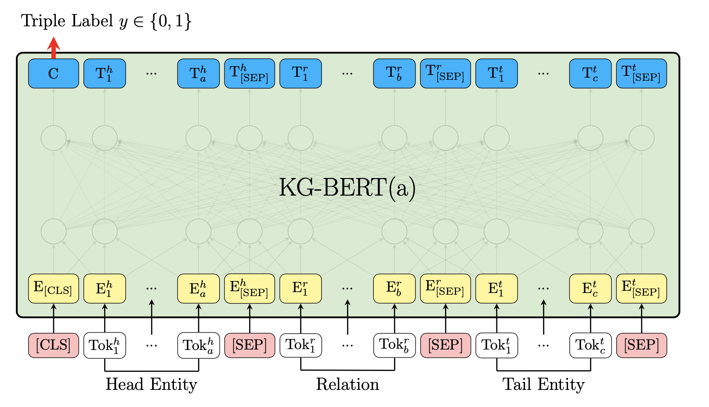
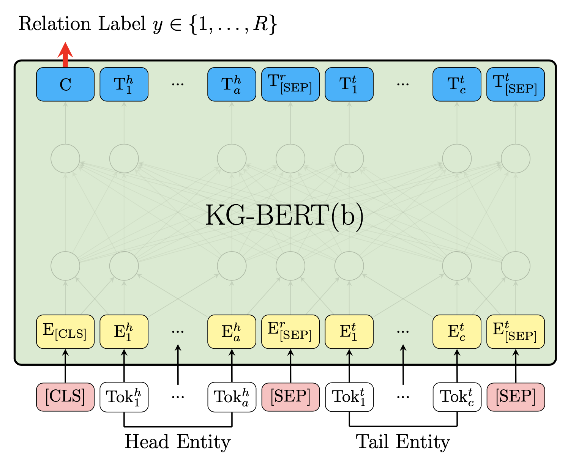
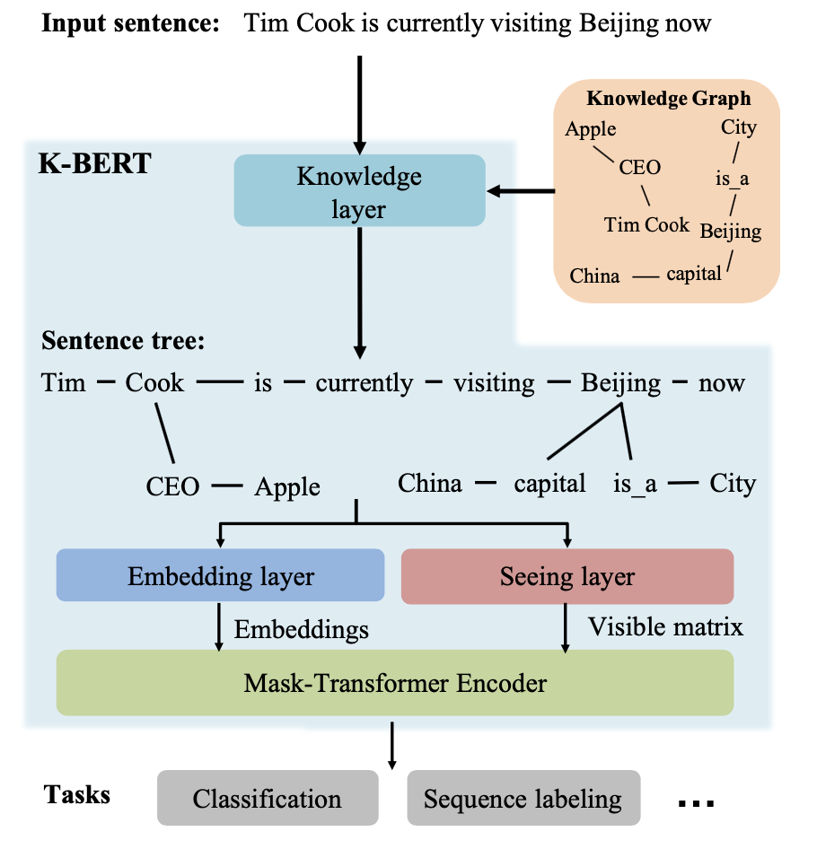
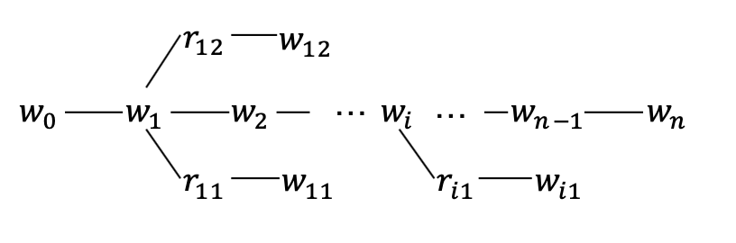
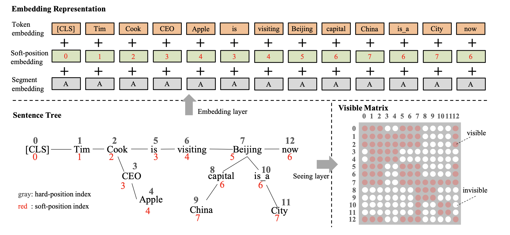
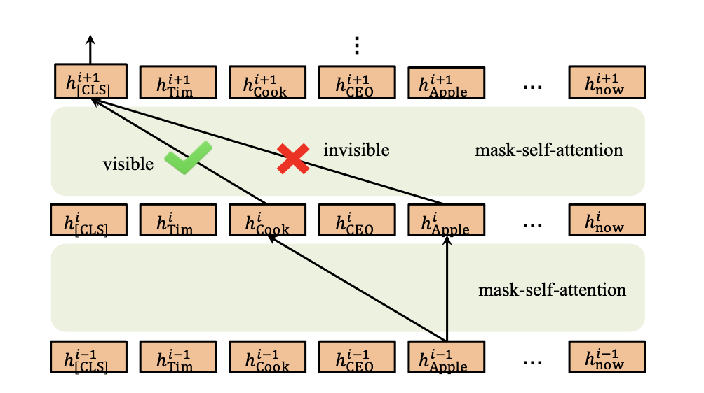

# 论文阅读笔记23：KG-BERT&K-BERT

> 论文《KG-BERT: BERT for Knowledge Graph Completion》和《K-BERT: Enabling Language Representation with Knowledge Graph》的阅读笔记，两篇论文都做了BERT预训练模型和知识图谱结合的工作，但是侧重点各有不同，KG-BERT关注用BERT解决知识图谱中本身的问题，而K-BERT的重点是在BERT中注入知识三元组并增强语言模型的效果

## 语言模型和知识图谱的结合

语言模型和知识图谱的结合早已有之，最早的一些研究将当时的语言模型(Word2Vec词向量)和知识表示模型(TransE等)相结合，得到了文本和知识的联合表示，并将其用在各种下游任务中，但是受制于语言模型和知识表示模型本身，终究表示能力有限。

而在BERT这样的预训练模型被提出之后，结合BERT做的一些知识和文本的联合表示又兴盛了起来，主要有两条发展路线：

- 第一条路是用语言模型解决知识图谱自身的下游任务比如链接预测，实体预测等等
- 第二条路是用知识赋能语言模型，增强语言模型的表示能力并用于各种下游任务，如**垂直领域的对话**就非常适合用语言模型+领域知识图谱来一起做

这一次我读的两篇论文分别是KG-BERT和K-BERT，分别就是在BERT发布初期对于上面两条路线的一些尝试。

## KG-BERT：用BERT做KG补全

KG-BERT的思路其实非常简单粗暴，就是直接将KG中的三元组数据看城市一个具有上下文情景的文本，用预训练好的BERT模型得到其表示向量并定义下游任务进行微调。而论文中定义的下游任务是来预测三元组的合理性(其实就是用BERT的结果进行打分)以及预测关系的合理性，对于两种不同的下游任务，论文分别提出了略有区别的模型架构。

### 三元组合理性预测

对于三元组合理性判断的任务，模型将head，relation和tail分别拆分成若干个token输入，并在开头用一个CLS标签，实体和关系之间用SEP标签隔开，用这样的形式作为BERT的输入，并且输入的表示向量包含正确的token，段表示和位置表示三个部分，这里的段表示是head，relation和tail分别作为一个段。

最终CLS这个特殊的token输出的结果，也是最终的hidden state C作为整个模型的输出并在下游任务中进行微调，微调的方式是使用一个神经网络将C映射成一个score，并且采用了基于负样本的损失函数，我们记三元组为：$$\tau=(h,r,t)$$，那么打分函数就可以写成：
$$
s_{\tau}=f(h,r,t)=\mathrm{sigmoid}(CW^T)
$$
而最终的基于负样本的损失函数可以表示成：
$$
\mathcal{L}=-\sum_{\tau \in \mathbb{D}+\cup \mathbb{D}^{-}}\left(y_{\tau} \log \left(s_{\tau 0}\right)+\left(1-y_{\tau}\right) \log \left(s_{\tau 1}\right)\right)
$$
这里的$$s_{\tau_0},s_{\tau_1}$$分别表示正负样本，负样本的采集方式是：
$$
\begin{aligned}
\mathbb{D}^{-}=&\left\{\left(h^{\prime}, r, t\right) \mid h^{\prime} \in \mathbb{E} \wedge h^{\prime} \neq h \wedge\left(h^{\prime}, r, t\right) \notin \mathbb{D}^{+}\right\} \\
& \cup\left\{\left(h, r, t^{\prime}\right) \mid t^{\prime} \in \mathbb{E} \wedge t^{\prime} \neq t \wedge\left(h, r, t^{\prime}\right) \notin \mathbb{D}^{+}\right\}
\end{aligned}
$$

### 关系预测

用于关系预测的KG-BERT的模型架构和用于三元组判定的略有区别，输入的内容改成了head和tail，但是依然使用CLS的最后一个隐层输出C用作下游任务，下游任务中其实用了一个交叉熵作为损失函数，将关系预测转化成了一个多分类问题：
$$
\mathcal{L}^{\prime}=-\sum_{\tau \in \mathbb{D}^{+}} \sum_{i=1}^{R} y_{\tau i}^{\prime} \log \left(s_{\tau i}^{\prime}\right)
$$

## K-BERT：用KG赋能BERT

K-BERT这篇论文则把目光聚焦于在BERT模型中注入知识三元组用来增强其表示效果，并在开放域和特定领域的下游任务中都取得了很好的效果。

K-BERT模型包含知识层，嵌入层，可视层和掩码Transformer等关键组件，其模型结构如下图所示：

我们假设输入的句子是包含n个token的序列(其中英文是单词级别的token而中文是单字token)，一个句子输入模型的时候会先在知识层中注入相关的三元组数据并扩展成一棵富知识的句子树，然后这个句子树被输入到嵌入层和可视层分别生成token的embeddings和visible matrix，最后得到每个单词的表示向量。

### 知识层

知识层的主要作用是将一个句子包含的token用KG中的三元组进行扩展，得到一个树形的结构，如下图所示：

中间需要经历KG查询和三元组注入两个环节，得到句子树之后还需要经历下面几个层的处理：

### 嵌入层

嵌入层的作用是将句子树转化成嵌入表示，这里的token embedding生成的方式和BERT非常相似，由三个部分相加而成，分别是token本身的embedding(同时要在句子开头加上CLS标签)，软位置编码和段编码三个部分。

#### 软位置编码

位置编码是BERT中提出的一个很重要的trick，如果BERT中没有位置编码就会变成和词袋模型等价的语言模型， 这会导致缺少模型缺少结构化的信息(比如token之间的位置关系)，位置编码正是提供了这样一种结构化的信息。

但是K-BERT的输入不是句子而是一个句子树，因此取代原本的硬位置编码(按照单词的顺序确定位置，不适用于树形的结构)提出了**软位置编码**的方式，这样一来就可以对树状结构进行位置编码了。

#### 段编码

段编码也是BERT中一个重要的部分，K-BERT沿用了段编码，并在组合的句子中采用不同的段标识，但是如果只有一个句子树，那么所有的token的段编码是相同的。

### 可视层Seeing Layer

可视层是K-BERT和BERT之间最大的区别，K-BERT的输入是一个句子树，树的分支上是一系列知识三元组，而这些三元组可能会导致原本句子意思的改变，比如上面图片的例子中，知识三元组中的China和原本句子中的Beijing关系比较大，但是和同样处于分支上的Apple关系不大，因此Apple这个单词不应该被China所影响，另一方面，CLS标签在用于分类的时候也不能被Cook分支上的Apple所影响，否则可能会改变句子原本的语义。

因此K-BERT中提出了一个可视层的概念，在这一层将生成一个可视矩阵用来表明哪些token之间是可以相互影响，而哪些token之间不能互相影响，具体的规则是：
$$
M_{i j}=\left\{\begin{array}{cc}
0 & w_{i} \ominus w_{j} \\
-\infty & w_{i} \oslash w_{j}
\end{array}\right.
$$
两个token i和j在同一个分支上的时候就是对应位置权重就是0，否则就是负无穷，这里的i和j是**硬位置**，因为软位置会导致下标重合。

### 掩码Transformer

最后还需要将嵌入层和可视层的结果输入到一个掩码Transformer层中，这里采用的是**掩码自注意力机制**，掩码自注意力要用到可视矩阵M，来排除无关token对特定token的影响，具体的运算方式如下：
$$
\begin{array}{c}
Q^{i+1}, K^{i+1}, V^{i+1}=h^{i} W_{q}, h^{i} W_{k}, h^{i} W_{v} \\
S^{i+1}=\operatorname{softmax}\left(\frac{Q^{i+1} K^{i+1^{\top}}+M}{\sqrt{d_{k}}}\right) \\
h^{i+1}=S^{i+1} V^{i+1}
\end{array}
$$

## 实验结果

两篇文章都和已有的方法做了大量对比，KG-BERT和Trans家族等一系列模型在知识图谱补全任务中进行对比，结论是效果好的惊人(你用了这么多参数不惊人才比较奇怪)，第二篇文章更是重量级，财大气粗直接用不同的语料库自己重新训练了几个不同的BERT模型，并在开放域问答和领域内(金融，法律)的问答和命名实体标注等多项任务中进行了比较，结论都是有明显的提升，具体的图表就不放了。

