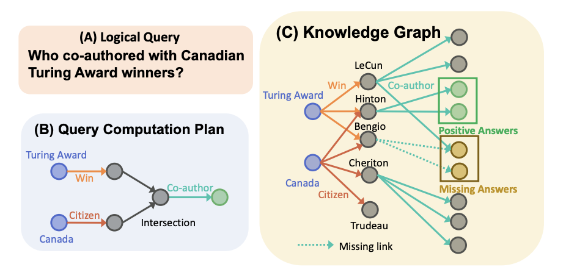
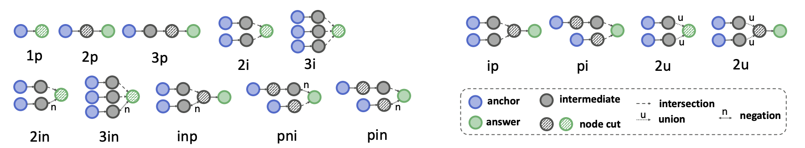
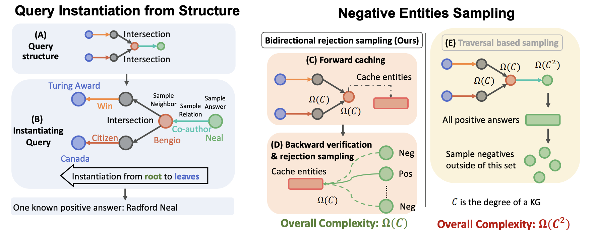
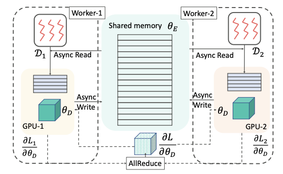
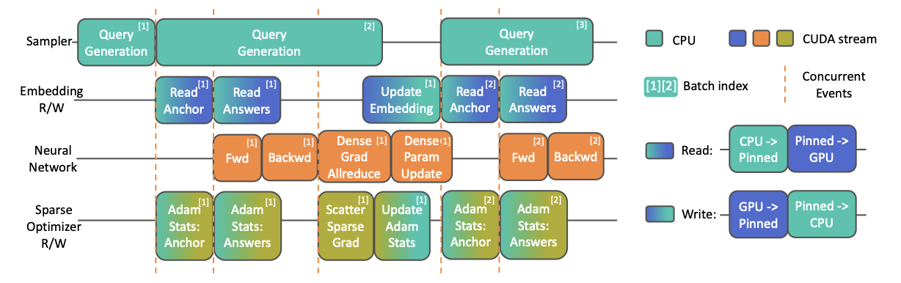

# 论文阅读笔记24：SMORE大规模知识图谱系统

> 论文《[SMORE: KNOWLEDGE GRAPH COMPLETION AND MULTI-HOP REASONING IN MASSIVE KNOWLEDGE GRAPHS](https://arxiv.org/pdf/2110.14890v2.pdf)》的阅读笔记，该论文提出了在超大规模数据量的场景下进行知识图谱的补全河推理的方法，从算法和系统机制设计两个层面解决了超大规模数据的情况下的知识图谱补全河多跳推理问题。

## Introduction

开篇的第一句依然是介绍知识图谱是一系列由头尾实体和对应的关系组成色三元组，并且在各种AI系统中非常重要，知识图谱中有两种非常重要的推理方式，一种是单条的推理，也就是链接预测或者叫做知识图谱补全，另一种就是多跳的推理，这种推理方式可以对一个给定的逻辑查询来查找对应的实体结果是否存在。

目前大部分知识图谱推理的方法都是基于embedding的，然而已经存在的可扩展性好的Knowledge Graph Embedding(KGE)框架都只能支持单跳的推理，与此同时支持多跳推理的方法又在大规模数据量的场景中训练缓慢，不能很好的规模化使用，因此本论文提出了一种可以规模化使用的多跳推理框架(Scalable Multi-hop Reasoning, SMORE)来同时解决大规模数据量场景下知识图谱的单跳和多跳补全的问题。

论文从算法和系统两个角度进行了设计，在算法方面，改进了模型训练过程中的采样算法，提出了一种双向拒绝采样策略，而系统方面则探索了CPU-GPU的异构I/O架构，设计出了可以尽可能提高系统吞吐量的学习系统，并且在单机器和多GPU等多种情况下都取得了SOTA的效果。

## 多跳知识图谱推理

多跳知识图谱推理是一个很困难的任务，这是因为给定的查询逻辑可能非常复杂(包含conjunction，disjunction和existential，negation等多种量词)，同时知识图谱中的实体和关系数量众多，因此复杂的方法会导致计算量直线升高，不能大规模使用。

多跳推理的通常解决方法是，对于一个给定的查询，我们生成一个查询计算计划，然后根据计算计划在知识图谱中进行游走，直到查询到想要的结果。问题是逻辑查询往往难以用代码实现，因此就衍生出了基于嵌入的遍历方式，即我们通过定义一个**嵌入模型**，并通过训练将所有的实体映射到这个模型的表示空间中，得到每个实体和关系的嵌入向量，然后再进行进一步的遍历和推理。这类方法也叫做知识图谱表示学习和知识图谱嵌入，当然前面已经介绍过不少知识图谱的嵌入模型了，不过基本都是用于单跳推理(即知识图谱补全和链接预测)的模型。相比之下多跳模型会更复杂一些。

同时在知识图谱嵌入的训练过程中，损失函数往往是基于负样本的，这其实也体现了一种对比学习的策略，对于一个查询q，我们往往会有关于q的正样本集合A和负样本集合q，以及一个距离函数Dist，并定义一个margin作为区分正负样本的边界，最后的损失函数一般长这样：
$$
\begin{array}{l}
\mathcal{L}(\theta)=-\frac{1}{|\mathcal{A}|} \sum\limits_{v \in \mathcal{A}_{q}^{\mathcal{G}}} \log \sigma\left(\gamma-\operatorname{Dist}\left(f_{\theta}(q), f_{\theta}(v)\right)\right) -\frac{1}{|\mathcal{N}|} \sum\limits_{v^{\prime} \in \mathcal{N}^{\mathcal{G}}} \log \sigma\left(\operatorname{Dist}\left(f_{\theta}(q), f_{\theta}\left(v^{\prime}\right)\right)-\gamma\right)
\end{array}
$$
同时，在多跳的知识图谱推理中，采集负样本往往涉及到比较复杂的一阶逻辑操作，比之前接触过的很多知识图谱补全模型中提出的负采样要复杂的多(因为知识图谱补全是单跳的)，这就造成了模型规模化使用的性能瓶颈，因此需要一种高效的采样策略来加速训练过程中的数据负采样。

## 算法设计：高效的训练采样

这一部分的内容将集中介绍论文提出的高效采样策略，采样包括两个部分，一个是复杂查询逻辑下的训练数据采样，另一个则是针对训练数据的负采样。

### 查询结构的实例化

多跳查询的查询结构往往是比较复杂的，有多种不同的查询结构：

为了获得训练数据，我们就要从知识图谱中找到具有类似结构的一系列子图结构，并将它们提取出来作为训练数据，传统的方法往往是从一个初始结点开始找，然后根据查询的结构不断搜索直到找到一个查询的答案为止(这个答案也叫做根结点root)，但是这种方法的时间复杂度是非常高的，大约是$\Omega(C^2)$，这里的C是指知识图谱中各个节点的度数的最大值，而论文中提出了一种新的方法，就是反向采样，对于一个特定的查询结构，搜索的时候先从答案节点开始搜索(即从根节点开始)，同时使用DFS的方法进行搜索，如下图所示：

这样一来搜索的时间复杂度就变成了$O(C|q|)$了，其中q是逻辑查询结构中最大的路径长度，通过这种方法，我们可以得到一个查询q，以及查询的起始实体和一个正确的答案。这种方法不仅可以降低时间复杂度，还可以保证每次搜索都找到想要的一个结果，避免了大量重复而无效的搜索。

### 高效率负采样：双向拒绝算法

负采样所面临的问题有两个，一是要尽可能采集有质量的负样本，即必须是负的，但又不能负的太离谱，另一方面，负采样要快速，避免大量重复的搜索，而许多负采样方案(之前的论文阅读笔记里就有)就在质量和效率这两个问题上分别给出了自己的trade-off，最简单的方法肯定是最暴力的方法，先从实体的集合中去掉所有多跳查询的正确答案，然后通过随机的方式选出负样本，但是在海量实体的情况下，这种手段肯定是非常慢的。

而论文中提出的新方法就是双向拒绝负采样，对于一个随机的结点v，我们只需要判断其是不是在正确答案集合内就可以完成负采样的过程，而不需要一个个穷举所有的负样本然后再随机选择。因此论文中提出了可以采用双向搜索的办法，并引入了一个node cut的概念

> Node cut是指一个查询q中的满足“在所有的起始结点和根节点之间的路径必定包含其中一个结点”的**结点集合**(具体的实例可以看上面的插图)，同时node cut的定义应该满足最小性，即集合里面任何的子集都不能是一个node cut

双向拒绝采样算法分成两个部分：

- 前向缓存Forward Caching，从一个起始结点出发，不断向前搜索直到找到一个node cut为止，搜索的过程中记录所有遇到过的实体
- 反向认证Backward Verification，前向缓存结束之后从根节点开始反响搜索，直到碰到node cut为止，对遇到的所有结点进行检查，通过比较这些实体**和cache中的实体有无重合**来判断是不是负样本，如果是负样本就可以采样。

## 系统设计：CPU/GPU异构体系

SMORE系统建立在一个由多核CPU核多个GPU共享内存的系统之上，它会同时使用GPU和CPU，把矩阵计算的任务放到GPU上，而把采样操作放在CPU上。

### 分布式训练范式

知识图谱相关的模型中，最重要的参数就是一个embedding矩阵，但是随着知识图谱规模的扩大，这个矩阵的规模也会随之增大，而GPU的存储空间是有限的(很多都是16GB)，embedding矩阵扩大之后GPU可能无法存入整个矩阵，因此论文提出的方案是把整个矩阵放在CPU中，同时每次需要GPU计算的时候就复制其中一部分需要操作的内容到GPU中。

GPU上开启一个工作线程进行学习，每次先更新存在GPU里的局部embedding，然后通过一定的异步机制将其更新到CPU存的完整embedding矩阵中。

### 异步机制的设计

论文中比较详细的阐述了SMORE系统中的优化机制，作者为系统设计了一个完整的pipeline，包含以下四个部分：

- 多线程采样器：一个可以访问共享KG的采样器，采样器中有一个线程池可以用来采样
- 稀疏嵌入读写：从内存完整的嵌入矩阵中复制很稀疏的一小部分内容并存放到GPU中
- 稠密计算：在GPU中执行模型的前向传播和梯度计算的过程
- 异步稀疏优化器：将GPU计算的稀疏梯度更新到CPU的完整矩阵中

## 实验

这篇文章的实验采用了BetaE，Q2B和GQE等多跳推理模型以及多个KG数据集，和其他KG文章不同的是，作者还比较了GPU利用率，查询处理速度和采样器消耗时间的对比。