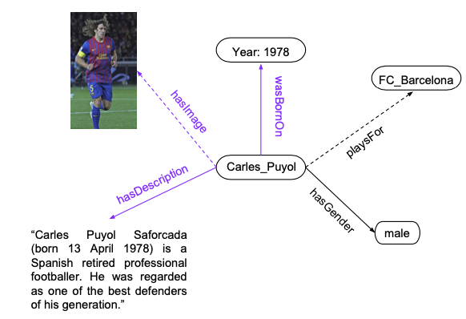
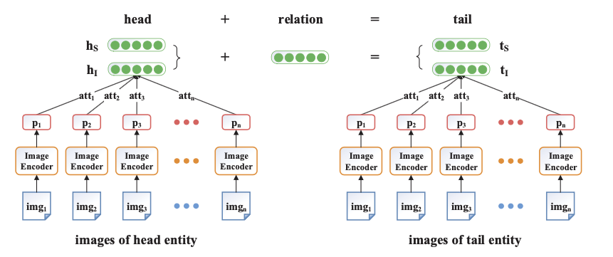
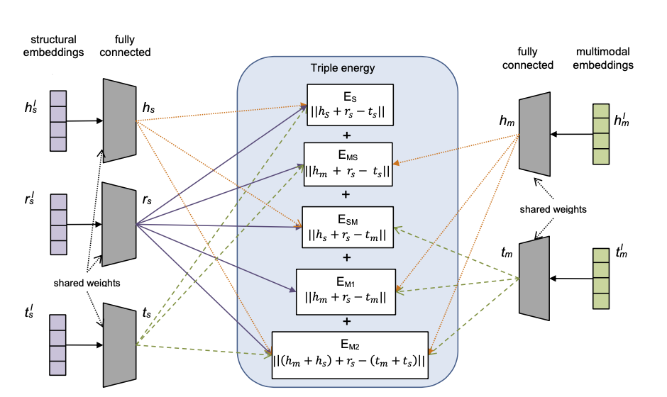
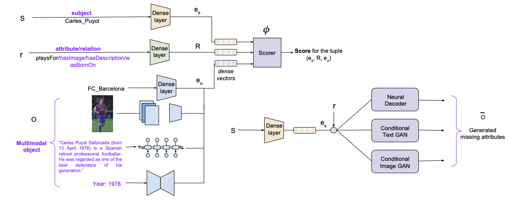
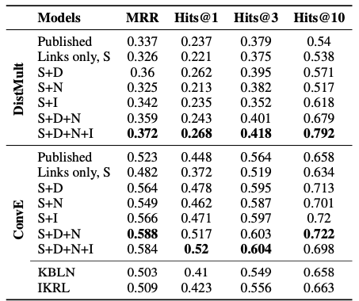

# 论文阅读笔记24：MMKG多模态知识图谱表示学习

> 这一次的论文阅读笔记聚焦于多模态知识图谱的表示学习和补全，选择了三篇前几年的论文，分别是发表在2017IJCAI上的《[Image-embodied Knowledge Representation Learning](https://arxiv.org/pdf/1609.07028v1.pdf)》，发表在2018ACL上的《[A Multimodal Translation-Based Approach for Knowledge Graph Representation Learning](http://aclanthology.org/S18-2027.pdf)》和2018年EMNLP的《[Embedding Multimodal Relational Data for Knowledge Base Completion](https://aclanthology.org/D18-1359.pdf)》

## Introduction

我们知道知识图谱是由一系列三元组$(h,r,t)$组成的，而知识图谱除了可以包含本身的结构化信息(作为一张异构图)以外，还可以包含各种不同模态的信息，比如文本，图像和数值，包含这些信息的知识图谱也被叫做多模态知识图谱(**Multimodal KG**)

事实上大部分知识图谱表示学习的方式都是从三元组的结构化表示出发，而忽略了很多结构化以外的信息，比如知识图谱三元组本身是文本，而在多模态KG中，实体也可能有其对应的图像，如果能够把这些额外的模态信息利用起来，那么知识图谱表示学习模型的表示能力将会得到进一步的增强。这次论文阅读也是围绕这个主题选择了三篇论文，来探究多模态知识图谱的表示学习的进展。

## 论文1：图像信息+注意力+Translation

第一篇论文《[Image-embodied Knowledge Representation Learning](https://arxiv.org/pdf/1609.07028v1.pdf)》提出了一个可以将实体的图像中蕴含的信息融入到知识表示中的模型IKRL，该论文的设想是对使用两种不同的嵌入向量来对每个实体进行表示，这两个表示分别是：

- 结构化的表示(Structure-based representation, SBR)，即实体通过结构化三元组学习到的表示，记为$h_s, t_s$
- 基于图像的表示(Image-based representation, IBR)，即实体根据其对应的图像所学习到的表示记为$h_I, t_I$ 

而每个关系r则只有一个表示，因为关系没有图片描述。

### 总体框架(打分函数)

和所有其他的知识表示方法一样，IKRL也需要定义一个打分函数(论文中称为**能量函数**，不过一般KGE中就是称为打分函数，所以我们也这么叫)，本论文中提出的打分函数定义是：
$$
E(h, r, t)=E_{S S}+E_{S 1}+E_{I S}+E_{I I}
$$
其中
$$
E_{SS}=||h_S+r-t_S||, E_{II}=||H_I+r-t_I||,E_{SI}=||h_S+r-t_I||,E_{IS}=||h_I+r-t_S||
$$
这个函数这样定义的目的是为了在**同一个表示空间中学习到每个实体的结构化表示和图像表示**，我们需要定义一个图像编码器对图像的特征进行提取，同时一个实体可能会有多张图像与之对应，因此我们希望能够让实体选择与之最符合的图像进行共同表示，所以模型中还**使用了注意力机制**来实现多张图像的权重分配。

IKRL模型的总体架构如下图所示：

### 图像编码器

图像编码器是模型中一个非常关键的设计，我们需要先得到图片的特征，然后将图片的特征投影到实体的表示空间中，如下图所示

论文中使用了预训练好的AlexNet作为图像特征的提取器，并设置投影矩阵M将图片特征投影到实体表示空间中：
$$
\mathbf{p}_{i}=\mathbf{M} \cdot f\left(i m g_{i}\right)
$$
然后我们可以使用注意力机制，为实体$e_k$的n张图片生成一个基于图像的实体表示：
$$
\operatorname{att}\left(\mathbf{p}_{i}^{(k)}, \mathbf{e}_{S}^{(k)}\right)=\frac{\exp \left(\mathbf{p}_{i}^{(k)} \cdot \mathbf{e}_{S}^{(k)}\right)}{\sum_{j=1}^{n} \exp \left(\mathbf{p}_{j}^{(k)} \cdot \mathbf{e}_{S}^{(k)}\right)}
$$

$$
\mathbf{e}_{I}^{(k)}=\sum_{i=1}^{n} \frac{\operatorname{att}\left(\mathbf{p}_{i}^{(k)}, \mathbf{e}_{S}^{(k)}\right) \cdot \mathbf{p}_{i}^{(k)}}{\sum_{j=1}^{n} a t t\left(\mathbf{p}_{j}^{(k)}, \mathbf{e}_{S}^{(k)}\right)}
$$

这里的注意力机制的依据就是希望每个图片的投影$p_i$能和实体本身的结构化表示尽可能相关，同时这里的注意力加权求和也可以简化成取平均值或者最大值。

### 目标函数和训练

因为模型本身选用的是基于Translation的模型(实际上就是基于TransE和图像特征的变种模型)，因此它依然采用了基于负采样的损失函数并进行训练。
$$
L=\sum_{(h, r,t) \in T\left(h^{\prime}\right.} \sum_{\left.r^{\prime}, j^{\prime}\right) \in T^{\prime}} \max (\gamma+E(h, r, t)-E(h',r',t'),0)
$$

- 这里的$T'$表示的就是负样本的集合，没有特别说明应该是指随机替换得到的采样(即Normal Sampling)

我们可以总结出该模型需要训练的参数包括了$(E,R,W,M)$四个大类别，其中E和R分别表示实体和关系的嵌入向量的集合，而W表示图像编码器的参数，M表示投影矩阵

### 实验

论文使用了一个非常小的数据集，并在此基础上进行了一些实验，这个数据集被命名为WN9-IMG，是一个基于WordNet的知识库，其中的实体图片来自于ImageNet，并且保证了每个实体都有对应的图片，数据集的规模如下图所示：

| 数据集 | 实体数量 | 关系数量 | 训练集 | 验证集 | 测试集 |
| ------ | -------- | -------- | ------ | ------ | ------ |
| W9-IMG | 6555     | 9        | 11741  | 1337   | 1319   |

实验基于知识图谱补全和三元组分类两项任务，并对基于注意力，MAX和AVG三种图像特征聚合方式的模型进行了性能的比对，Baseline选取了TransE和TransR

## 论文2：文本+图像+Translation+复杂Loss

第二篇文章是在前一篇文章的基础上进行的incremental工作，它提出了在图像的基础上增加文本的信息来增强知识图谱的表示，但是依然使用了类似于TransE的模型架构，但是在此基础上使用了更复杂的模型架构和打分函数。

### 总体架构和打分函数

该模型提出给每一个实体学习三个表示，分别是结构化表示$h_S,t_S$，文本表示$h_W,s_W$和图像表示$h_I,t_I$,论文提出的模型架构如下图所示：

框架图中提出了多个不同的打分函数，而模型总体的打分函数是将这几个打分函数都合到一起：
$$
E(h, r, t)=E_{S}+E_{M 1}+E_{M 2}+E_{MS}+E_{SM}
$$
其中$h_m,t_m$表示实体的跨模态特征，这个特征是由实体的文本特征和图像特征融合而成的：
$$
\begin{aligned}
h_{m} &=h_{w} \oplus h_{i} \\
t_{m} &=t_{w} \oplus t_{i}
\end{aligned}
$$
这里的符号$\oplus$表示将两个向量进行融合，有多种方式，后面还会具体讲。

### 损失函数

由于模型整体上是基于类TransE的方法的，因此还是和前面一样采用了基于负样本的损失函数，而论文相比于之前的论文的进步之处在于，采用了多个角度看待的损失函数，我们知道TransE模型的目标是：
$$
h_{s}+r_{s} \approx t_{s}
$$
而从另一个角度看，这个目标也可以改写成：
$$
t_{s}-r_{s} \approx h_{s}
$$
因此论文提出了基于头尾两种视角的损失函数：
$$
\begin{aligned}
\mathcal{L}_{\text {head }}=& \sum_{(h, r, t) \in \mathcal{T}} \sum_{\left(h, r, t^{\prime}\right) \in \mathcal{T}_{\text {tail }}^{\prime}} \max (\gamma+E(h, r, t)-E(h,r,t'),0)\\
\mathcal{L}_{\text {tail }}=& \sum_{(h, r, t) \in \mathcal{T}} \sum_{\left(h^{\prime}, r, t\right) \in \mathcal{T}_{\text {head }}^{\prime}} \max (\gamma+E(t,-r, h)\left.-E\left(t,-r, h^{\prime}\right), 0\right)
\end{aligned}
$$
最后的总体损失函数就是两个损失函数相加得到

### 跨模态信息融合方法

到这里为止，模型还有一个问题没有解决，那就是如何将跨模态的实体文本特征和图像特征融合到一起，论文给出了三个不同的办法：

- 直接使用向量拼接的方式
- 基于DeViSE预训练模型
- 使用Imagined方法(另一种多模态预训练的方法)

这篇论文发表的时候还没有BERT以及其衍生物，所以说跨模态信息的融合依然处于比较原始的状态。

### 实验

上一篇论文提出的新数据集是WN9-IMG，这篇论文也依样画葫芦提出了一个基于FreeBase的新数据集FB-IMG，数据集具体的信息如下：

| 数据集 | 实体数量 | 关系数量 | 训练集 | 验证集 | 测试集 |
| ------ | -------- | -------- | ------ | ------ | ------ |
| FB-IMG | 1231     | 11757    | 285850 | 29580  | 34863  |

同时，对于文本特征和图像特征，论文在实验过程中分别使用了预训练好的300维GLOVE和VGG模型，直接从中提取了对应的特征。

## 论文3：文本+图像+数值+神经网络

相比之下第三篇论文和前两篇工作的继承性没有那么大，这篇论文在图像，文本的基础上新增了一种模态的数据——数值，这篇博客的第一张图就是一个包含数值的知识图谱。

此外，这篇文章的另一个亮点在于提出了对**缺失的模态数据进行补全**的方法，主要是基于GAN的，可以补全缺失的图像/文本和数值，看起来非常🐂，同时文章也指出，已有的多模态知识图谱表示方法都不能够对跨模态的数据进行补全，这是因为他们的搜索空间是无限的。

这篇文章的总体的思路是用CNN/RNN/MLP分别来提取图像/文本/数值三个模态的特征信息，提出的模型架构如下：

### 多模态数据编码

论文中提出的模型对于头实体subject，关系relation和尾实体object分别进行编码并进行打分，其中头实体和关系都是用专门的嵌入向量来表示，

- 结构化三元组数据：采用embedding的模式进行编码
- 数值特征：采用一个前向网络将数值映射到d维空间中
- 文本特征：使用一个双向的GRU进行文本表示编码
- 图像特征：使用预训练好的VGG提取图像特征

### 目标函数

将打分函数通过sigmoid运算之后，可以生成一个三元组的合理性概率$p_o^{s,r}$，并用一个二元标签$t_o^{s,r}$来表示这个三元组是否在训练集中出现过，最后的目标函数是：
$$
\sum_{(s, r)} \sum_{o} t_{o}^{s, r} \log \left(p_{o}^{s, r}\right)+\left(1-t_{o}^{s, r}\right) \log \left(1-p_{o}^{s, r}\right)
$$

### 解码器

这个模型的亮点在于可以通过解码器反过来进行多模态数据的补全，对于数值/文本/图像的特征，模型分别有不同的补全办法。

- 对于数值来说模型采用了一个简单的前馈网络进行求解
- 对于文本和图像，论文中采用了基于GAN的方法进行生成，其中文本生成使用ARAE而图像生成用了BE-GAN和pix2pix-GAN相结合的方式

### 实验

论文的实验在两个数据集MovieLens和YAGO-10上面进行，相比之下这两个数据集比之前的数据集要大得多。同时实验过程中对MovieLens数据集进行了立rating prediction任务，对YAGO-10数据集进行了链接预测任务，并探究了多种模态的特征是否添加对于模型的性能影响。

其中一个实验如下图所示：

