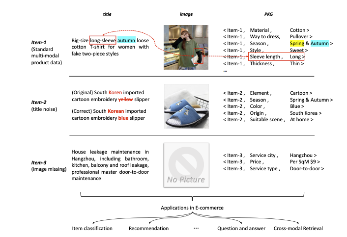
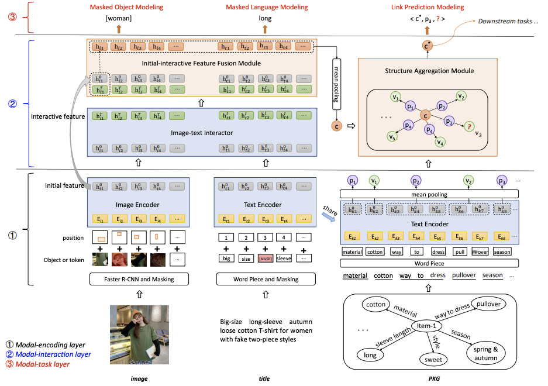

# 论文阅读笔记25：K3M多模态商品知识图谱预训练

> 2021ACM MM论文《[Knowledge Perceived Multi-modal Pretraining in E-commerce](https://person.zju.edu.cn/person/attachments/2021-08/01-1629873990-846837.pdf)》该论文提出了一种可以有效解决信息缺失和信息噪声问题的多模态知识图谱预训练的方法，并在多项下游任务中取得了非常好的表现。

## Introduction

在电商领域中，知识图谱已经有了一些应用，而对于海量的电商数据而言，其商品数据中可能包含了结构化信息，文本和图像等多种模态的信息，但同时，这些信息又有可能是不完整或者充满噪声的，比如下面的图中，第一个商品的信息是完整的，而第二三个商品的信息则有噪声或者缺失：

面对众多的下游任务，每种商品各自的表示就显得尤为重要，商品表示的预训练已经被证明是一种非常有效的手段，而面对多模态的商品数据和数据有大量缺失和噪声的实际场景下，直接使用多模态的预训练方式效果不尽如人意，而本论文汲取了之前一篇论文商品知识图谱预训练的思想，在商品数据预训练的过程中**融入多模态数据和知识三元组**，增强预训练模型的鲁棒性，解决数据缺失和数据噪声的问题，从而得到更好的商品表示向量。

本文的贡献在于：

- 提出了将结构化的商品数据表示称形如`<item, property, value>`形式的三元组，并构建知识图谱，将知识图谱作为一个新的模态和图像文本等数据融合。
- 提出了一种新的多模态商品数据预训练模型，并在淘宝的实际商品数据中进行了实验，效果相比于普通的多模态BERT要好很多。

## 相关工作

### 多模态预训练

在BERT出来之前，CV和NLP等领域都有各自的预训练模型，比如CV中的VGG和ResNet，NLP中的Word2Vec和GLoVe，而BERT模型被提出之后，越来越多的基于BERT的预训练模型被提出并在多种任务和场景下取得了比较好的效果，其中多模态的BERT模型包括：VideoBERT，, VisualBERT, Unicoder-VL， VL-BERT和UNITER等等，多模态的BERT主要可以分成两种大类：

- 单流模型：视觉模态和语言模态用一个BERT结构，
- 双流模型：视觉模态和语言模态分别用一个BERT进行编码，然后用共同注意力机制来进行模态之间的交互

### 知识增强的预训练

知识增强的预训练模型是指，将知识图谱融入到语言模型的预训练中，比如K-BERT等，这些模型的目的都是使用知识三元组来增强数据的语义信息以便得到更好的向量表示，但是这类模型往往只考虑了单个模态的信息，而没有多模态的数据以供预训练。

## K3M模型

### 数据格式和关键问题

在这篇论文中所使用的数据包括了$D=(C,I,T,K)$​，这里的C表示一系列商品的集合，I是商品的图片集合，T是商品的标题集合，K是商品知识图谱，包括了实体集合，关系集合和三元组集合

当前问题的关键在于，多模态的信息可能是有缺失的，比如有的商品可能没有图片，有的标题可能有错误的描述或者错别字，而预训练的模型需要用来解决商品分类，商品对齐和多模态问答等下游任务，因此模型的设计必须要考虑到这些要素。

### 模型架构

论文中提出的模型架构如上图所示，整个模型主要分成了编码层，交互层和任务层三个大的模块，每个层的作用如下表所示：

| 模块   | 功能                                                         |
| ------ | ------------------------------------------------------------ |
| 编码层 | 负责对三个模态(图像，文本和知识)分别进行编码表示             |
| 交互层 | 负责进行跨模态的信息交互，其中包括了**图像和文本模态之间**的交互以及**图像和文本模态与知识模态之间**的交互 |
| 任务层 | 定义了预训练模型所需要执行的三个任务，每个模态分别对应了一个预训练任务 |

#### 编码层

编码层首先要对三个模态的数据分别进行编码，由于模型要从头开始训练，所以不能使用预训练好的BERT之类的模型，论文中提出的方法是，对图像和文本分别使用Transformer结构进行编码表示，然后对于商品知识图谱中的数据，首先使用和文本模态中的同一个Transformer模型对实体/关系按照文本进行表示，然后通过平均池化得到商品item的**每个property和value的表示向量**。

总之就是使用了非常多的Transformer分别进行编码，然后编码的时候要注意使用一些常用的trick包括：

- 使用R-CNN对输入的图像进行目标检测然后进行掩码和分割成若干个patch
- 对输入的文本进行Word Piece掩码操作，对三元组也进行Word Piece操作

#### 交互层

交互层主要分成了图像文本模态间的交互和图像文本与知识模态之间的共同交互。

##### 图像文本交互

首先将输入的图像和文本数据通过一个使用共同注意力机制的Transformer进行融合，但是问题在于，使用共同注意力机制的时候，模态之间的独立性就被破坏了，但是如果出现了模态数据的缺失和噪声，这种方法会对模型的性能造成比较大的影响，因此维护模态之间的独立性也是非常有必要的

为此论文提出了保留原本的文本和图像信息，并设计了一个**初始特征交互模块(initial-interactive feature fusion module, IIFM)**，这个模块负责将交互后的特征和初始的模态特征进行融合

- 实际上我认为这种方法很像率先在CV中提出的残差连接，即ResNet的核心idea

$$
\begin{array}{l}
h_{t a}=\operatorname{fusion}\left(h_{t a}^{0}, h_{t a}^{I}\right),\left(a=1,2, \ldots, M_{1}\right) \\
h_{i b}=\operatorname{fusion}\left(h_{i b}^{0}, h_{i b}^{T}\right),\left(b=1,2, \ldots, M_{2}\right)
\end{array}
$$

这里的融合策略来自于另一篇论文，有mean，soft-spl和hard-spl三种

##### 知识模态交互

知识模态的交互主要是通过多模态交互后的模态特征来生成商品结点的初始化表示，然后使用一个加强版的GAT来进行结构化信息的传递和聚合，这里商品特征就通过将IIFM的输出结果进行平均池化之后得到
$$
c=\text { mean\_pooling }\left(h_{t 1}, \ldots, h_{t M_{1}}, W_{0} h_{i 1}, \ldots, W_{0} h_{i M_{2}}\right)
$$
然后使用一个GNN的结构来进行商品知识图谱的信息聚合，每个三元组x的信息聚合过程如下：
$$
t_{x}=W_{1}\left[c\left\|p_{x}\right\| v_{x}\right]
$$
之后再使用一个LeakyReLU和注意力机制计算每个三元组的重要性，并将它们加权求和来得到每个商品的最终表示：
$$
b_{x}=\operatorname{LeakyReLU(W_{2}t_{x})}
$$

$$
a_{x}=\operatorname{Softmax}\left(b_{x}\right)=\frac{\exp \left(b_{x}\right)}{\sum_{i=1}^{X_{c}} \exp \left(b_{i}\right)}
$$

$$
c^{*}=W_{3} c+\sigma\left(\frac{1}{M_{h}} \sum_{m=1}^{M_{h}} \sum_{x=1}^{X_{c}} a_{x}^{m} t_{x}^{m}\right)
$$

- 总之就是非常华丽而且麻烦

#### 任务层

任务层主要为每个模态都定义了一个预训练阶段的任务，我们前面说过在编码层，我们对图片和文本都进行了掩码操作，因此图像和文本模态的预训练任务也就被定义成了掩码语言模型和掩码对象模型。

掩码语言模型需要来预测输入文本中被掩盖的token，其目标函数是：
$$
l_{M L M}=-E_{t_{c} \sim \mathcal{T}} \log P\left(\text { to } k_{m} \mid \text { tok }_{\widehat{m}}\right)
$$
掩码对象模型需要预测图片的patch中被掩盖的对象的像素值，其目标函数是：
$$
l_{M O M}=-E_{i_{c} \sim I} \log P\left(o b j_{m} \mid o b j_{\bar{m}}\right)
$$
而对于知识模态，预训练任务则自然被定义成了链接预测，采用了典中典的margin损失和负采样：
$$
l_{L P M}=E_{\mathcal{T} \mathcal{R}_{c} \sim \mathcal{K}} \frac{1}{X_{c}} \sum_{x=1}^{X_{c}} \max \left\{S_{c}^{x}-\widetilde{S_{c}^{x}}+\gamma, 0\right\}
$$

## 下游任务和实验

### 下游任务

这篇论文提出的预训练模型需要解决的预训练任务主要有商品分类，商品对齐和多模态问答等等，商品分类和对齐实际上就是一类问题，就是将一个或者多个商品的预训练好的embedding输入一个简单的MLP中进行微调，然后进行多分类和二分类(对齐实际上就是一个二分类问题)

而多模态问答好像看论文里说的也跟另外两个任务差不多，通过输入一个形如`product title [SEP] question`的问题以及答案，然后使用预训练好的embedding来预测结果，并用交叉熵作为loss进行微调，因为看不到数据集所以具体也不知道这个任务究竟是什么形式。

### 实验

实验是我认为这篇文章中另一个做的比较到位的地方，首先关于baseline，论文选用了现成的预训练模型如ViLBERT和LXMBERT，VLBERT等，并探究了这些多模态BERT在**不使用PKG和使用PKG**两种情况下的性能作为对照，来体现K3M(论文提出的模型)的强大能力。

另一方面，本论文的核心其实是对模态数据缺失和噪声场景下模型的鲁棒性，因此实验部分设置了若干个缺失率参数TMR，IMR，MMR以及噪声参数TNR，INR，TINR和MNR(T和I代表标题和图像，M和N代表缺失和噪声)，探究了各个模型在不同的缺失率和噪声比例下的性能，并和baseline进行对比，可以说工作量大的离谱。
