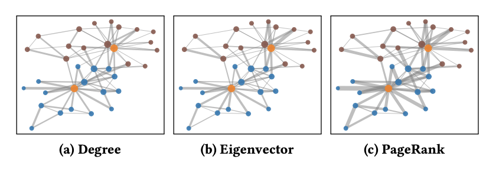
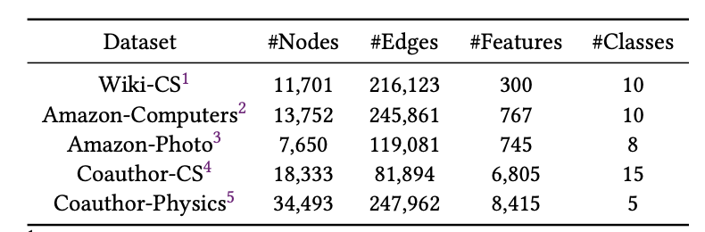
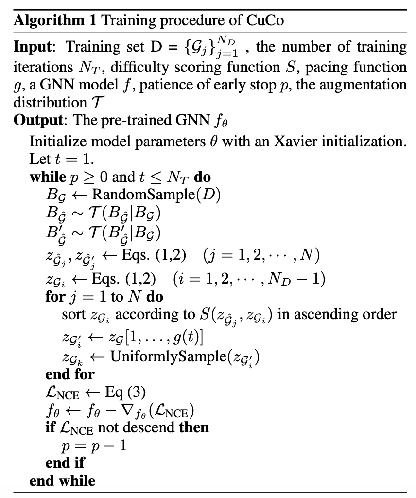

# 论文阅读笔记26：图对比学习

> 这次阅读的两篇论文是图对比学习相关的内容，虽然我对图对比学习不是很感兴趣，但是因为下周组会要讲这两篇论文，就顺便拿出来看一看了，正好之前CS231N里也稍微了解了一点对比学习相关的东西，就当是开开眼了。两篇论文分别是2021IJCAI上的《[CuCo: Graph Representation with Curriculum Contrastive Learning](https://www.ijcai.org/proceedings/2021/0317.pdf)》和2021WWW上的《[Graph Contrastive Learning with Adaptive Augmentation](https://arxiv.org/pdf/2010.14945.pdf)》

## Introduction

对比学习contrastive learning是近几年来无监督学习领域非常热门的一个话题，对比学习的目标是在数据没有标注的情况下通过数据增强和正负样本对比的方式来学习数据的表示向量，并用于其他的任务中。

对比学习的核心理念以一言蔽之，就是“一切都是相比较而言的”，对比学习往往通过**对数据通过各种手段进行扩增**，得到两个不相同但是相似的数据，称为一个对，然后和其他扩增后的数据一起放到编码器中去训练，再得到每个数据的表示向量之后，通过一个基于相似度的损失函数来评估学习到的表示的质量，而基于相似度的损失函数通过计算正样本和负样本，并将他们形成对比，通过这种方式来突出模型的学习效果，正样本就是通过扩增产生的数据对，他们之间应该是非常相似的，所以表示向量也应该比较相似，相似度应该比较高，而负样本则是不同的数据两两组合而成的，一般来说他们应该有所区别，通过这种方式，我们可以学到一个对数据之间的不同有所感知的编码器，进而可以得到好的表示。

而图对比学习是对比学习中比较热门的研究内容，相比于图像和文本，图数据的扩增似乎更难进行，图像可以通过各种基本的图像处理手段得到相似的图像对，文本可以通过掩码的方式生成训练数据，而图则比较麻烦，我们既要关注图的拓扑结构，又要关注图中结点和边的特征，而完全随机化的数据增强策略和负采样策略往往不能适应图的复杂结构，表现效果也不太好，因此这次读的两篇论文，分别从数据扩增和负采样两个角度，对图对比学习中的策略进行了探究，并分别提出了自己的方法。

## 图对比学习总体框架

图对比学习中的关键就是相似度的定义和loss函数，我们对N个数据$z_k$ 分别进行扩增，然后通过编码器模型，得到了N对数据的表示向量$(z_i,z_j)$ 并定义相似度函数来计算不同表示向量之间的相似度，然后对于每个正样本选择K个负样本与之形成对比，这样一来损失函数就变成了：
$$
L_i=\log
\frac {{e^{\theta\left(\boldsymbol{u}_{i}, \boldsymbol{v}_{i}\right) / \tau}}} {{e^{\theta\left(\boldsymbol{u}_{i}, \boldsymbol{v}_{i}\right) / \tau}}+\sum_{k \neq i} e^{\theta\left(\boldsymbol{u}_{i}, \boldsymbol{v}_{k}\right) / \tau}+\sum_{k \neq i} e^{\theta\left(\boldsymbol{u}_{i}, \boldsymbol{u}_{k}\right) / \tau}}
$$

$$
\mathcal{J}=\frac{1}{2 N} \sum_{i=1}^{N}\left[\ell\left(\boldsymbol{u}_{i}, \boldsymbol{v}_{i}\right)+\ell\left(\boldsymbol{v}_{i}, \boldsymbol{u}_{i}\right)\right]
$$

## GCA：自适应的图数据增强策略

首先是第一篇要说的论文《[Graph Contrastive Learning with Adaptive Augmentation](https://arxiv.org/pdf/2010.14945.pdf)》，这篇论文认为已有的图对比学习中数据增强的方式不能适应不同的复杂图结构，其存在的缺点至少有两个：

- 简单的数据增强策略要不就在改变结构，要不就在改变结点自身的特征，而不能有效的构建出多样化的邻居信息，尤其是当图比较稀疏的时候，这种时候就不利于对比
- 过去的数据增强策略无视了改变结点和边造成的影响的差异性，比如随机删除了一条边可能会导致学到的表示向量质量严重下降，因为不同的边和结点的重要性是不同的，有的很重要的边和结点不应该在数据增强阶段被随意移除

因此这篇论文认为图对比学习的数据增强中，需要有自适应的数据增强机制，本文针对拓扑结构变换和结点特征变化都提出了一种自适应的方法，可以根据结点的重要性来进行数据的增强。本论文也将自己提出的方法称为GCA(Graph Contrastive Adaptive)

### 自适应图增强算法

#### 拓扑结构

GCA提出的图自适应增强方法可以根据图本身的拓扑结构性质对图数据进行增强，一般的规则是，对于比较重要的结点一般就不轻易替换，而对于不重要的节点，它被替换的概率就会很大，我们假设节点的重要性可以用中心度$\phi(i)$来衡量，同时每个节点在数据增强的过程可以表示为：
$$
P\{(u, v) \in \widetilde{\mathcal{E}}\}=1-p_{u v}^{e}
$$
这里的$p_{uv}^e$就代表了每一条边被替换的概率，而每条边被替换的概率和边的中心度有关，边的中心度又是以两个结点的中心度的平均数来衡量的，即：
$$
w_{u v}^{e}=\frac{\left(\varphi_{c}(u)+\varphi_{c}(v)\right)} {2}
$$
然后论文中提出的方法是，首先用对数来缓解中心度相差过大造成的严重bias，即：
$$
s^e_{ue}=\log w_{uv}^e
$$
然后定义了概率$p_{uv}^e$的计算方式：
$$
p_{u v}^{e}=\min \left(\frac{s_{\max }^{e}-s_{u v}^{e}}{s_{\max }^{e}-\mu_{s}^{e}} \cdot p_{e}, p_{\tau}\right)
$$

- 这里的max和mu分别表示所有边的对数中心度的最大值和平均值，pe代表了对边进行移除操作的总体概率，pr则代表了一个移除概率的上限，以防止计算出的概率太高

而结点的中心度有三种常见的度量方法：

- 结点的度数
- 特征向量中心度，取邻接矩阵的特征向量来计算结点的中心度
- PageRank中心度

#### 结点特征

对于结点的特征来说，一般是采用加噪声的方式来进行数据增强的，我们假设每个结点的特征中n维的，那么我们也就需要一个N维的噪声分布，满足分布$m_i\sim \mathrm{Bern}(1-p_i^f)$，这里的概率p也就是需要根据结点的中心度进行自适应的确定的，得到噪声m之后，结点的特征就变成了：
$$
\tilde{X}=\left[x_{1} \circ \tilde{m} ; x_{2} \circ \tilde{m} ; \cdots ; x_{N} \circ \tilde{m}\right]^{\top}
$$
而这个概率p获得的方式和之前差不多，也是基于结点的重要性的：
$$
s_{i}^f=\log w_{i}^{f}=\sum_{u \in \mathcal{V}}\left|x_{u i}\right| \cdot \varphi_{c}(u)
$$
概率的计算也是和上面类似：
$$
p_{i}^{f}=\min \left(\frac{s_{\max }^{f}-s_{i}^{f}}{s_{\max }-\mu_{s}^{f}} \cdot p_{f}, p_{\tau}\right)
$$

### 实验

这篇论文的实验选用的数据集有：

实验主要从三个方面进行了探究：

- GCA模型是否能够提高结点分类任务的效果
- 提出的自适应方法是否提高了模型的表示能力？不同的增强方法到底各自有什么样的效果？
- 这些方法是否对超参数很敏感，超参数怎么影响模型的表现能力

## CuCo：新的负采样策略

第二篇文章《[CuCo: Graph Representation with Curriculum Contrastive Learning](https://www.ijcai.org/proceedings/2021/0317.pdf)》则重点关注了另一个问题，即如何采集高质量的负样本，负样本相关的工作实际上在之前的研究中一直没有受到过重视，而这篇论文提出了一种**基于课程学习**的对比学习负采样策略，可以在训练过程中选择高质量的负样本。

- 课程学习也是一个比较花里胡哨的概念，它的基本思想是从简单的数据开始学，逐渐学到难的数据，通过这种方式来改进模型，提高学习能力
- 本论文中指的课程学习其实是对于负样本的课程学习，即通过一定的策略，先学普通的负样本，然后学越来越难的负样本

该论文的方法也遵循图对比学习的一般策略，先用数据增强得到若干相似的数据，然后通过GNN编码器进行编码，最后用基于相似度的损失函数计算loss并进行梯度更新，而这篇论文重点不在于数据增强，因此它只提出了几种非常普通的图增强方法：

- 随机删除一些结点
- 打乱图中边的顺序
- 对结点和边的属性进行掩码操作，并提示模型去恢复被遮蔽的属性
- 通过随机游走等方式进行采样，用子图代替完整的图

同时论文使用的编码器都是基于GNN的，因此会有一个消息传递，聚合的总体框架，然后用一个READOUT函数获得整个图的表示，而它的损失函数是：
$$
\mathcal{L}_{\mathrm{NCE}}=-\log \frac{\exp \left(\operatorname{sim}\left(z_{i}, z_{j}\right) / \tau\right)}{\exp \left(\operatorname{sim}\left(z_{i}, z_{j}\right) / \tau\right)+\sum_{k=1}^{K} \exp \left(\operatorname{sim}\left(z_{i}, z_{k}\right) / \tau\right)}
$$
其实也和前面说的差不多，本文将重点放在了loss函数分母的负样本上，提出了一种基于课程学习的负采样策略。

### 课程学习负采样策略

论文认为，数据的增强策略固然很重要，但是负采样同样也很重要，并且负采样应该遵循一个由简单到难的过程，先用简单的，然后再用难的负样本来学习。所以论文的设计了这样几个东西：

#### 相似度函数

相似度函数也叫打分函数，常见的打分函数主要有余弦相似度函数和点击相似度函数

#### 步调函数

步调函数Pacing Function是论文中提出的一个用来限制负样本个数的函数，我们需要先采样好K个负样本，构建一个Memory Bank，然后根据步调函数，在不同的训练时间t(一共训练T次)采样不同个数的负样本进行学习，论文中用的步调函数有两个：
$$
g(t)=\left[1+.1 \log \left(\frac{t}{T}+e^{-10}\right)\right] \cdot K
$$

$$
g(t)=(t / T)^{\lambda} \cdot K
$$

每个时间点t的采样个数是$g(t)$，并且根据打分函数的结果，从最低的开始选。

#### 早停止机制

在训练的后期，可能会有false negative的样本影响模型的训练，因此论文的模型中设置了一个退出机制，如果loss不再降低持续了p次，那么训练就会提前退出。

#### 算法伪代码

### 实验

这篇论文的实验采用了多个图数据集，并在图级别的任务上进行了比较。

