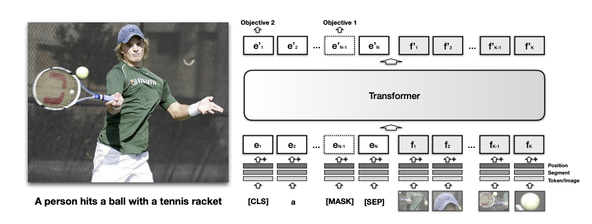
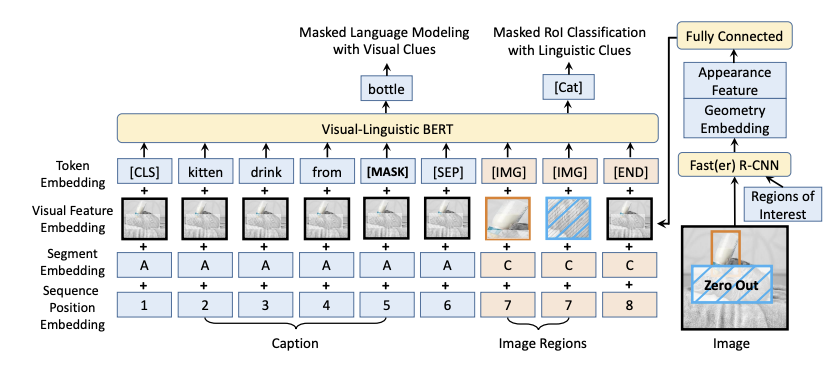
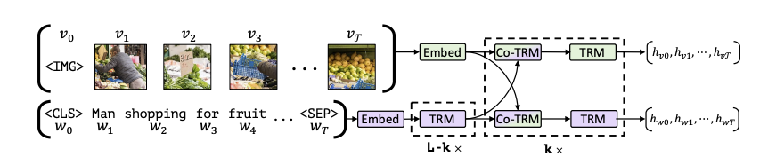
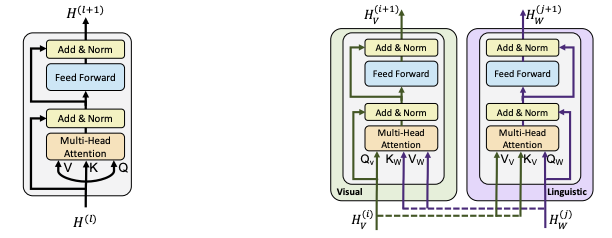
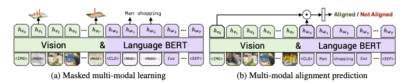
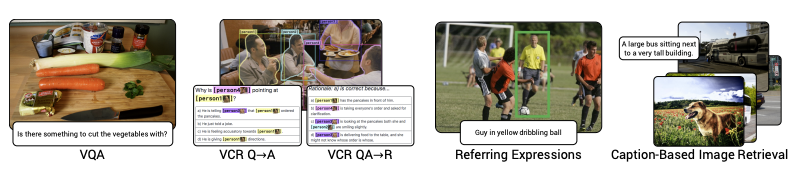

# 论文阅读笔记28：多模态BERT

> BERT模型是NLP领域近几年来最成功的预训练模型之一，而BERT一经提出，很多模仿BERT架构并用于其他的任务中的类BERT模型也不断涌现，这一次读的几篇文章都是多模态BERT相关的内容，分别是[VisualBERT](https://arxiv.org/pdf/1908.03557.pdf)，[VL-BERT](https://arxiv.org/pdf/1908.08530.pdf)和[ViLBERT](https://arxiv.org/pdf/1908.02265.pdf)

## Introduction：多模态BERT

BERT预训练模型在NLP领域的成功已经不需要我再多说了，它的成功引来了深度学习的其他领域比如CV的争相效仿，各种各样不同却又相同的类BERT模型不断涌现出来，说它们不同是因为这些BERT模型在细节上各有区别，分别对应不同的使用场景做了不同的挑调整和优化，而说它们相同是因为它们都遵循了预训练+微调的范式，通过在海量的数据集上进行预训练，来完成下游任务。今天的重点在于多模态的BERT模型，这一系列模型都是BERT在多模态任务上的应用。

### 关于多模态任务

所谓的多模态任务，常见的有图片标准Image Captioning，可视问答VQA，图片-文本检索和可视常识推理等等，多模态的任务往往需要将给定的图片和文本信息结合起来，找到它们的内在联系，这也是多模态任务的最大特征，即数据集中的图片和文本信息往往是成对的，并且图像和文本之间存在着一定的语义关联性，而多模态机器学习的最重要任务就是挖掘出成对的图像和文本信息之间隐藏的关联性。

### 关于预训练模型

预训练模型的通用范式有两种，一种是基于特征的，即**将从预训练好的模型中得到的特征**作为额外的特征输入，而另一种是基于微调的，即在训练好的模型的基础上**增加与下游任务相关的一些神经网络层**，并且在下游任务的数据集上进行训练，这个过程就称为微调。而BERT系列的预训练模型都是基于微调的，我们需要在海量数据集上进行预训练，并将训练好的模型迁移到特定的下游任务中进行微调。

对于微调型的预训练模型而言，最重要的几个组成部分是：

- 模型的架构：比如BERT使用的是深层的双向Transformer
- 预训练任务的设置：比如BERT的预训练任务是掩码语言模型和下一句预测
- 下游任务和对应的微调模型：这个就太多了，BERT针对不同的下游任务提出了不同的微调模型

我们研究多模态的预训练模型也可以从这三个角度入手。

### 关于多模态BERT的架构

多模态BERT模型的一般情况下可以分成两类：单流模型和双流模型，所谓的单流模型就是对文本特征和图像特征**用同一个深层的双向Transformer进行编码**，而双流模型则是图像和文本分开编码，然后用共同注意力机制进行特征的融合，下面提到的三个模型中，VisualBERT和VL-BERT都是单流模型，而ViLBERT则是双流模型。

下面我们来分别介绍三个不同的多模态BERT，我们将重点放在它们各自的模型架构，预训练任务和下游任务上。

## VisualBERT

首先是第一篇VisualBERT，这个模型在ICLR2019的论文《VISUALBERT: A SIMPLE AND PERFORMANT BASELINE FOR VISION AND LANGUAGE》中被提出，它的模型结构如下图所示：

### 模型架构

很明显这是一种单流模型，将文本和图像特征放在一个Transformer中进行编码，而对于文本编码，它采用的是和BERT一样的子词(subword)token化操作(实际上就是WordPiece)而图像特征则是先通过R-CNN等检测模型先提取出图像中的重要部分，然后再用这些部分输入模型。

每个输入的token都包括三个部分的embedding相加，分别是位置编码，段编码和token本身的编码，对于文本来说token本身的编码是文本表示，而对于图像小块来说，自身的特征编码通过预训练好的CNN进行提取。

同时输入的token中还有几个特殊的token包括`[CLS], [MASK], [SEP]`等等，它们的作用和BERT中的对应token基本一致。

### 预训练任务和数据集

VisualBERT中的预训练任务有两个，分别是：

- 带有图片的掩码语言模型：在预训练阶段，一些输入的token会被处理成掩码，并且需要在训练的过程中来预测出被掩盖的MASK位置究竟对应了哪个单词，同时相对应的图片特征是不掩盖的，相当于模型要在预训练任务中，根据上下文和图像特征来共同预测某个位置被掩盖的token
- 句子-图像预测：输入一个句子和一个图像，来判断二者是不是匹配的，通过处理输入数据，让错误的匹配和正确的匹配以1:1的比例输入(这种预训练方式主要是利用了图像的Captioning是图像的描述这一特点)

同时VisualBERT的预训练分成两个阶段，一个阶段是在COCO数据集上进行任务无关的预训练，另一个阶段是在指定的任务数据集上进行同样任务的预训练，这样做的目的是为了让模型能够适应指定领域的任务。预训练过程中使用的数据集是COCO

### 下游任务

VisualBERT的下游任务包括VQA/VCR和NLVR，其中NLVR任务是在给定句子和图像的情况下，判断一个句子是不是和这个图像对应。

- 这篇论文的下游任务感觉写的可读性较差，所以我就不太想看了

## VL-BERT

第二篇文章VL-BERT是ICLR2020上的论文《VL-BERT: PRE-TRAINING OF GENERIC VISUALLINGUISTIC REPRESENTATIONS》上提出的，这篇论文中提出了一种**混合预训练的预训练方式**，并且提供了一种改进的多模态模型架构。

### 模型架构

Vl-BERT的模型架构如下图所示：

它的亮点在于对文本和图像模态的信息进行了更好的融合，对每一个输入的token都采取了token编码，可视编码，段编码和位置编码相加的方式，对于文本来说，文本中的每个token都要加上一个整张图片的特征编码，而对于抽取的图片块来说，可视编码就是这一小块自身的编码，而token编码就是一个专门的`[IMG]`标签。

同时在R-CNN提取关键特征的步骤中，VL-BERT采用了先对图片进行掩码操作的方式。

### 预训练任务和数据集

VL-BERT采用了两种预训练任务，分别是经典的掩码语言模型和掩码ROI分类，其中掩码语言模型是结合图像特征的，而掩码ROI分类则是结合了文本特征。

ROI是指Region Of Interest，即感兴趣区域，是R-CNN提取特征过程中圈定的重点区域，论文中的处理办法是，对于图像中的每个ROI，以一定的概率对其进行掩码操作并输入到模型中，而预训练时候的任务就是来预测被掩盖的这一块区域的所属分类。通过这种方式加强模型对图像信息的理解能力。

同时论文还提出，在多模态模型中进行纯文本的预训练，这是因为多模态的预训练数据可以让模型建立对文本和图像的匹配能力，但是这类文本往往比较短，所以**模型对句子的理解能力还是不够，通过纯文本的预训练可以让模型对长难句的理解更加到位**。

VL-BERT在预训练过程中使用的数据集是Conceptual Captions，它提供了大量有caption的图片。

### 下游任务

Vl-BERT的下游任务包括VCR/VQA和Referring Expression Comprehension，第三个任务是指给定一个指向图像中某个目标的短语，让模型标注出所指对象的位置。

VL-BERT对三种不同的下游任务分别给出了不同的微调模型，其输入输出形式分别如下图所示：

## ViLBERT

ViLBERT是一个双流的多模态BERT模型，它和之间的模型的区别在于，ViLBERT使用了两个Transformer分别对图像和文本特征进行了编码，然后使用了共同注意力机制进行多模态信息的聚合。

### 模型架构

共同注意力机制可以用下图来表示：

共同注意力机制和普通的多头自注意力机制的区别在于，共同注意力机制交换了不同模态的K和V，即用文本特征的Q来对图像的K和V做注意力计算，然后通过FFN层再加上原本的文本特征，来达到多模态的信息融合的目的。

### 预训练任务和数据集

ViLBERT的预训练任务比较神奇，它的预训练任务有两个，分别是：

- 掩码多模态学习：利用多模态的信息重新构建被掩盖的图像/单词
- 多模态对齐预测：预测一对图像和文本是不是同一个东西，类似于Captioning

同时ViL-BERT使用的数据集也是Conceptual Captions

### 下游任务

ViL-BERT的下游任务包括VQA，Ground Referring Expression和基于Caption的图像检索

## 总结

VisualBERT这篇文章看起来还是比较粗糙的，很多设计上都基本照搬了BERT，只不过把数据集改成了多模态的，并且把图像引入到了模型的架构中。而后面两片VL-BERT和ViLBERT逐渐提出了更复杂的预训练任务/模型架构和下游任务。在另一篇论文Unicoder-VL中，有对这几个模型的如下评价：

| 区别       | VisualBERT                                           | VL-BERT                                                      | ViLBERT                           |
| ---------- | ---------------------------------------------------- | ------------------------------------------------------------ | --------------------------------- |
| 模型架构   | 单流模型                                             | 单流模型                                                     | 双流模型                          |
| 预训练任务 | 都使用了掩码语言模型，VisualBERT没有使用目标预测任务 | 对输入图片预先进行了掩码处理，但是没有使用跨模态匹配任务，因为论文任务这个任务是无效的 | 没有啥特别的地方                  |
| 数据集     | 在MSCOCO数据集上进行预训练                           | 在Conceptual Captions上进行预训练                            | 在Conceptual Captions上进行预训练 |

总的来说这些多模态BERT虽然看起来很nb，但好像仍然处于多模态表示学习的初级阶段。我之前一直想用多模态BERT做一些下游任务，但是现在看来理想和现实还有有比较大的GAP，也不知道事情究竟能不能成。多模态BERT在`transformers`这个库里有的也不多，只看到了一个VisualBERT