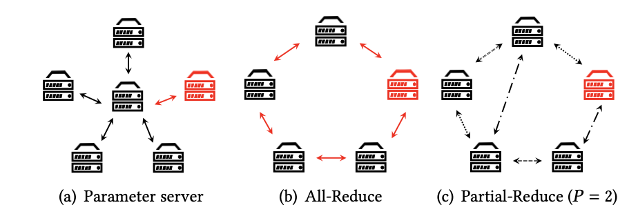

# 论文阅读笔记30：异构分布式机器学习Partial Reduce

> 研究生课程《高级数据库技术》课程指定的阅读论文其中一篇《Heterogeneity-Aware Distributed Machine Learning Training via Partial Reduce》，发表于SIGMOD2021，因为期末考试要考所以仔细读一读。

## Introduction

数据的并行化训练是分布式机器学习的关键，在同构环境下，All-Reduce是最常用的分布式机器学习训练时的通信算法，但是这种算法对**straggler**(即一直没有完成训练的节点，在All-Reduce算法中，其他节点需要等待这个节点训练完成)和**通信延迟**非常敏感，但是随着现在的深度学习任务往往被部署在异构的环境上进行(比如云端服务器)，straggler和通信延迟的现象会越来越多，因为不同的节点处于不同的环境中，节点上模型训练的速度也会有很大的差别，这就导致每个节点完成训练的时间点可能有较大差距，这种异构的训练环境下并不适合使用All-Reduce算法，这也正是这篇论文的motivation

已有的分布式训练算法包括Parameter-Server，All-Reduce等等，而实现了这些算法的分布式学习系统包括PS2, PyTorch, TensorFlow等等，它们采用的策略都是对数据进行并行化处理，然后使用**分布式SGD**使模型达到收敛。一般来说，同构环境下的数据并行的分布式训练是在多个节点上部署模型，并用数据的不同部分来训练模型，在每一次迭代结束之后，都会在所有节点之间进行一次参数的同步。这种方式一旦出现了straggler就会导致模型训练的效率降低，因为同构环境下，这些模型和算法都**假设**不同节点上的模型的训练效率保持一致。然而事实就是大部分情况下，不同节点的训练环境都是异构的。

论文认为，训练的异构性主要表现为以下三个方面：

- 通讯的异构：大规模的数据很多都存储在数据中心里，这就导致了在数据中心内部的通讯和数据中心之间的通讯所需要的时间会相差很多，即使是在同个数据中心中，数据的通信效率也会因为网络接口的不同而有较大差异。
- 硬件的异构：不同节点上拥有的深度学习硬件可能有所区别，比如GPU的数量和种类，而深度学习模型的训练速度很大长度上取决于GPU，因此不同的硬件也会导致训练速度的不同，造成一种异构的环境。
- 资源的共享：现在很多的云服务都依赖于集群调度器，著名的比如Kubernetes，同时一个物理节点可能被分成了若干个容器进行多个作业，这种技术被称为虚拟化，而一个并行训练作业的不同的容器可能被分配到了不同数量的硬件资源，这就导致不同容器中的训练速度不同，这也是一种异构性。

因此，这篇论文基于这些异构性的现实提出了一种新的异构分布式机器学习模型训练的算法，称为Partial Reduce，这种算法要求节点只和随机选定的P个节点进行信息的同步，而不需要和所有节点消息同步(这个是All-Reduce)，并且同样可以达到模型的收敛状态，同时论文进一步提出了动态的Partial Reduce来解决训练过程中依然存在的straggler问题。

## 相关背景知识

### 分布式SGD

分布式SGD是分布式机器学习得以成立的理论依据，对于训练集 $\xi$，每个逻辑节点上分配到的数据集的一个partition $\xi_i$， 那么整个模型所需要优化的目标就变成了：
$$
\min _{\mathbf{x}}\left[F(\mathbf{x}):=\frac{1}{|S|} \sum_{i} f\left(\mathbf{x} ; \xi_{i}\right)\right]
$$
而小批量的SGD会选择一个小批次的数据放到模型中训练，并进行梯度的更新，分布式SGD就在N个并行训练的节点上分别计算其梯度，并更新到结点本地的模型中，同时反馈给总模型：
$$
\mathbf{x}_{k+1}=\mathbf{x}_{k}-\gamma\left[\frac{1}{N} \sum_{i=1}^{N} g_{k}\left(\mathbf{x}_{k} ; \xi_{k}^{i}\right)\right]
$$

### 通信机制

分布式的训练可以分为中心化和去中心化两大类，参数服务器是中心化分布式训练的代表，而All-Reduce则是去中心化分布式训练的代表，它们各自有着不同的节点通信和消息传递机制。

#### 中心化训练

参数服务器Parameter Server是一种中心化的分布式训练模式(简称为PS)，PS会存储一个全局模型，并且每个worker将这个模型复制过去，并在本地训练，得到更新的梯度，然后将更新的梯度返回给全局模型，同时PS中使用了一种被称为BSP(Bulk Synchronous Algorithm)的算法进行worker间的信息同步。

#### 去中心化训练

去中心化的训练没有中心化的参数服务器，一般在worker之间进行P2P的通讯，以此来更新参数，训练出总体的模型，比如All-Reduce是一种很常见的分布式训练方法，它要求每个worker和剩下的所有worker进行消息同步，并最终达到收敛状态。

### 异构环境下的训练

PS和All-Reduce都依赖于固定的通信机制，这种通信机制在异构的环境下可能会变得难以满足，因为不同环境下的worker训练模型的速度可能有很大的差异，因此很多现有的研究提出了新的模型，比如PS的SSP同步算法，异构性感知的PS，Eager-Reduce等等。

## Partial Reduce算法

## 实验