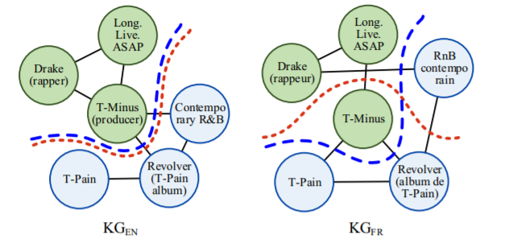
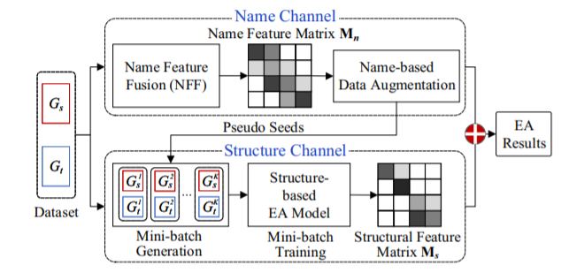
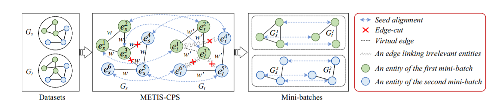

# 论文阅读笔记31：大规模知识图谱对齐LargeEA

> 研究生课程《高级数据库技术》课程指定的阅读论文其中一篇《LargeEA: Aligning Entities for Large-scale Knowledge Graphs》，发表于PVLDB 2022，因为期末考试要考所以仔细读一读。

## Introduction

实体对齐Entity Alignment是指在不同的知识图谱中找到对齐的实体，已有的方法都缺乏可扩展性，因为他们很多都依赖复杂的模型和参数设置，并且只在benchmark中进行实验，并不能很好的用在现实世界实际场景下的数据中。同时，已有的一系列EA方法往往只是基于知识图谱三元组的结构信息，而忽略了很多side information，比如每个实体的名字，这些东西中也包含了重要的实体信息，可以用来辅助实体对齐，比如两个名字很相似的实体很有可能指代的就是同一个东西。这些都是已有的EA方法存在的不足。

为了让EA方法能够适应大规模的真实数据集，一种办法是采用大规模的分布式训练，但是这种方法训练代价高昂。论文提出的一种办法是，将大规模的数据集分割成独立的若干个mini-batch，然后分别进行训练和对齐，这样可以减少对硬件资源的需求，但是这样的做法也存在一些难题：

- 难点1：如何有效地生成mini-batch，batch的大小和KG子图的结构密切相关，因为EA高度依赖于KG中的结构信息，而对一个大规模的KG进行分割可能会破坏其中的一些局部结构，一般来说分出的batch越多，每个batch的数据所包含的局部特征就越少。因此，如何在保持图结构的情况下对大规模的KG进行分割是本论文的一个难点，比如下图就是一个例子：

- 难点2：如何处理图分割带来的信息损失，因为论文希望能够将大规模的KG分割成mini-batch，这个过程必然伴随着结构信息的丢失，因为有一些边在分割的过程中被丢弃了，所以如何解决KG分割带来的信息损失也是很重要的一点，论文中提出利用实体的name等信息来增强模型，论文使用了预训练语言模型(比如BERT)提取实体的名字特征，并将结构特征和名字特征融合来进行实体对齐。

因此本论文的贡献可以概括为以下几点：

- 提出了一个大规模的EA框架，并且通过structure channel和name channel两个channel进行特征的融合实现更好的EA效果
- 在structure channel中，提出了一种基于memory saving的METIS-CPS策略来进行mini-batch的训练，并且最小化分割带来的损失，在name channel提出了一种基于名字的数据增强策略以及特征融合策略NFF
- 提出了大规模EA的benchmark，并进行了大量的实验

## 总体框架

### 模型架构

按照论文的描述，整个EA模型分成两个channel，分别是structure channel和name channel，structure channel负责对大数据集进行分割，生成一系列mini-batch并得到他们的结构化特征，而name channel负责生成每个实体对应的名字特征，并对实体进行特征增强，最后得到EA的结果。

### Structure Channel

#### mini-batch生成

将一个大规模的KG分成若干mini-batch有两个要注意的地方：

- 首先要将两个大规模的KG分别分割成K个子图
- 保证每个实体和它在另一个KG中的等价实体应该被划分到同一个batch中

为了实现这样的目标，论文提出了两种生成策略：一个是vanilla partition strategy(VPS)，另一个是METIS-based collaborative partition strategy(METIS-CPS)

- VPS：将seed alignment先平均分配所有的seed alignment，然后将两个KG中的剩余实体随机划分到K个子图中，VPS保证每个子图包含相同数量的seed alignment，因为不均衡的seed alignment分配会降低EA的结果
- METIS-CPS：VPS的划分是纯随机的划分，这可能会对KG的结构造成破坏，因此本论文提出了METIS-CPS的算法来进行KG的划分，其基本过程如图所示：

METIS是一种基于模块度最大化原则提出的图分割算法，它认为图分割的过程中应该**让被切除的边的权重之和最小化**，以此来实现有关的节点被分割到同一个partition中，而不相关的节点被分到不同的partition中，因此图中的每一条边都会有一个权重w，而且所有边的权重都是相同的。

而在本论文的structure channel中，会先对其中一个KG使用METIS算法进行分割，然后压力就来到了另一个KG这边，论文提出的CPS就是要根据图分割的情况来对第二个KG中的每一条边进行权重的调整，着调整的过程分成两个步骤：

- 提高相关实体的权重
- 降低不相关实体的权重

这个过程涉及到比较麻烦的操作，这里就不细说了。在调整权重之后，再对第二个KG进行分割，然后得到若干个mini-batch

#### mini-batch训练

对mini-batch进行训练的时候，论文采用了GNN作为编码器，并且用基于margin的loss函数，如下所示：
$$
\mathcal L=\sum_{\left(e_{s}^{i}, e_{t}^{i^{\prime}}\right) \in \psi^{\prime}}\left[f_{p}\left(\boldsymbol{h}_{e_{s}^{i},} \boldsymbol{h}_{e_{t}^{i^{\prime}}}\right)+\gamma-f_{n}\left(\boldsymbol{h}_{e_{s}^{i}}, \boldsymbol{h}_{e_{t}^{i^{\prime}}}\right)\right]_{+}
$$
这种形式对于稍微了解一点KGE的人来说还是比较熟悉的，它其实就是将两个KG的partition分别训练，然后用一个打分函数fp来判断一对实体的表示是不是相似的，然后用margin rank loss进行学习，同时，对于partition中的实体，可以生成一个实体-实体的相似度矩阵，记作$M_s$ 

### Name Channel

#### 方法

这个模块中，论文提出了使用名字所包含的语义信息来增强实体表示，同时提出了一个名字特征融合的策略，称为NFF，对于来自两个KG的两个实体s和t，NFF会通过将语义特征和字符串特征进行融合得到名字特征来计算它们的相似性，每个实体对应的语义特征和字符串特征分别是$M_{se}, M_{st}$ 而最终的名字特征就是：
$$
M_n=M_{se}+\gamma M_{st}
$$
论文中使用了BERT+Max Pooling进行语义特征的提取，同时对于得到的语义相似度矩阵，因为实体和实体之间是独立的，所以可以将其分成K个段来节约内存，在实体对齐的时候，可以通过在K个段的两两组合中，每次找到相似度最高的若干个段，只要判断它们是不是对齐的就可以了(因为相似度太低的情况下，两个实体大概率不会对齐)

论文定义了一个STNS函数用来计算基于string的实体相似度，论文采用了计算Levenshtein距离来表示不同的字符串之间的相似度，并且通过**局部敏感Hash**的方式来快速找到相似的字符串对

#### 基于Name的数据增强

因为一些结构信息在分割的时候丢失了，所以论文使用实体的名字特征对数据进行增强，这是基于这样一种思路：如若两个不同语言的句子可以互相翻译，那么它们就拥有相同的意思。

#### channel融合

论文里提出的channel融合策略就是非常简单的直接相加，把structure channel和name channel的两个相似度矩阵直接相加作为最后的相似度矩阵，并以此来进行实体对齐的判定。