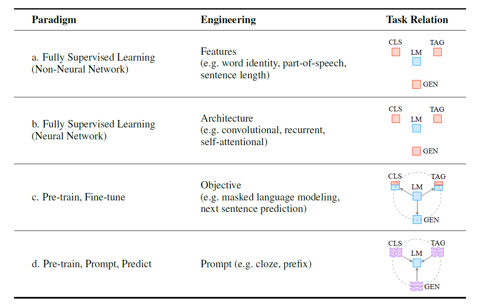
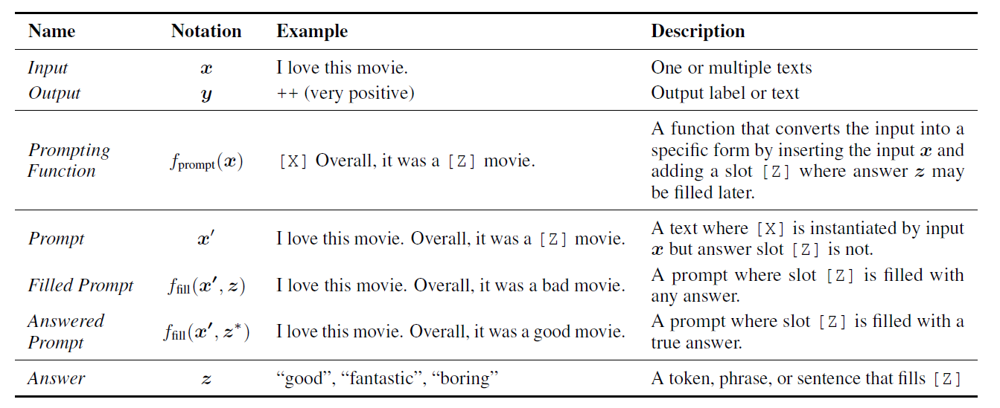
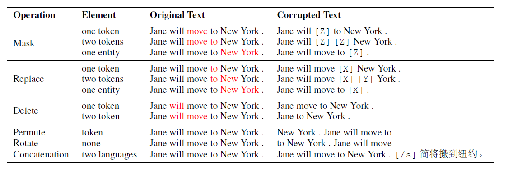
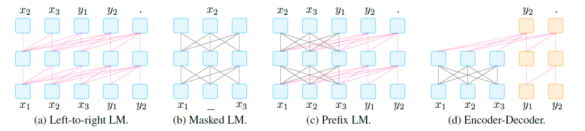
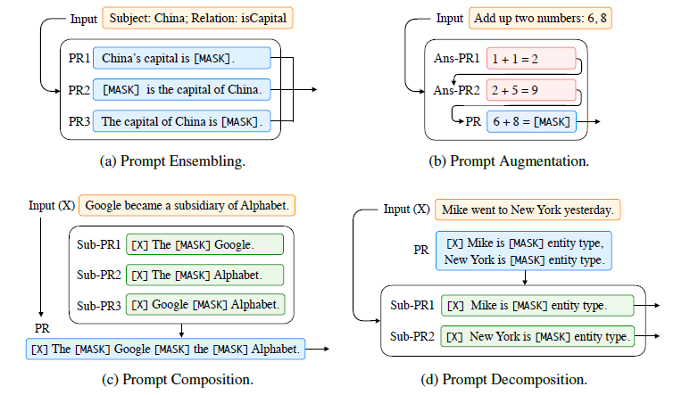

# 论文阅读笔记32：提示学习Prompt

> 综述论文《[Pre-train, Prompt, and Predict: A Systematic Survey of
> Prompting Methods in Natural Language Processing](https://arxiv.org/abs/2107.13586》的阅读笔记，来简单了解一下去年听说很热门的Prompt是个什么东西。

## Introduction: NLP范式的变迁

NLP领域的范式(Paradigms)经过了多次的变迁，最早的时候，NLP主要依赖统计机器学习模型来解决一下完全监督的问题，这个过程主要依赖于各种各样的特征工程(Feature Engineer)来提取数据中的特征并用机器学习模型来解决问题。

第二个阶段，神经网络和深度学习被引入了NLP任务中，这种范式依然是全监督学习的形式，但是神经网络将设计模型所需做的特征工程工作改成了架构工程(Architecture Engineer)，也就是设计更合适的模型架构。前两个阶段中，NLP的模型训练主要依靠的是有效的监督信息。

第三个阶段，BERT等大规模的预训练模型的引入让NLP的范式变成了预训练和微调，我们解决NLP问题的方式就变成了用预训练好的模型，加入几个简单的层进行下游任务的微调，而这个范式中，主要的工作就变成了设计训练目标(包括预训练的目标和下游任务的目标)，很经典的预训练目标包括掩码语言模型MLM和下句预测。

而NLP范式变迁的第四个阶段就是现在很火热的提示学习Prompt，它的过程包括Pre-train, Prompt和Predict三个步骤，其中的主要工作被称为Prompt Engineer，具体是怎么样后面会细说。这里论文给出了一个表格来对比四种范式。

我们知道NLP任务主要可以分成分类，标注和生成三种，而在前两个阶段，三种任务之间不能共享语言模型的参数，而从预训练-微调这个范式开始，三种任务逐渐可以被统一到大规模的预训练模型下面共享参数。

## Prompt的基本要素

下面我们就需要来解释什么是Prompt，对于传统的NLP模型来说，我们一般接受一个输入x然后根据模型$P(y|x, \theta)$来预测模型的输出y，这里的y可以是一个标签，或者文本，或者其他的形式。而为了学习模型参数$\theta$，我们需要使用输入输出成对的数据对模型进行训练，让模型来预测这个条件概率$P(y|x, \theta)$，这是传统的有监督NLP

### Prompt的基本介绍

Prompt方法和传统方法的不同之处在于，它希望直接学习到输入数据x自身根据模型参数的概率分布$P(x,\theta)$，然后用这个概率来预测结果y，它的整个运行过程可以用下面的表格来概括：

#### 添加Prompt

Prompt的总体框架中，首先要对于输入的数据要通过一个Prompt函数将其转变为对应的Prompt，这个函数就是一个**模板**，会将输入的文本数据x填充到模板中，并且还保留了填写答案的空位。根据答案的位置可以将Prompt分成Prefix Prompt(答案位置在句子末尾)和Cloze Prompt(答案位置在句子中间)两种。

#### 答案搜索

然后我们需要定义一个答案集合Z，里面包含了若干个可能作为答案的选项(x对应的原本输出y就是正确答案)，然后我们将这些答案分别填写到Prompt中，构成一系列Filled Prompt，其中填写了正确答案的叫做Answer Prompt

然后我们在答案集合中搜索使得Prompt经过语言模型LM计算后所得到的分数最高的结果$\hat z$，即：
$$
\hat{z}=\mathrm{Search}_{z \in \mathcal{Z}} P\left(f_{\mathrm{fill }}(x^{\prime}, z\right) ; \theta)
$$
这个搜索可以是常见的argmax搜索。

#### 答案映射

最后我们需要将得分最高的答案$\hat z$变成得分最高的结果$\hat y$，对于一些任务来说，得分最高的结果可能就作为答案使用，比如语言生成类的任务，但是也有一些任务需要进行一个答案到结果的转换，比如分析句子的正负面情绪，我们可以设定答案集合为wonderful，excellent，awful等等，其中wonderful和excellent对应的结果是正面的情感，而awful则对应负面的情感，我们要将最后的不同答案的得分总结成输出结果，并输出可能概率最高的结果。这就需要建立一个从answer到result的映射。

### Prompt模型中的设计考虑

根据Prompt的基本性质，在设计Prompt模型的时候，我们有这样几个地方是需要考虑的：

- 选择不同的预训练模型，因为预训练LM根据与训练任务的不同，在不同的任务上会有不同的表现
- Prompt Engineering, 选择合适的Prompt构建方式，针对任务构建有效的Prompt
- Answer Engineering, 选择合适的答案搜索空间以及答案到结果的映射关系
- 对Prompt训练范式进行扩展
- 选择合适的训练策略

## 预训练语言模型

我们首先要选择一个合适的预训练语言模型(PLM)作为Prompt的基础，而PLM可以按照预训练策略、文本加噪声方式、注意力掩码、架构类型和应用场景进行分类，不同的PLM适合不同的场景。

### 预训练目标

不同的PLM在预训练阶段会采用不同的任务(也就是预训练目标)，常见的预训练任务有：

- 标准语言模型：采用自回归预测的方式，训练模型来预测句子中本身存在的单词，一般预测的方向都是从左到右，常见的比如预测下一个单词(Next Word Prediction)
- 降噪：这种训练目标是对标准语言模型的一种改进，它通过在输入的文本中增加噪声，并训练模型来预测原本正确的输入，这种训练目标可以细分成下面两种
  - 乱序文本重建：对输入文本加噪声，并对**噪声部分进行判断**是否有噪声
  - 全文重建：判断**整个输入文本**是否加了噪声

### 噪声函数

在降噪类的训练目标中，噪声函数是一个很重要的模型设计点，对文本加噪声的方式主要有掩码，替换，删除，打乱，旋转和拼接等等，如下表所示：

不同的加噪声方式训练出的模型适合不同的下游任务。

### 模型的表示方向

模型的表示方向指的是训练过程中模型对上下文的感知情况，具体可以分成以下两种：

- 从左到右：模型中每个单词的表示取决于它自身和它前面出现的单词，在训练过程中，每个位置的单词不能观测到位于它后面的单词。
- 双向奔赴：训练过程中单词可以感知到整个句子中所有的单词

在训练过程中实现这些表示方式需要依赖不同的mask

### 预训练方式

因此，常见的PLM根据目标，噪声函数和表示方向的不同，主要有以下几种不同的范式：

- 从左到右的语言模型
- 掩码语言模型
- 前缀语言模型
- 编码器-解码器语言模型

## 提示工程

提示工程Prompt Engineering是指构建最适合下游任务的提示函数的过程，说白了就是找一个合适的Prompt模板，并决定是选用人工的方法还是自动的方法来进行。

前面已经提到Prompt可以分成两种类型，Cloze Prompt将需要填写的空设置在了输入的文本中，而Prefix Prompt则要在输入的末尾填写。选择哪种Prompt取决于下游任务和PLM的类型，一般来说，对于传统的自回归PLM来说Prefix更好一点。

### 人工提示工程

提示工程最原始的做法肯定是依赖于人工经验来寻找最合适的提示模板，现有的工作主要有这样几种：

- 通过LAMA数据集和Cloze Prompt在PLM中挖掘知识，这个过程叫做Knowledge Probing
- 通过人工定义的模板进行QA和翻译
- 使用预定义好的模板，在少样本学习的设置条件下进行文本分类和条件文本生成

### 自动提示工程

人工选择提示模板实际上难度非常大，自动化的提示工程希望通过一系列手段让模型拥有自己找到高质量提示模板的能力。提示模板可以分成两类：

- 离散提示：这种提示模板是一段真实的文本
- 连续提示：这种提示模板是一种embedding，也就是一个连续空间中的向量

#### 离散提示

对于离散的提示，我们的搜索空间是一个离散的区域，一般来说就是一些词组和短语，目前已经有的方法包括：

- Prompt Mining，通过挖掘的方法，找到输入x和输出y之前的middle words和dependency paths，然后用这些middle words作为Prompt
- Prompt Paraphrasing，基于一个已有的Prompt，将其扩展成一系列候选的Prompt，然后选择在训练集上表现最好的
- Gradient-based Search，通过对token的梯度进行搜索来找到合适的Prompt——即最能生成预测目标的的tokens
- Prompt Generation，用自然语言生成的方法，来生成高质量的Prompt
- Prompt Scoring，引入打分函数对各个Prompt进行打分，并在训练之后选择出分数最高的Prompt，打分的依据是PLM输出的概率

#### 连续提示

连续提示的思想是，对于Prompt，我们不一定真的要找到一个实际存在的单词和短语，而是找一个合适的向量输入模型中作为Prompt就可以了，我们可以将这个向量看成是一种虚拟的词汇，反正单词短语输入PLM之后得到的都是个embedding向量，那么我直接找个embedding作为输入应该也可以。基于这种想法，连续提示需要在一个连续的向量空间中找到合适的向量并将其作为Prompt，目前已有的研究有这样几种：

- Prefix Tuning，通过预设一些任务相关的向量作为Prompt，然后冻结PLM的参数，用这种方式来训练这些Prompt向量
- Tuning Initialized with Discrete Prompts，先用离散形式的Prompt作为初始化，然后再进一步调整
- Hard-Soft Prompt Hybrid Tuning，在一个硬模板(Hard Prompt)中加入一个可以调整的embedding

## 答案工程

答案工程是Prompt Learning中的另一个重要步骤，它的目标是找到合适的答案搜索空间以及答案到最终输出结果的映射，一般来说Prompt中的Answer有这样几种不同的形态：

- Token——PLM的词汇表中的若干个token作为答案
- Span——一段包含多个token的明文
- Sentence——用一个句子或者文档作为答案

不同的Answer形态适合不同类型的任务 

### 人工设计答案空间

很多时候Prompt的答案是人工设计的，并且答案空间可以分成无约束合有约束两种类型，无约束就是答案空间是全体token或者定长的span，而有约束的空间一般是在有限的标签的约束下有一些对应的答案，比如情感分类任务中，标签为正面情感的句子对应的答案可能会被局限在一些正面的词汇中。

### 离散空间答案搜索

离散空间中的答案搜索常用的技巧有这样几个：

- 答案改写，用同义化处理的方式生成很多差不多的答案来增强答案空间的数据
- 剪枝然后再搜索答案
- 标签分解，将标签分解成很多更细的子标签

### 连续空间答案搜索

目前还不太有工作在研究连续空间中的答案搜索问题。

## 多提示学习

多提示学习是指用多个Prompt来一起进行学习，主要可以分成Ensembling，Augmentation，Composition和Decomposition四个方向。四个方向的区别如下图所示：

### Ensembling

Ensembling其实就是设计多个不同的提示模板，将得到的结果进行组合，然后得到答案，不同的提示模板的组合方式和研究方向有：

- 普通的平均或者加权平均
- 多数投票制，用出现次数最多的预测结果作为答案产生输出
- 知识蒸馏，将多个提示模板训练出的大模型的结果蒸馏到小模型上面

### Augmentation

模板增强(Prompt Augmentation)也叫做演示学习(Demonstration Learning)，指的是先给模型一些填写好答案的例子让模型学习，然后再训练模型去预测Mask了的答案，这种方式据说非常适合少样本的场景

### Composition

Composition就是将模板分成多个子模版的组合，每一个子模版对应了一个子任务，然后将它们组合到一起让模型进行预测

### Decomposition

Decomposition经常用于对一个样本要进行多种/多次预测的任务，比如序列标注，这种方法使用多个子提示模板进行训练，让Prompt可以完成一个样本多次预测类型的任务。

## 训练策略

Prompt模型的参数主要来自于Prompt函数和PLM，而在Prompt模型训练的过程中，根据是否调整它们的参数可以将训练分成以下几种形式：

| 训练方式               | 调整的参数                      | 优点                                                 | 缺点                                                         |
| ---------------------- | ------------------------------- | ---------------------------------------------------- | ------------------------------------------------------------ |
| Tuning-free Prompting  | 不训练直接进行Prompt            | 不需要训练和更新参数，非常适合零样本的情况           | 非常依赖于Prompt的设计，因为只有Prompt可以决定任务的specification |
| Fixed-LM Prompt Tuning | PLM不变，调整Prompt的参数       | 类似于上一种方式，适合少样本的情况                   | 不能用在零样本的场景下，但是适合少样本的场景，在大规模数据集上的表示能力受到限制 |
| Fix-prompt LM Tuning   | Prompt的参数不变，调整PLM的参数 | 提示工程和答案工程的效果会更好，并且可以更有效的学习 | 依然需要提示工程和答案工程，同时泛化能力可能不好，在一个下游任务上微调的参数不一定适合另一个任务 |
| Prompt+LM Fine-tuning  | 所有参数都一起调整              | 适合大规模的数据集                                   | 在小数据集上容易过拟合，并且训练代价比较高                   |

