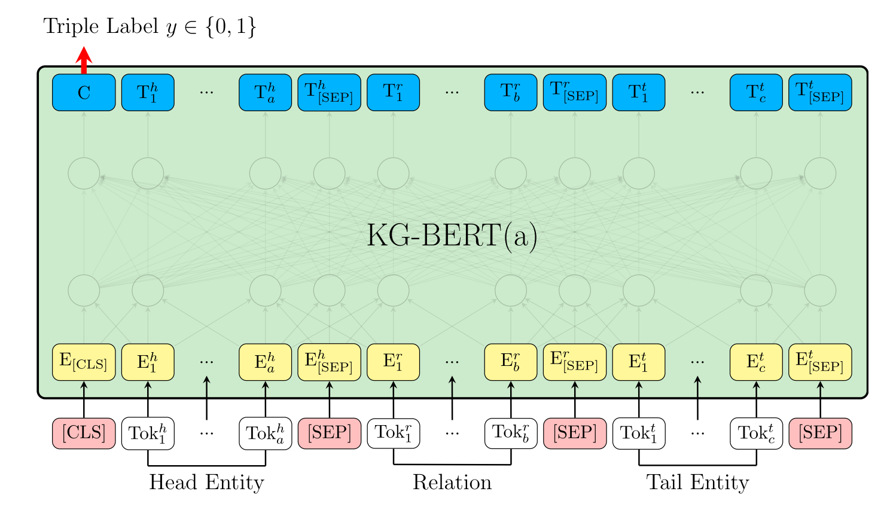
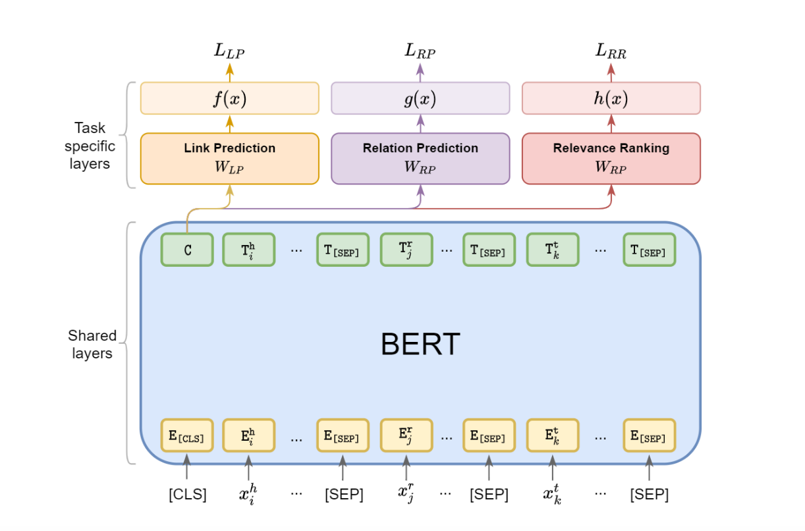
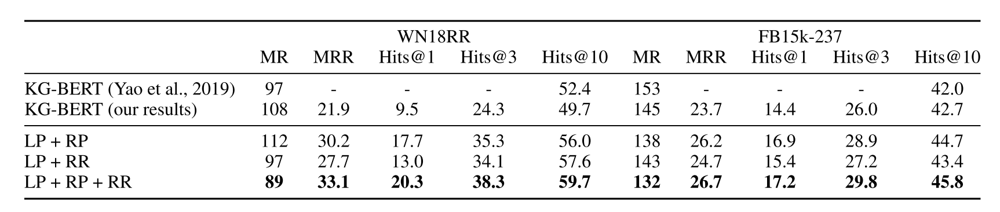
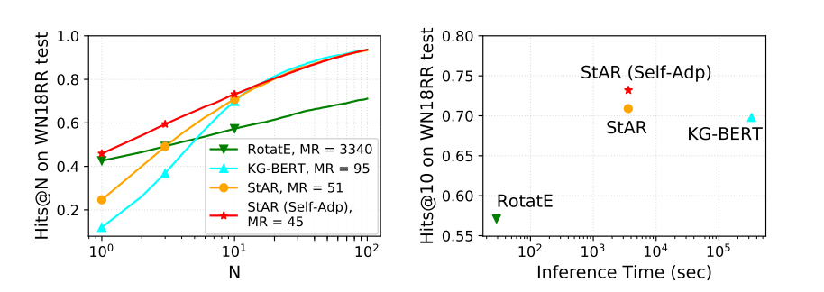
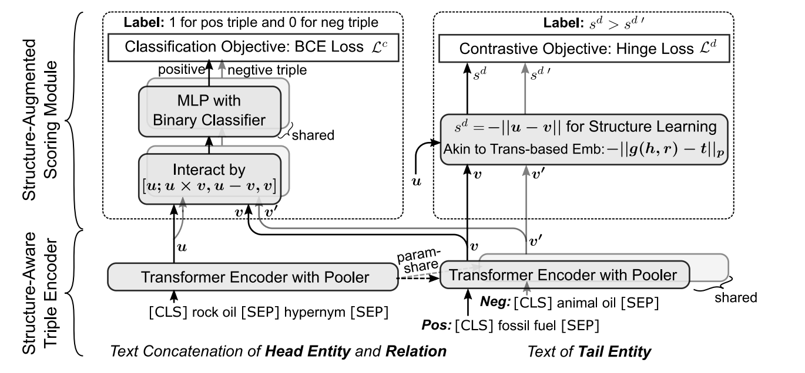

# 论文阅读笔记33：结合BERT的知识图谱补全(KGC)

> 这一次论文阅读笔记主要内容包括几篇使用了预训练语言模型BERT做知识图谱补全任务(其实主要就是链接预测)的文章，包括《KG-BERT: BERT for Knowledge Graph Completion》，《Multi-Task Learning for Knowledge Graph Completion with Pre-trained Language Models》，《Structure-Augmented Text Representation Learning for Efficient Knowledge Graph Completion》以及《Inductive Entity Representations from Text via Link Prediction》

阅读本笔记需要有一定的知识图谱相关的基础。

## KG-BERT: 将BERT用在KGC中

KG-BERT是一篇19年就挂在Arxiv上的文章，当时距离BERT的提出还没有过很久，作者认为预训练好的BERT模型包含了丰富的文本信息和知识，可以用来对知识图谱中的三元组进行编码，所以就提出了KG-BERT这个模型。

传统的KGC方法一般依赖于KGE，而KGE往往通过将KG中的三元组关系投影到某个表示空间中，然后使用打分函数对三元组的合理性进行评估，在用基于正负样本的对比进行模型的训练，而这个表示空间往往和某些数学结构联系在一起，比如最著名的TransE就是向量的加法，RotatE对应了复平面上的旋转，后面还发展出了双曲面、圆锥等各种各样的表示模型。

而KG-BERT则直接使用BERT模型对三元组进行打分，它将三元组中的头尾实体和关系转换成对应的文本输入(`[CLS]head[SEP]relation[SEP]tail[SEP]`)到BERT模型中，然后使用BERT函数输出结果中的CLS标签作为整个三元组的表示向量，并投影到一个打分函数空间中，然后通过三元组分类这样的任务来对BERT进行微调，具体的模型架构如下：

KG-BERT的打分函数可以表示为：
$$
s=\mathrm{Sigmoid}(CW^T)
$$
其中s就是BERT输出的CLS标签，而Sigmoid函数将投影结果映射到了0-1区间中，用这个结果作为三元组合理性的分数，并通过负采样和交叉熵损失函数，让正样本的分数趋向于1，负样本的分数接近于0

这就是KG-BERT模型的基本想法，论文在实验中主要进行了链接预测，三元组分类这样两个任务，但是论文中对于链接预测只提供了MR和Hit@10两个指标下的结果，从这两个指标来看，KG-BERT的表现并不能够令人满意。

## MTL-KGC: 对KG-BERT的改进

第二篇论文是《Multi-Task Learning for Knowledge Graph Completion with Pre-trained Language Models》，它发表在2020年COLING会议中，对KG-BERT做出了一点改进，主要就是在原本的三元组分类任务上**多加了几个任务**(论文中把这个本质上是三元组分类的任务称为链接预测任务，实际上也没有问题)——关系预测和相关度排序，这两个任务的介绍如下：

- 关系预测任务：将头尾实体输入模型中，让模型预测正确的关系
- 相关度排序：将BERT输出结果中的CLS标签投影到1维空间中，并且让正确的三元组的得分比负样本更高，实际上就是将KGE中非常常见的**Margin-rank Loss**引入了基于BERT的模型中，这个任务的损失函数如下：

$$
h(x)=\operatorname{sigmoid}\left(C W_{R R}^{T}\right), \quad \mathcal{L}_{R R}=\sum_{x \in S, x^{\prime} \in S^{\prime}} \max \left\{0, h\left(x^{\prime}\right)-h(x)+\lambda\right\}
$$

整个模型的架构图如下：

我们可以来关注一下这篇论文中的实验结果，它对KG-BERT和MTL-KGC两个模型在WN18RR和FB15K-237两个数据集上的各种指标的详细对比，如下图所示：

我们发现KG-BERT在MRR和Hit@1, 3这样更对模型精确推理能力更高的指标上表现实际上不太好，并且论文提出的三个任务都对模型性能有比较高的增益，(KG-BERT可以认为是只有LP任务的MTL-KGC)

## StAR: 孪生模型带来更快的推理速度

虽然看上去基于BERT的KGC方法也可以取得不错的效果，但是有一个问题在之前的研究中被严重忽视了——那就是模型的推理速度非常慢，这是因为KG的链接预测任务的评估方式决定的，链接预测是一个Ranking的任务，比如根据头实体h和关系r，我们要预测尾实体t，那么就需要考虑所有可能的作为尾实体的实体，并计算所有这样的三元组在链接预测模型中的分数，然后用真实结果(h, r, t)在所有可能结果中的排位作为评价指标(实际上这是一种召回)

在这种设定下，链接预测模型在测试阶段，对每个正确三元组都要重复这个过程，我们假设所有实体数量是N，测试集中三元组数量是M，那么测试过程中就需要计算MN次三元组的分数，对于传统的KGE模型，实体关系的表示是训练好的，根据打分函数的计算规则直接拿来算就可以了，而对于KG-BERT以及MTKGC模型，他们的实体和关系没有各自训练好的表示，而是需要将一个三元组完整输入模型中才能计算出分数，并且这个模型还是计算非常复杂的BERT模型，这就导致了KG-BERT这些模型在推理阶段的速度慢的离谱。

第三篇论文《Structure-Augmented Text Representation Learning for Efficient Knowledge Graph Completion》专门研究了不同的模型的推理速度并绘制成下面的表格：

从这里我们很直观地可以看出，KG-BERT的推理所需时间是传统方法(RotatE)的几千倍，而这篇论文正是要解决这个问题，因此提出了推理速度更快并且效果更好的模型StAR，它的模型结构如下：

这篇文章提出的做法是，将实体分开进行BERT编码，以尾实体预测为例，在推理阶段，可以把所有的实体先在尾实体编码器上跑一遍，得到训练好的尾实体表示，然后再进行尾实体的预测环节，逐一计算三元组的分数，这样一来就把NM次尾实体的计算降低到了M次，并且模型中将头实体和关系共同进行编码，得到一个表示u，而尾实体单独进行编码，得到一个表示v

然后模型提出了两个训练任务，一个是三元组分类，一个就是基于对比的链接预测，三元组分类中，需要将头关系表示u和尾表示v进行交互，然后通过一个MLP进行二分类，最后用交叉熵计算损失，u和v两个表示向量的交互过程可以记为：
$$
c=[u ; u \times v ; u-v ; v]
$$
交互得到的结果c就会通过MLP进行正负样本的二分类任务。

另一个任务和传统的KGE一样，是基于对比的链接预测任务，它会定义一个u和v的距离函数作为评价三元组合理性的打分函数，然后通过一个Margin Loss计算损失函数。模型最终的loss就由两个任务的loss加权来得到。另外这篇文章还提出了StAR和RotatE的自适应集成，不过这个我们先不去管它。

这篇论文对KG-BERT的改进在于，提出了对三元组进行不对称的孪生编码，并且提出将两个不对称的表示进行交互并进行正负样本的判断。

## BLP: BERT用于Inductive场景下的KGC

第四篇论文《Inductive Entity Representations from Text via Link Prediction》提出了如何在Inductive的场景下利用BERT来辅助KGC的方法，所谓的Inductive就是指KG中的一些实体在训练阶段没有出现过，但是在测试阶段会出现并且需要我们做出推理

这个时候，给每个实体训练的Structure Embedding就不起作用了，因为新出现的实体根本没有学好的Structure Embedding，而本论文提出的方法就是使用BERT对KG中的实体表示进行一个初始化，并且在后面的训练过程中冻结BERT的参数(实际上就是提取出初始化向量之后就不管BERT了，计算的时候直接拿向量来用而不会通过BERT模型)，BERT的初始化包含了很多预训练过程中学习到的语义知识，然后我们只要训练一个投影矩阵将这个初始化表示投影到打分函数的空间中就可以。因为投影矩阵不会随着实体的变化而不同，所以训练好的投影矩阵可以直接迁移到未出现的实体中使用(并且由于BERT参数冻结，每个实体初始化向量是不会变的，因此学习的目标会专注在投影矩阵W上面，而这个**投影矩阵可以较好的适应Inductive的场景**)

不过这篇论文对模型本身没什么新的贡献，用的还是以TransE为代表的老一套东西，只不过实体的表示改为由BERT初始化再投影，训练的对象也从每个实体各自的Embedding转变为投影矩阵。

