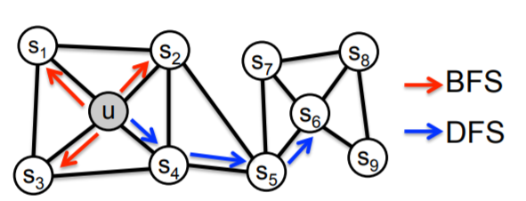
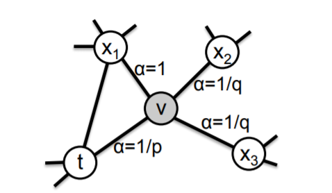
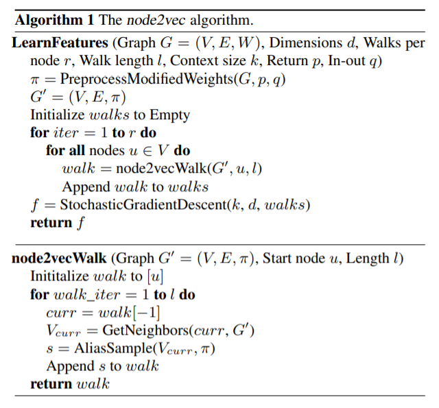
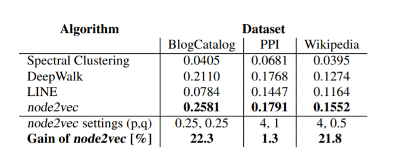
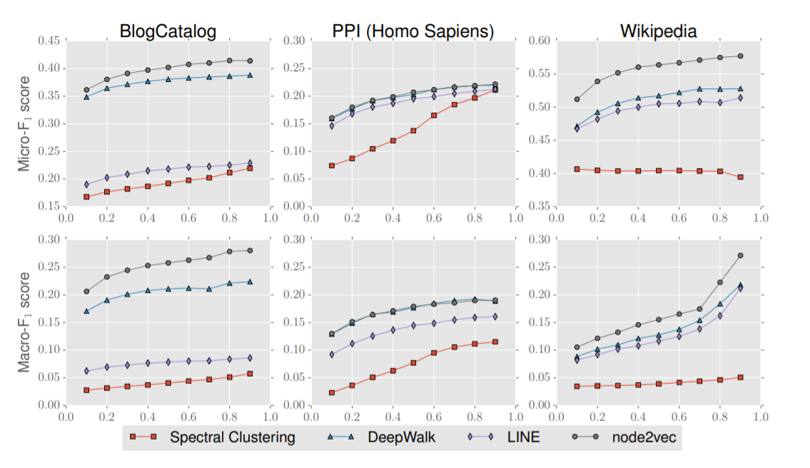
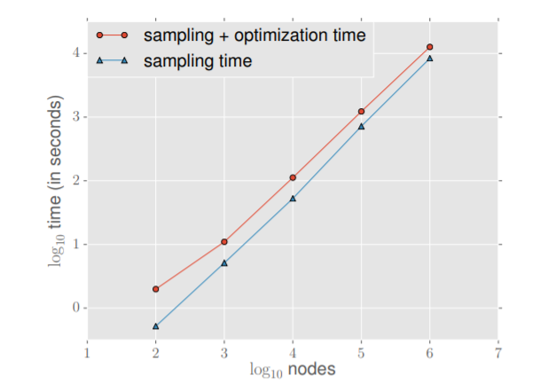

# 论文阅读报告：Node2Vec

> 论文《node2vec: Scalable Feature Learning for networks》的阅读笔记

## 前言与研究背景

​		本文是发表在KDD16上的一篇图数据挖掘和图机器学习主题的论文，我们知道在数据挖掘中，获得数据的特征是非常重要的一步，不管我们希望用什么算法，分类也好，回归也好，聚类也好，都首先需要获取数据的特征表示，然后再将机器学习算法应用到这些得到的表示中。

​		结构化的数据往往是比较容易获得特征表示的，它可以把若干个特征表示在若干个维度上，从而为每个样本形成一个向量的表示形式，这也是前面学到的算法中比较常见的。而对于图这样的结构，直接使用传统方法将图中的节点表示成一系列向量是比较麻烦的，比如在图结构中非常经典的任务有节点分类和边的预测中，最关键的一步就是将每个节点的邻域信息和自身特征表示到一个向量中，然后利用分类算法来完成对应的任务

​		事实上这是一个非常大的研究领域——图嵌入，传统的图嵌入模型有两种比较常见的特征表示方法，一种是大量依赖人造的手工特征，而另一种是使用无监督的特征学习方式，使用谱图理论对每个图的拉普拉斯特征图进行一定的降维操作从而得到图节点的特征表示，这些方法要不缺乏可解释性，要不就存在计算量过大的问题（因为构造拉普拉斯特征图和降维都是确定性的算法，时间复杂度非常高）

​		而本论文《node2vec: Scalable Feature Learning for networks》则提出了一种可度量的网络结构特征表示学习方法，并将其命名为node2vec，这种表示学习方式在保留了局部特征的同时，采用一定的随即策略降低了算法的复杂度。

## 论文解决的问题

​		本论文主要解决的问题就是在DeepWalk等的基础上提出了更加合理的图特征学习方法，提出了用于网络中**可伸缩特征学习的半监督算法**，使用SGD优化一个自定义的基于图的目标函数，该方法可以最大化的在D维特征空间保留节点的网络领域信息；在随机游走的基础上设计了一种二阶随机游走的过程，相当于对DeepWalk算法的一种扩展，它保留了邻居节点的图特征。该论文的贡献可以概括为：

- 提出了node2vec这种图特征学习算法，并使用SGD来优化一个neighborhood preserving的目标函数
- 展示了node2vec如何提供发现符合不同等价的表示的灵活性
- 将node2vec和其他的特征学习方法在考虑邻域保留程度的目标函数上进行了一定的扩展
- 在多项图学习子任务中对node2vec算法进行了评价

## 论文提出的方法

​		这一部分将着重分析论文中提出的node2vec算法中的一些核心概念和策略，并分析其总体框架。

### node2vec总体框架

​		node2vec实际上将图特征的学习转化成了一个似然最大化的问题，对于一个图$G=(V,E)$我们的目标是要学习一个映射函数将图中的每一个节点映射成一个d维度的嵌入向量，因此最终学习到的映射f是一个$|V|\times d$的矩阵，此外我们还定义$N_s(u)$来表示节点u的基于采样策略S的邻居节点集合。

​		我们的目标实际上就是将该目标函数根据节点 u的特征表示，最大化节点u的网络观测邻域，因此node2vec的总体目标函数可以表示为：
$$
\max _{f} \sum_{u \in V} \log \operatorname{Pr}\left(N_{S}(u) \mid f(u)\right)
$$
​		为了简化问题使其更容易处理，论文对上面的目标函数提出了如下假设：

#### 条件独立假设

​		为了简化概率的计算，我们将u节点对应的领域$N_s(u)$中的各个节点被观测到的概率都假设为独立的，即：
$$
\operatorname{Pr}\left(N_{S}(u) \mid f(u)\right)=\prod_{n_{i} \in N_{S}(u)} \operatorname{Pr}\left(n_{i} \mid f(u)\right)
$$

#### 对称特征空间假设

​		同时node2vec认为一个节点和其邻居节点对于是否出现这一事件起到的作用是一样的，也就是具有一定的对称性，因此node2vec使用了softmax函数来对特征向量的内积进行归一化并用其作为一个邻居节点在领域中出现的概率，即：
$$
\operatorname{Pr}\left(n_{i} \mid f(u)\right)=\frac{\exp \left(f\left(n_{i}\right) \cdot f(u)\right)}{\sum_{v \in V} \exp (f(v) \cdot f(u))}
$$
这样一来，我们令$Z_{u}=\sum_{v \in V} \exp (f(u) \cdot f(v))$则原本的目标函数可以转化成如下形式：
$$
\max _{f} \sum_{u \in V}\left[-\log Z_{u}+\sum_{n_{i} \in N_{S}(u)} f\left(n_{i}\right) \cdot f(u)\right]
$$
而$Z_u$的计算复杂度是比较高的，因此可以采用SGD和负采样的策略来对其进行优化。

### 随机游走策略

​		随机游走(Random Walk)是图嵌入中非常重要的一种方法，通过随机采样大大降低了提取节点的局部特征所需要的时间复杂度，传统的采样方式有DFS和BFS，而node2vec中提出了一种全新的带偏见的采样策略

#### DFS与BFS

​		在邻近节点的选取过程中，深度优先采样和广度优先采样是两种最简单但是也最极端的策略，深度优先采样会优先按照路径采样下去，而广度优先搜搜会优先采样到该节点附近的节点。

​		在学习一个网络的嵌入表示的时候最值得关注的两个特征就是节点的同质性和结构上的等价性，同质性的节点往往更容易互联连接，而结构等价性是节点的局部拓扑结构的相似性，BFS倾向于在初始节点的周围游走，可以反映出一个节点的邻居的微观特性；而DFS一般会跑的离初始节点越来越远，可以反映出一个节点邻居的宏观特性。

#### node2vec中改进的偏见随机游走

​		node2vec中定义了一种**二阶的随机游走策略**，并且给每种不同类型的点分配了不同的权重，对于一个节点v，假设随机游走到v之前的一个节点是x，那么在v的所有邻居节点中，不同的节点按照到节点x的最短路径的边数分成了三类，即0(节点x本身)，1(和vx两个节点都相邻)和2(和v相邻但是和x不相邻)，随机游走的概率可以定义为：
$$
\pi_{v x}=\alpha_{p q}(t, x) \cdot w_{v x}
$$
而这里的bias被定义为：
$$
\alpha_{p q}(t, x)=\left\{\begin{array}{ll}
\frac{1}{p} & \text { if } d_{t x}=0 \\
1 & \text { if } d_{t x}=1 \\
\frac{1}{q} & \text { if } d_{t x}=2
\end{array}\right.
$$

关于偏见随机游走还有这样几点说明

- p被称为返回参数，控制了随机游走回到原本节点的概率，对应BFS
- q被称为离开参数，控制了随机游走跳到别的远处节点的概率，对应DFS
- 随机算法带来的是算法的时间复杂度和空间复杂度的大幅度降低，不再需要每一次都进行全局搜素
- 总的来说，整个策略是在DFS和BFS之间采取某种平衡，也提供了参数化的控制方式，可以根据不同的需求进行调参，增大了普适性。

### 算法伪代码描述

​		node2vec的算法主要有特征学习和随机游走两个部分，论文中给出了这些算法的伪代码如下：

- 每个节点要经过若干次的随机游走进行采样
- 最终的嵌入表示采用SGD进行优化
- node2vec提供了一种半监督的方法来进行特征表示的学习，同时也可以进行一定的改进之后用于边特征的学习(将节点两两组合即可)

## 实验结果

### 算法性能

​		论文中对使用node2vec算法得到的特征表示在多标签节点分类任务、链接预测任务中进行了评估，并且和谱聚类，DeepWalk和LINE等之前的特征表示学习算法在BlogCatalog，PPI和Wikipedia等数据集上进行了对比得到的**F1分数比较结果**如下：

同时论文中还给出了两种F1分数下的算法性能对比图：

从上述实验结果的对比中我们可以看到，node2vec取得了比其他方法都要好的效果，这也说明node2vec可以学到更好的图特征表示。

### Scalability

​		论文中还对node2vec模型的scalability进行了一定的探究，在Erdos-Renyi图数据集上探究了算法消耗时间和节点数目的关系，最终得到的结果如下：

从图中我们可以看到算法小号的时间和节点数基本成线性关系，说明算法的scalability比较好。

## 总结与展望

​		本论文中提出了一种新的偏见游走策略并在此基础上产生了一种新的图特征学习算法，有了特征表示我们才能在具体的图机器学习任务中有所作为，而node2vec所提出的这种偏见游走策略，实际上体现的依然是机器学习中的一种trade-off的思想，即将BFS和DFS两种采样策略进行了一定的妥协，最终得到了效果更好的采样策略。

