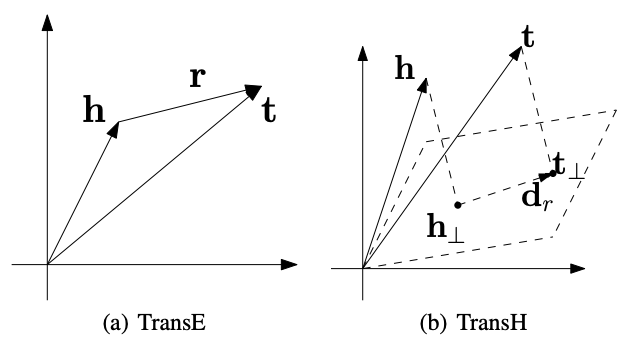

# 论文阅读笔记6：TransH

> 阅读知识图谱嵌入领域的论文《Knowledge Graph Embedding by Translating on Hyperplanes》的阅读笔记，该论文中提出了知识图谱嵌入的**TransE模型**

## Introduction

​	  论文的开头提出了知识图谱领域老生常谈的一些话题，包括知识图谱是什么，知识图谱是一个实体-关系-实体组成的三元组等等，这些内容在TransE模型的原论文中也已经提的不要提了，而知识图谱的研究存在的两个主要的困难是：

- 知识图谱本质上是一个符号逻辑系统，是人工智能流派中的符号学派的产物，但是计算机只能支持数值计算，而**符号逻辑和数值计算之间存在着一个巨大的鸿沟**难以跨越
- 难以获得全局的知识，传统的方法在面对长距离的推理的时候缺少鲁棒性

而TransE的提出使得知识图谱可以表示成连续空间中的向量并保留原本图谱中的一些性质，同时，实体和关系的表示可以用最小化一个全局损失函数的方式来进行优化。这样一来每一个实体和关系的嵌入表示就将全局的信息编码了进去，而学习到的嵌入表示就可以用到各种任务中去，比如知识图谱的补全。

​	  总的来说知识图谱嵌入就是将实体和关系表示成一个k维的向量，并且定义了一个打分函数$f_r(h,t)$来评价这个嵌入表示的合理性，打分函数往往选用L1或者L2范数，其中TransE是一个基于translation的代表性算法，简单而有效，但是我们发现TransE也存在很多问题，比如它在处理多对一/一对多/多对多的关系的时候表现不好，而现有的能够处理多元关系的模型往往十分复杂。因此本文提出了一种TransH算法解决这些问题。

## 本文的贡献

​	  这片论文中作者对TransE的困境进行了分析，并提出了一种新的方法TransH，这种方法将基于translation的知识图谱嵌入方法推广到了超平面上，并且每个关系有两个向量来描述，一个是超平面的法向量$w_r$，另一个是超平面上的平移向量$d_r$，对于一个三元组$(h,r,t)$，需要先将实体h和t投影到关系r超平面上，然后再用打分函数来衡量结果的合理性，这样一来每个关系都有了一个单独的表示空间，可以解决TransE不能解决的一对多/多对一/多对多的知识图谱嵌入问题。

​	  同时TransH模型的复杂度和TransE基本相同，为了训练出更好的嵌入表示，论文指出构造负样本非常重要，并且提出了一种trick可以减少生成错误负样本的概率。

## TransH算法的细节

### 对TransE的分析

​	  TransE存在一些问题，论文对这些存在的问题进行了简单的分析，首先基于translation的知识图谱嵌入方法都用打分函数作为评价标准，而打分函数往往是$||h+r-t||_{l1/l2}$，如果这个分数的值非常小就说明这个三元组的嵌入向量学习的比较到位，但是这个模型只在**一对一和非自反的关系中**比较有效。我们不妨假设一个三元组的嵌入向量满足$h+r-t=0$，我们可以进行如下推导：

- 如果这个三元组是自反的，即$(h,r,t)\in \Delta\rightarrow (t,r,h)\in \Delta$，那么根据$h+r=t=h-r$有$r=0,h=t$，这很明显是不合理的，因为r不可能是0，h和t也不一定相等
- 如果这是一个多对一关系，即$(h_i,r,t)\in \Delta$，那么就有$h_i=t-r=h_j$，也就是说所有的h都相等，这很明显也不合理，同样的多对一和多对多关系也是同理

上面的推导表明TransE在这些情况下学习到的嵌入向量存在很多问题，究其根本，就是因为TransE对所有的实体和关系都只用了一个嵌入向量来描述，而**忽略了实体在不同关系中的分布式表示**，也就是说**每个实体在不同的关系中表现出的“特征”可能是不一样的**，而TransE只用了一个向量来表示实体就是让每个实体都只有一个特征表示，这就导致了TransE算法在特定情况下的失败。

### TransH算法

​	  因此TransH提出了用给每个关系使用一个专用的超平面，并且将实体投影到这个超平面上使得每个实体都有一个分布式的表示方式，我们假设投影之后的h和t变成了$h_{\perp},t_{\perp}$，那么打分函数就变成了：
$$
\|\mathbf{h}_{\perp}+\mathbf{d}_{r}-\mathbf{t}_{\perp}\|_{2}^{2}
$$
而投影的计算方式是：
$$
\mathbf{h}_{\perp}=\mathbf{h}-\mathbf{w}_{r}^{\top} \mathbf{h} \mathbf{w}_{r}, \quad \mathbf{t}_{\perp}=\mathbf{t}-\mathbf{w}_{r}^{\top} \mathbf{t} \mathbf{w}_{r}
$$
这里的超平面法向量$||w_r||_2=1$，因此最终的打分函数就是：
$$
f_{r}(\mathbf{h}, \mathbf{t})=\left\|\left(\mathbf{h}-\mathbf{w}_{r}^{\top} \mathbf{h} \mathbf{w}_{r}\right)+\mathbf{d}_{r}-\left(\mathbf{t}-\mathbf{w}_{r}^{\top} \mathbf{t} \mathbf{w}_{r}\right)\right\|_{2}^{2}
$$
TransH中，我们使用一个向量来表示每个实体，用两个向量来表示关系。

### 嵌入向量训练

​	  为了加强模型对好的三元组和差的三元组之间的判别能力，我们可以在训练的过程中使用基于margin的损失函数，即：
$$
\mathcal{L}=\sum_{(h, r, t) \in \Delta} \sum_{\left(h^{\prime}, r^{\prime}, t^{\prime}\right) \in \Delta_{(h, r, t)}^{\prime}}\left[f_{r}(\mathbf{h}, \mathbf{t})+\gamma-f_{r^{\prime}}\left(\mathbf{h}^{\prime}, \mathbf{t}^{\prime}\right)\right]_{+}
$$
这和TransE是一样的，同时我们在最小化损失函数的时候需要满足以下几个约束条件：
$$
\begin{array}{l}
\forall e \in E,\|\mathbf{e}\|_{2} \leq 1, / / \text { scale }\\
\forall r \in R,\left|\mathbf{w}_{r}^{\top} \mathbf{d}_{r}\right| /\left\|\mathbf{d}_{r}\right\|_{2} \leq \epsilon, \text { //orthogonal }\\
\forall r \in R,\left\|\mathbf{w}_{r}\right\|_{2}=1, \text { //unit normal vector }
\end{array}
$$
因此损失函数也可以加上软约束，变成：
$$
\mathcal{L} =\sum_{(h, r, t) \in \Delta} \sum_{\left(h^{\prime}, r^{\prime}, t^{\prime}\right) \in \Delta_{(h, r, t)}^{\prime}}\left[f_{r}(\mathbf{h}, \mathbf{t})+\gamma-f_{r^{\prime}}\left(\mathbf{h}^{\prime}, \mathbf{t}^{\prime}\right)\right]_{+}
+C\left\{\sum_{e \in E}\left[\|\mathbf{e}\|_{2}^{2}-1\right]_{+}+\sum_{r \in R}\left[\frac{\left(\mathbf{w}_{r}^{\top} \mathbf{d}_{r}\right)^{2}}{\left\|\mathbf{d}_{r}\right\|_{2}^{2}}-\epsilon^{2}\right]_{+}\right\},
$$
这里的C是一个可以自己设置超参数，表示这个约束的重要性，并且在训练的时候采用随机梯度下降的方式来优化损失函数。每当一个三元组的正样本被选择进行训练的时候一个对应的负样本被随机地构造出来，经过一小批数据的训练之后就会计算一次梯度并更新。

### 减少错误负样本

​	  在训练过程中我们要进行负采样的操作，以往的方法往往采用随机打乱三元组的方式来生成负样本，然而一个知识图谱里往往是不完整的，知识图谱中只存在一些我们已经观测到的样本，对于未观测到的样本，我们更倾向于认为它是负的样本，而负样本的质量直接关系到嵌入表示的训练效果，如果选择的负样本无效反而可能让模型的performance变差，而这样一来随机生成的方式我们很有可能将一些错误的负样本(false negative，即原本是正样本，我们却把它当作负样本)引入训练中。

​	  TransH中提出了一种新的负采样方法，根据一个三元组的映射情况，给替换head还是替换tail赋予了不同的权重，比如对于对于一对多关系的三元组，更倾向于替换它的head，而对于多对一关系的三元组更倾向于替换其tail，这样一来生成false negative样本的概率就降低了，因此对于一个关系的所有的三元组我们统计这样几个信息：

- 每个tail实体平均拥有的head数量，计为hpt
- 每个head实体平均拥有的tail数量，计为tph

然后用参数$p=\frac{tph}{hpt+tph}$定义一个伯努利分布，每次负采样用p的概率对head进行替换，以1-p的概率对tail进行替换。